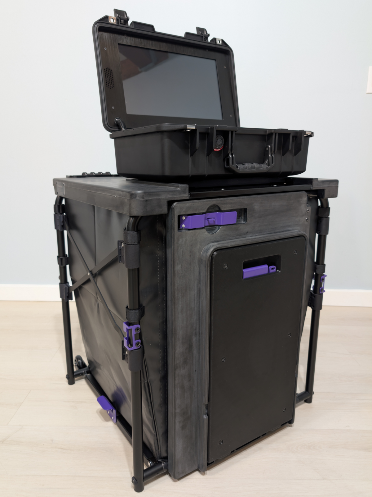
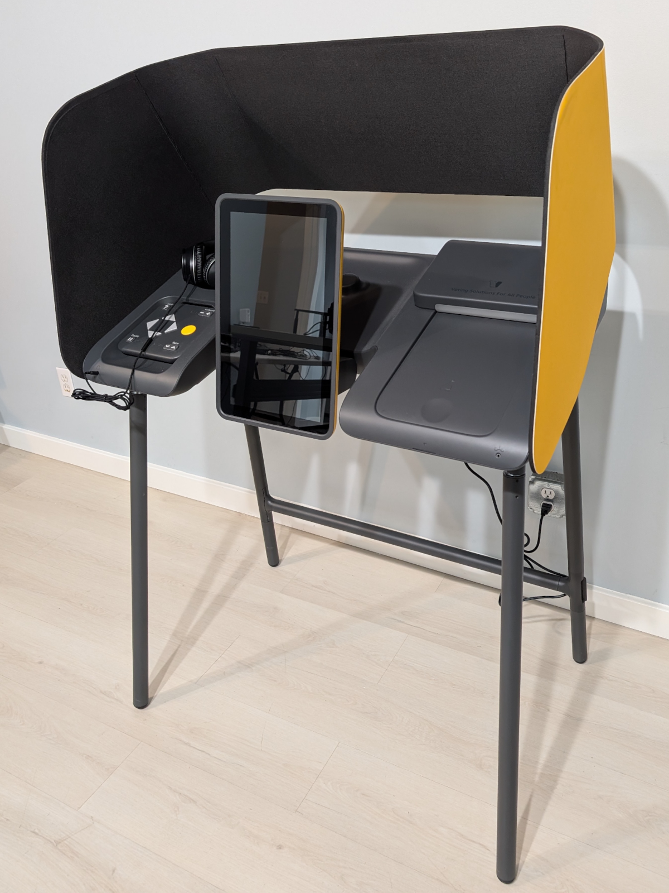
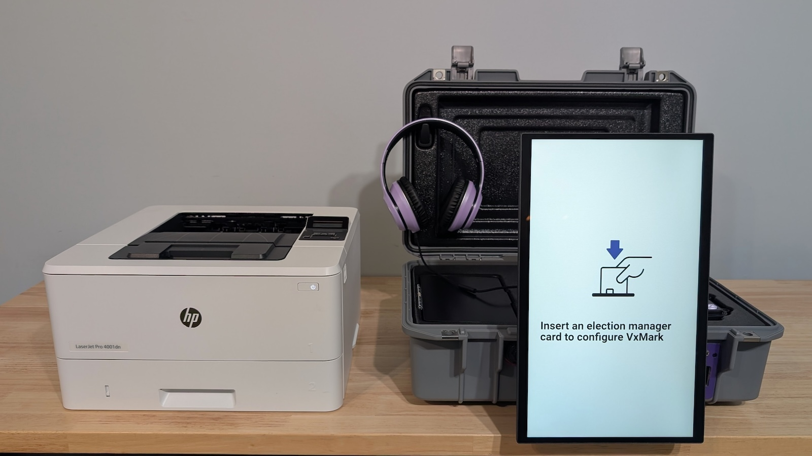
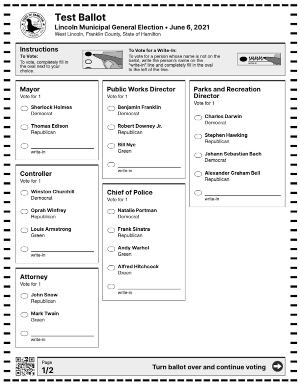
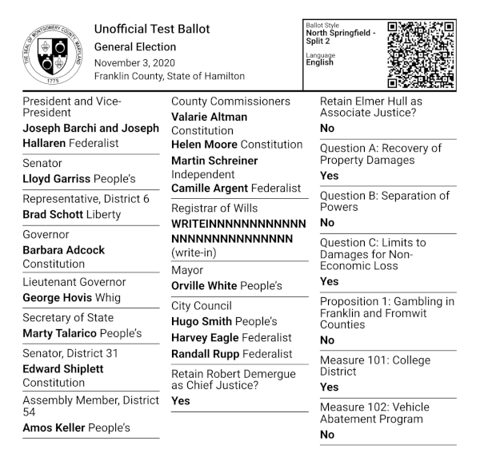

# VotingWorks Overview

This guide walks you through the complete process to set up, test, and operate the voting system. If you have questions, please don't hesitate to reach out to the VotingWorks team by emailing [help@vx.support](mailto:help@vx.support) or calling **(510) 426-9991**.

## System Overview

VotingWorks consists of two subsystems:

1. **Central System:** all equipment necessary for election programming, central batch ballot scanning, results aggregation, adjudication, and reporting.
2. **Precinct System:** all equipment necessary for use at the precinct to scan hand-marked ballots and provide an accessible ballot marking device for voters who need or prefer assistance marking a ballot.

### Central System

VotingWorks Central System includes three components:

1. **VxAdmin**: the main tool for local election administrators, which programs elections, tabulates and reports results on election night.
2. **VxCentralScan** (optional): a central scanner used for rapidly scanning absentee or vote by mail ballots.
3. **VxPrint** (optional): an on-demand ballot printer, which lets election workers print unfilled or blank ballots.

### Precinct System

VotingWorks Precinct System consists of three portable, self-contained products:

1. **VxScan**: a voter-facing precinct scanner that scans paper ballots and notifies voters of ballot issues for second-chance voting.
2. **VxMark**: a tabletop accessible ballot marking device with a printer that produces a voter-verifiable paper ballot.
3. **VxMarkScan**: a free-standing accessible ballot marking device with a printer that produces a voter-verifiable paper ballot.

<figure><figcaption>
VxScan
</figcaption></figure> <figure><figcaption>
VxMarkScan
</figcaption></figure>

<figure><figcaption>
VxMark
</figcaption></figure>

Voters at the precinct vote on hand-marked paper ballots (bubble ballots) and cast their ballot into VxScan, with the option to instead vote and cast one's ballot on VxMarkScan if requested.

## Paper Ballots

All votes cast using VotingWorks equipment are on paper ballots for security and post-election auditing. There are two types of VotingWorks paper ballots:

*   **Hand-marked paper ballot (Bubble ballot)**

    * All absentee voters will receive a hand-marked paper ballot (bubble ballot) that is printed by either a third-party print vendor or an on-demand printer (VxPrint). Absentee ballots are scanned by election administrators using a high-speed central scanner (VxCentralScan) or the precinct scanner (VxScan).
    * Most in-precinct voters will receive a hand-marked paper ballot (bubble ballot) that is printed by either a third-party printer or an on-demand printer (VxPrint) to hand mark. Precinct ballots are scanned by voters using a precinct scanner (VxScan).

    <figure><figcaption>
Example hand-marked paper ballot
</figcaption></figure>
* **Machine-marked paper ballot (summary ballot)** (via ballot marking device)
  * In-precinct voters may request to use the tabletop accessible ballot marking device (VxMark), or the free-standing accessible ballot marking device (VxMarkScan), both of which print a voter verifiable paper ballot. The VxMarkScan also includes the capability to deposit the printed ballot into the attached ballot box. Election administrators or poll workers later scan the machine-marked paper ballot at a high-speed central scanner (VxCentralScan).

<figure><figcaption>
Example machine-marked paper ballot (summary ballot)
</figcaption></figure>


VotingWorks provides technical support through the email and phone number listed at the top of the page. Upgrades and defect correction are defined in the customer's contract and scheduled through VotingWorks support system.



All functions in this user manual can be performed by one individual unless otherwise stated.

