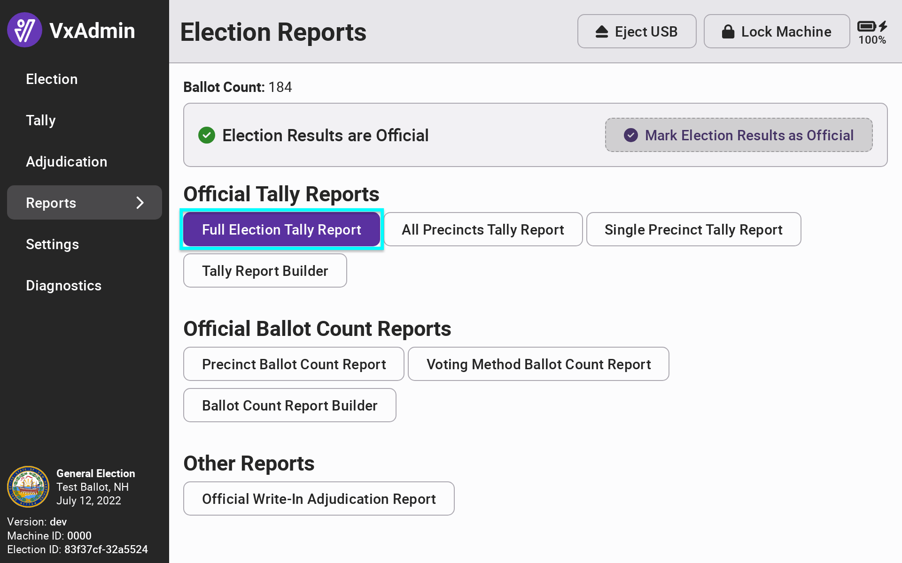
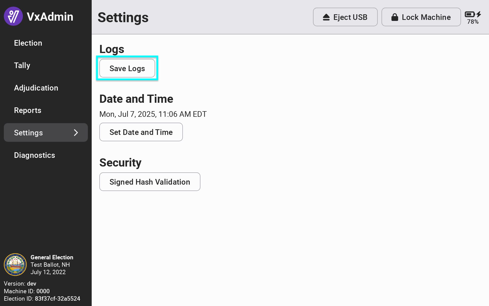
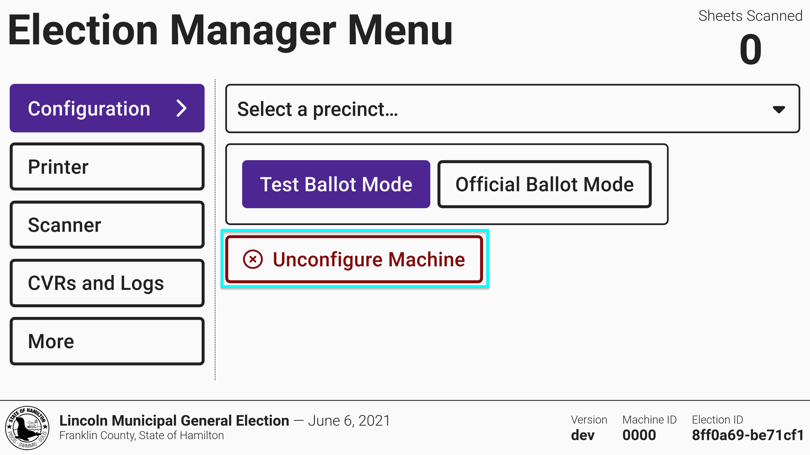

# Retaining & Removing Election Files

### Retaining Election Files

After certification of an election and before configuring a new election, all election files and data should be saved and the election package removed from the previous election.&#x20;

VotingWorks recommends retaining the following files after each election:

* [ ] VxAdmin results file
* [ ] VxAdmin tally reports
* [ ] VxAdmin log file
* [ ] VxScan CVRs
* [ ] VxScan log file
* [ ] VxCentralScan backup (if applicable - see [Retaining and Removing files - VxCS](../vxcentralscan/retaining-and-removing-files-vxcentralscan.md))
* [ ] VxCentralScan log file (if applicable - see [Retaining and Removing files - VxCS](../vxcentralscan/retaining-and-removing-files-vxcentralscan.md))
* [ ] VxMarkScan log file (if applicable - see [Retaining and Removing Files - VxMarkScan](../vxmark/retaining-and-removing-files-vxmark.md))


Ballots should have been secured post-tabulation. Follow state guidelines to ensure proper retention.


All election data should be retained for at least 22 months in the following storage conditions:

* Temperature: 5C-40C (41F-104F)
* Relative humidity: 5% to 85%, non-condensing

All VotingWorks paper records and USB drives are specified to last at least 22 months when stored in these conditions.

###

### VxAdmin&#x20;

To save the recommended VxAdmin files, follow these steps when logged in as an election manager:

* [ ] Select _`Reports`_ from the side menu, select _`Full Election Tally Report`_, select _`Export Report PDF.`_
* [ ] Then select _`Export Report CSV`_.

<figure><figcaption></figcaption></figure> <figure><figcaption></figcaption></figure>

Next select _`Settings`_ from the side menu and _`Save Logs`_. Machine log files are saved in the /logs folder on the USB drive.

<figure><figcaption></figcaption></figure>

### VxScan CVR Files

VxScan CVRs include the VxScan's CVRs and ballot images. The log file contains the logs. To save the VxScan files, [setup the VxScan](../election-day-guides/vxscan-setup.md) without the ballot box and follow the following steps:

* [ ] Insert election manager card
* [ ] Select _`CVRs and Logs`_ from the side menu
* [ ] Insert a USB drive
* [ ] Select _`Save CVRs`_
* [ ] Selec&#x74;_`Save Logs`_

<figure><figcaption></figcaption></figure>


**Log files** contain records of user interactions with the machine (e.g., election officials and poll workers unlocking the machine, voters casting ballots, etc.) as well as internal system information (e.g., the status of paper running through the scanner, errors, etc.). [A detailed description for each event in the log can be found in Github](https://github.com/votingworks/vxsuite/blob/main/libs/logging/VotingWorksLoggingDocumentation.md).


### Removing Election Files

In VxAdmin, log in with a system administrator card, select _`Election`_ from the side menu and select _`Unconfigure Machine`_.

<figure><figcaption></figcaption></figure>

In VxScan, log in with an election manager card and select _`Unconfigure Machine`_.

<figure><figcaption></figcaption></figure>

