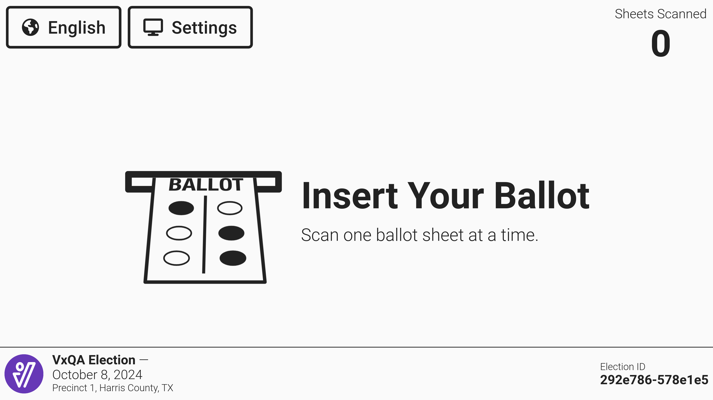
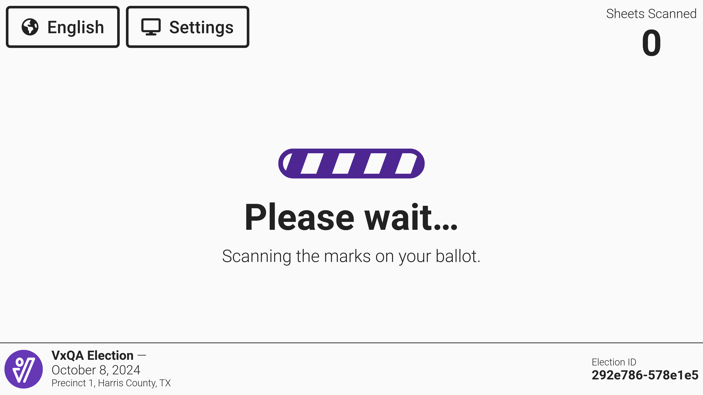
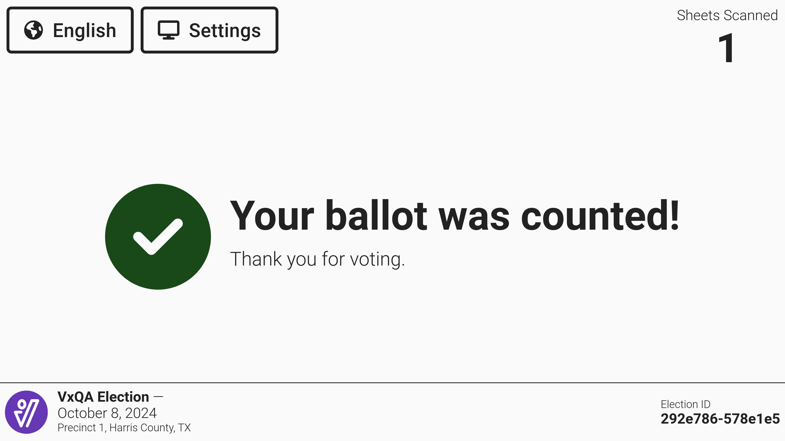
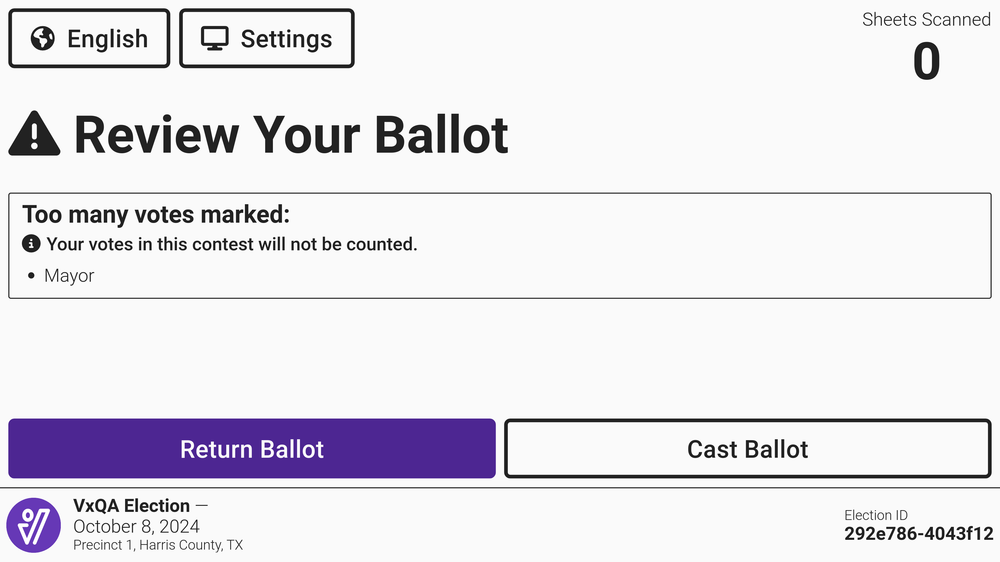
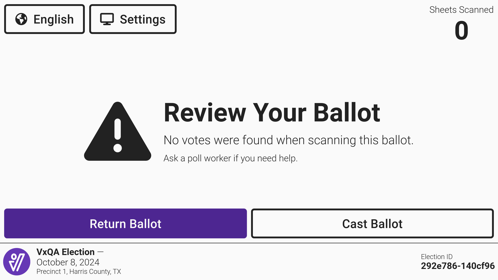
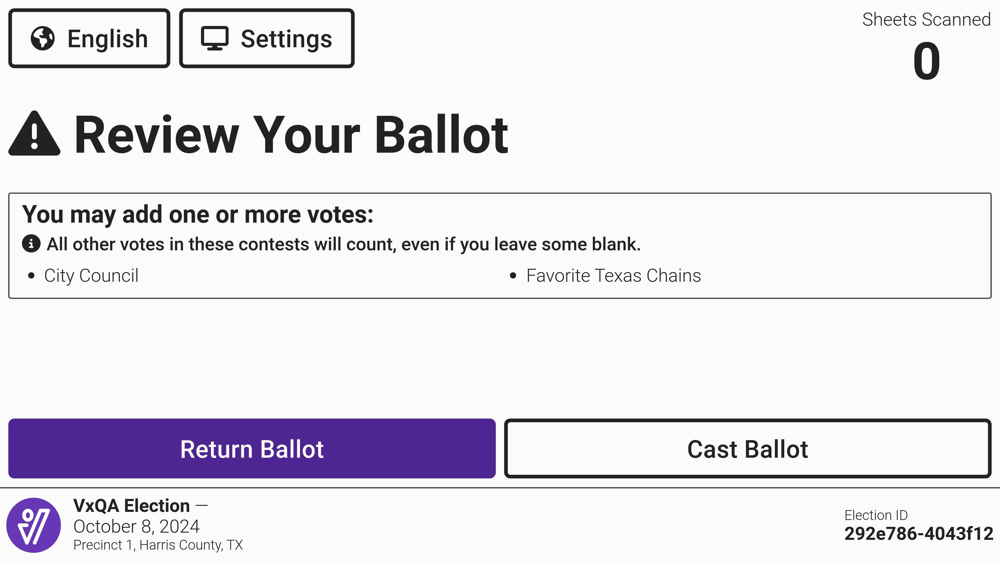
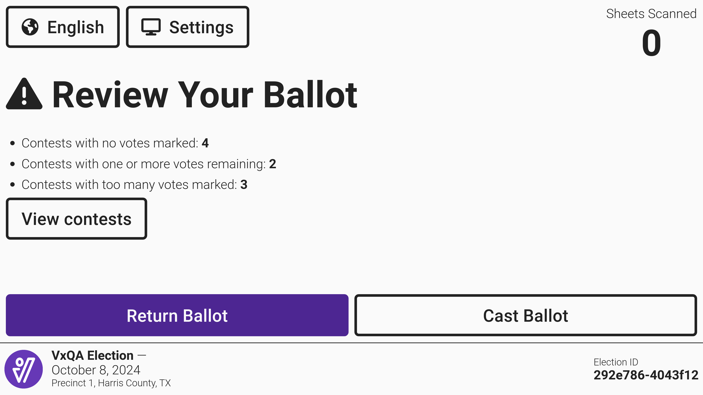
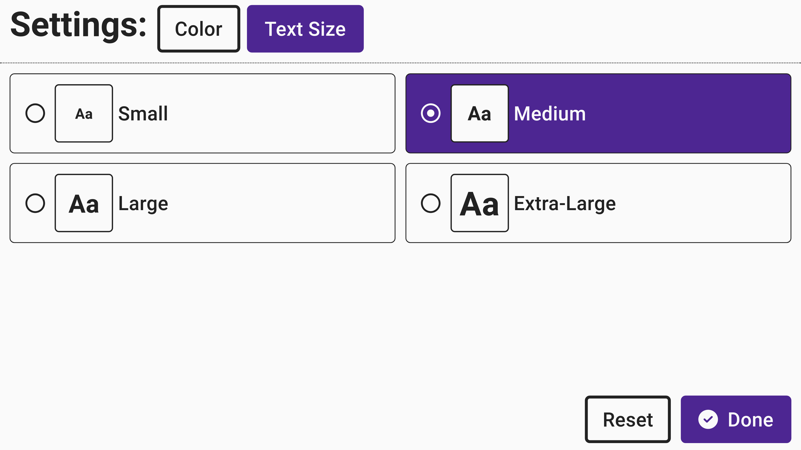
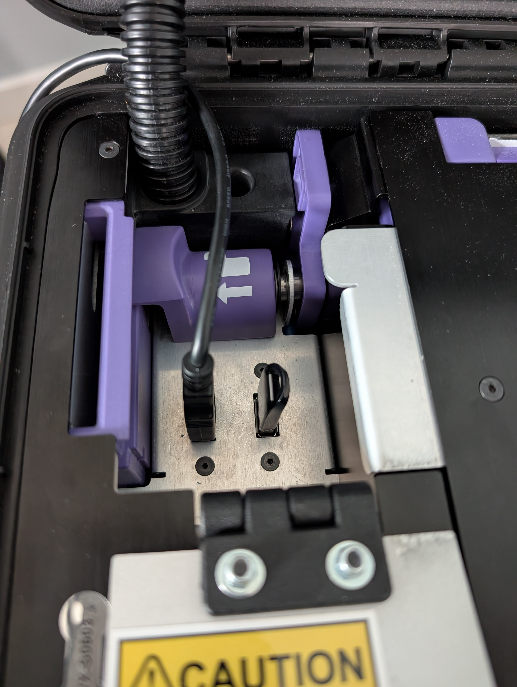
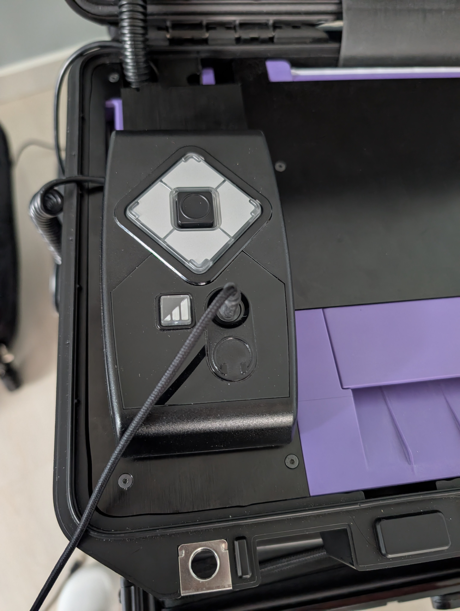

# Assisting Voters

## Casting Ballots

VxScan is ready to accept a new ballot whenever it displays _Insert Your Ballot:_

<figure><figcaption></figcaption></figure>

A voter can then push their ballot onto the tray and into the scanner. When a ballot is properly inserted, the scanner will grip the ballot. If a ballot is inserted at an angle, the scanner may push the ballot back into the voter's hands without scanning, in which case the voter should simply re-insert their ballot. VxScan will then scan the ballot by pulling it in while showing the following screen:

<figure><figcaption></figcaption></figure>

If the ballot has no issues, the ballot will go into the ballot box and the screen will show that the ballot has been counted. Notice that the _Sheets Scanned_ count goes up.

<figure><figcaption></figcaption></figure>

After a few seconds, VxScan will return to the _Insert Your Ballot_ screen in preparation for the next voter. &#x20;

If the ballot was not counted because of an issue, the scanner will hold the ballot. There could be any of the following issues with the ballot depending on state law or rule.

### Overvoted Ballots

A ballot is considered overvoted if the scanner recognizes more than the allowed number of votes for a particular race. For example, a voter marked two candidates in a race where they must make a single choice. If the voter would like to correct their error, they should select _`Return Ballot`_ and VxScan will return the ballot to the voter. If the voter would like to count the ballot as is, they should select _`Cast Ballot`_ and then confirm by selecting _`Cast Ballot`_ again.  All votes will be counted in correctly voted contests but the overvoted contest will be ignored.

<figure><figcaption></figcaption></figure>


An overvote will also be detected when a candidate is marked and writing is detected on the write-in line for the same contest if it exceeds the number of allowed votes (when required by law or rule). This is true even if the bubble is not marked.&#x20;


### Blank Ballots

If a state requires notification to the voter that a ballot has no selections marked, the voter will be prompted to review their ballot.

The voter may have circled or underlined the names of their choices instead of filling in the bubbles. Or the voter may have used a writing utensil whose marks are ignored by the scanner, like a highlighter. VxScan will warn the voter that their ballot appears blank.

<figure><figcaption></figcaption></figure>

If the voter would like to correct their error, they should select _`Return Ballot`_ and VxScan will return the ballot to the voter. If the voter would like to count the ballot as is, they should select _`Cast Ballot`_ and then confirm by selecting _`Cast Ballot`_ again. The _Sheets Scanned count_ will increase but no votes will be counted from a blank ballot.

### Undervotes

If a state requires notification to the voter that a specific contest has fewer than the maximum selections marked, the voter will be prompted to review their ballot.&#x20;

<figure><figcaption></figcaption></figure>

If the voter would like to correct their error, they should select _`Return Ballot`_ and VxScan will return the ballot to the voter. If the voter would like to count the ballot as is, they should select _`Cast Ballot`_ and then confirm by selecting _`Cast Ballot`_ again. All votes will be counted.

### Multiple Corrections

If a voter has both undervotes and overvotes on their ballot and the state requires review of both, the _Review Your Ballot_ screen will list the number of contests with each issue. Select _`View contests`_ to see the full list of contests that were undervoted or overvoted.&#x20;

<figure><figcaption></figcaption></figure>

If the voter would like to correct their errors, they should select _`Return Ballot`_ and VxScan will return the ballot to the voter. If the voter would like to count the ballot as is, they should select _`Cast Ballot`_ and then confirm by selecting _`Cast Ballot`_ again.

### Adjusting Color and Size

Simple changes to the screens color and size can be very helpful for voters with low vision and other cognitive disabilities. Selecting _`Settings`_ in the upper left hand corner of the screen provides the voter with different options. Select _`Color`_ to change the text and background color and select _`Text Size`_ to change the text size.

<figure><figcaption></figcaption></figure> <figure><figcaption></figcaption></figure> <figure><figcaption></figcaption></figure>

#### **Text and Background Color**

Four different color options are available for users. While we provide a short description of who may benefit most from these different options, please note that the user likely knows what setting is best for them.&#x20;

**White text, black background** - used by a person that finds white backgrounds too bright due to visual disabilities.

**Gray text, dark background** - used by a person needing lower contrast. For example, a person with dyslexia may find the screen quieter.

**Dark text, light background** - as the default this setting will be used by most people.

**Black text, white background** - used by a person who needs the highest contrast because of light vision or color perception disabilities or aging.

#### Text Size

The default text size is _`Medium`_.  A user can select _`Small`_, _`Large`_, or _`Extra-Large`_ based on their preferences.  Select _`Done`_ to save the selection.&#x20;

### Language

If a jurisdiction provides language options to voters, a voter may select that language by selecting _`English`_. Next, they'll select the language of their choice and select _`Done`_.&#x20;




All selections above are made for a specific voting session and will reset with the next voter.


### Audio Tactile Interface

VxScan also supports ballot casting over an audio-tactile interface via an accessible controller and headphones. A poll worker does the following to enable the audio tactile interface:

* Plug the accessible controller into the second USB port
* Close and seal the poll worker door (document as required)
* Plug in headphones to the accessible controller's headphone jack

<figure><figcaption>
USB connected
</figcaption></figure> <figure><figcaption>
Headphones connected
</figcaption></figure>

Voters can navigate with the touchpad, select with the center button, and adjust the volume using the volume control button next to the headphone jack.
