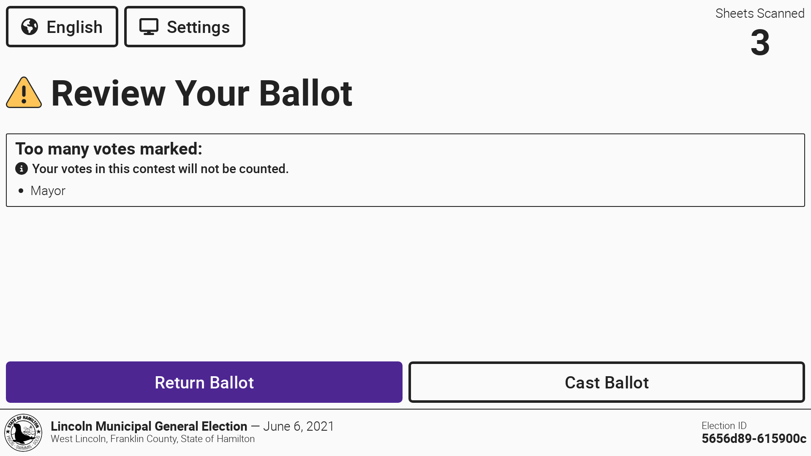
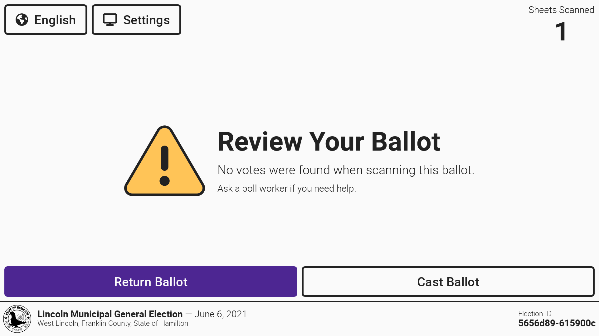
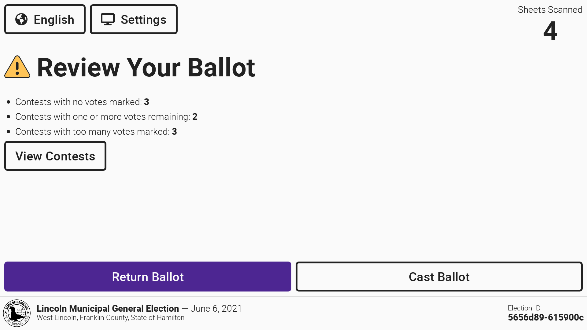
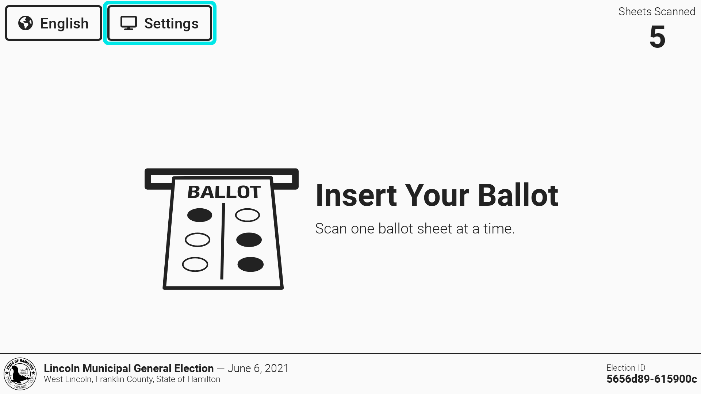
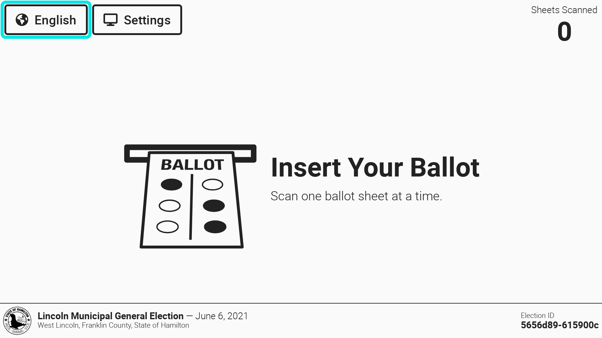
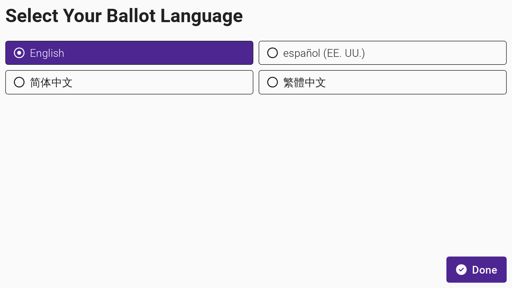

# Assisting Voters

## Casting Ballots

VxScan is ready to accept a new ballot whenever it displays "Insert Your Ballot":

<figure><figcaption></figcaption></figure>

A voter can then push their ballot onto the tray and into the scanner. When a ballot is properly inserted, the scanner will grip the ballot. If a ballot is inserted at an angle, the scanner may push the ballot back into the voter's hands without scanning, in which case the voter should simply re-insert their ballot. VxScan will then scan the ballot by pulling it in while showing the following screen:

<figure><figcaption></figcaption></figure>

If the ballot has no issues, the ballot will go into the ballot box and the screen will show that the ballot has been counted. Notice that the "Sheets Scanned" count goes up.

<figure><figcaption></figcaption></figure>

After a few seconds, VxScan will return to the "Insert Your Ballot" screen in preparation for the next voter.

If the ballot was not counted because of an issue, the scanner will hold the ballot. There could be any of the following issues with the ballot depending on state law or rule.



### Overvoted Ballots

A ballot is considered overvoted if the scanner recognizes more than the allowed number of votes for a particular race. For example, a voter marked two candidates in a race where they must make a single choice. If the voter would like to correct their error, they should select `Return Ballot` and VxScan will return the ballot to the voter. If the voter would like to count the ballot as is, they should select `Cast Ballot` and then confirm by selecting `Cast Ballot` again. All votes will be counted in correctly voted contests but the overvoted contest will be ignored.

<figure><figcaption></figcaption></figure>


An overvote will also be detected when a candidate is marked and writing is detected on the write-in line for the same contest if it exceeds the number of allowed votes (when required by law or rule). This is true even if the bubble is not marked.


### Blank Ballots

If a state requires notification to the voter that a ballot has no selections marked, the voter will be prompted to review their ballot.

The voter may have circled or underlined the names of their choices instead of filling in the bubbles. Or the voter may have used a writing utensil whose marks are ignored by the scanner, like a highlighter. VxScan will warn the voter that their ballot appears blank.

<figure><figcaption></figcaption></figure>

If the voter would like to correct their error, they should select `Return Ballot` and VxScan will return the ballot to the voter. If the voter would like to count the ballot as is, they should select `Cast Ballot` and then confirm by selecting `Cast Ballot` again. The "Sheets Scanned" count will increase but no votes will be counted from a blank ballot.

### Undervotes

If a state requires notification to the voter that a specific contest has fewer than the maximum selections marked, the voter will be prompted to review their ballot.

<figure><figcaption></figcaption></figure>

If the voter would like to correct their error, they should select `Return Ballot` and VxScan will return the ballot to the voter. If the voter would like to count the ballot as is, they should select `Cast Ballot` and then confirm by selecting `Cast Ballot` again. All votes will be counted.

### Multiple Corrections

If a voter has both undervotes and overvotes on their ballot and the state requires review of both, the "Review Your Ballot" screen will list the number of contests with each issue. Select `View Contests` to see the full list of contests that were undervoted or overvoted.

<figure><figcaption></figcaption></figure>

If the voter would like to correct their errors, they should select `Return Ballot` and VxScan will return the ballot to the voter. If the voter would like to count the ballot as is, they should select `Cast Ballot` and then confirm by selecting `Cast Ballot` again.

### Adjusting Color and Size

Simple changes to the screen's color and size can be very helpful for voters with low vision and other cognitive disabilities. Selecting `Settings` in the upper left hand corner of the screen provides the voter with different options. Select `Color` to change the text and background color and select `Text Size` to change the text size.

<figure><figcaption></figcaption></figure> <figure><figcaption></figcaption></figure> <figure><figcaption></figcaption></figure>

#### Text and Background Color

Four different color options are available for users. While we provide a short description of who may benefit most from these different options, please note that the user likely knows what setting is best for them.

**White text, black background** - used by a person that finds white backgrounds too bright due to visual disabilities.

**Gray text, dark background** - used by a person needing lower contrast. For example, a person with dyslexia may find the screen quieter.

**Dark text, light background** - as the default this setting will be used by most people.

**Black text, white background** - used by a person who needs the highest contrast because of light vision or color perception disabilities or aging.

#### Text Size

The default text size is `Medium`. A user can select `Small`, `Large`, or `Extra-Large` based on their preferences. Select `Done` to save the selection.

### Language

If a jurisdiction provides language options to voters, a voter may select that language by selecting `English`. Next, they'll select the language of their choice and select `Done`.

<figure><figcaption></figcaption></figure> <figure><figcaption></figcaption></figure>


All selections above are made for a specific voting session and will reset with the next voter.


### Audio-Tactile Interface

VxScan also supports ballot casting over an audio-tactile interface via an accessible controller and headphones. A poll worker does the following to enable the audio-tactile interface:

* Plug in the Personal Assistive Technology (PAT) device into the PAT jack in front in the top-left.
* Plug in the headphones into the headphone jack in front in the bottom-left.


Accessibility devices MUST be connected to VxScan before scanning a ballot, for a voter using the audio-tactile interface.


<figure><figcaption>
PAT device and headphones plugged into the front left ports
</figcaption></figure>



Voters can navigate with the PAT device. When first plugging in the PAT device, a 3-step tutorial first shows up to test the device, as shown in the following screens:

<figure><figcaption>
Step 1: Activate a PAT input.
</figcaption></figure>

<figure><figcaption>
Step 2: Identify the "Move" input.
</figcaption></figure> <figure><figcaption>
Input identified
</figcaption></figure>

<figure><figcaption>
Step 3: Identify the "Select" input.
</figcaption></figure> <figure><figcaption>
Input identified
</figcaption></figure>

<figure><figcaption>
PAT setup complete
</figcaption></figure>

Voters can adjust the volume using the volume control interface in the `Settings` menu. Audio settings can be modified by selecting the `Settings` button in the top header and finding options under the `Audio` tab, as shown in the screen below.

<figure><figcaption></figcaption></figure>

Voters using the PAT device to cast a ballot use two inputs to perform this task. The move input allows voters to navigate through a screen's focusable elements, and the select input allows voters to select, i.e., click, the currently focused element. Every focusable element has an audio cue that is played when the element is focused.\
\
The move input provides a means of skipping and pausing audio playback. Using the move input while audio is being played will navigate to the next focusable element and skip/pause the previous element's audio. By cycling through all focusable elements with the move input and returning to the element for which the audio was skipped/paused, the voter can repeat/resume the audio playback for that element. This is most relevant for the main body text on the screen, e.g., the adjudication warnings when that screen is surfaced, as these are the most likely audio cues that a voter would want to skip/repeat.


Poll workers can share the above guidance with voters using a PAT device and audio cues to cast a ballot on VxScan to help orient those voters.

