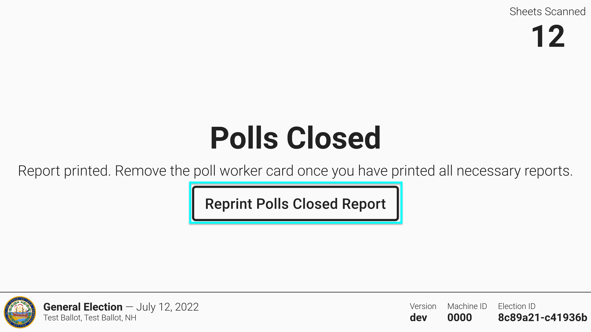
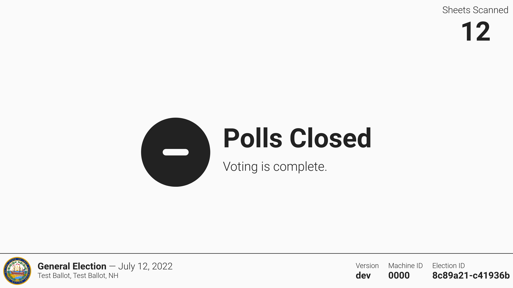

# Closing Polls

* [ ] Insert the poll worker card
* [ ] Select _`Close Polls`_
* [ ] One copy of the polls closed report will print
* [ ] Tear to remove the report

<figure><figcaption>
Insert poll worker card
</figcaption></figure> <figure><figcaption>
Select <em>Close Polls</em>
</figcaption></figure> <figure><figcaption></figcaption></figure>

* [ ] Select _`Reprint Polls Closed Report`_ to print more reports as necessary
* [ ] Remove the poll worker card

<figure><figcaption>
Select <em>Reprint Polls Closed Report</em>
</figcaption></figure> <figure><figcaption>
Remove the poll worker card
</figcaption></figure>

* [ ] Unseal and document the poll worker door seal as required
* [ ] Open the poll worker door
* [ ] Remove the USB drive from the poll worker door and secure as required

<figure><figcaption>
unseal and document interior panel
</figcaption></figure> <figure><figcaption>
remove the USB drive
</figcaption></figure>

The polls are now closed. Below is an example of the polls closed report.

<figure><figcaption></figcaption></figure>
