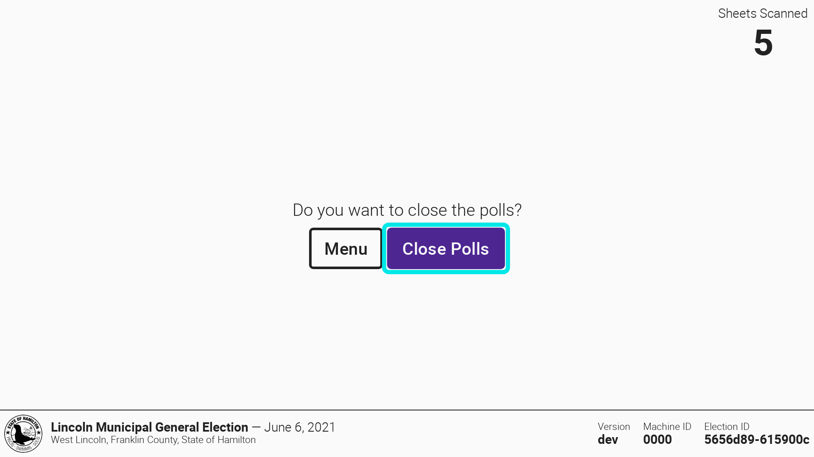
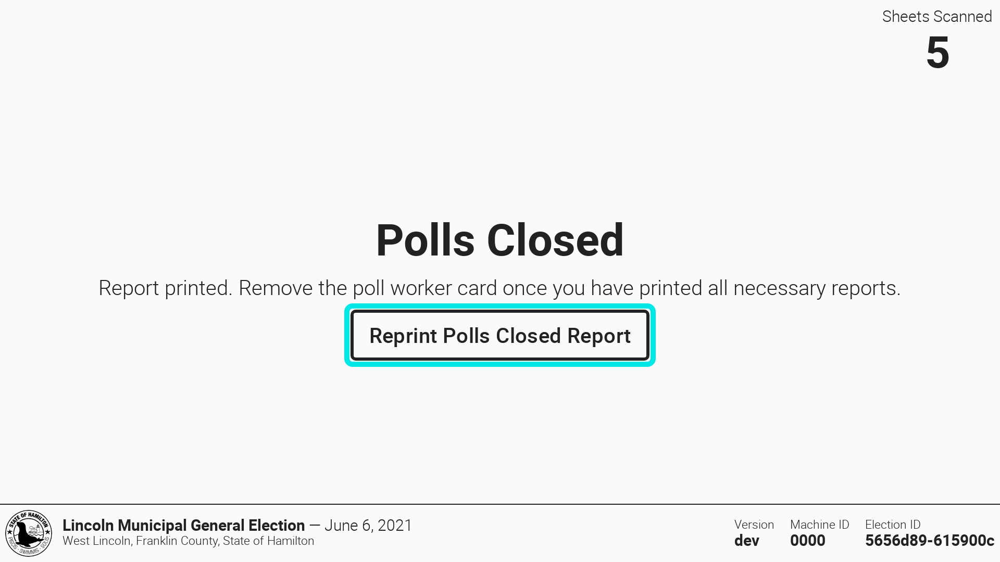
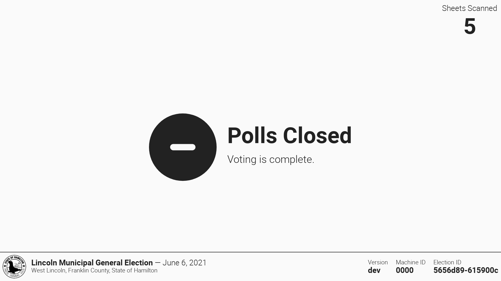
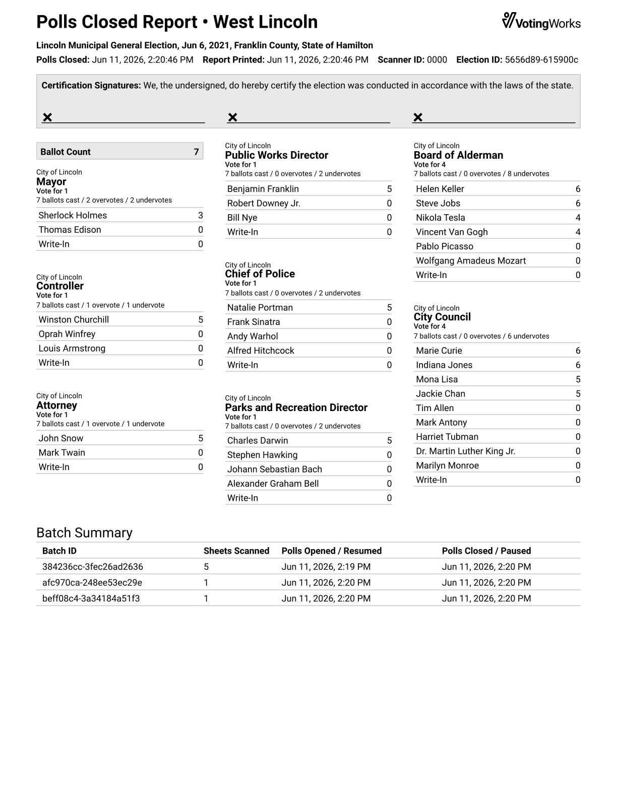

# Closing Polls

* [ ] Insert the poll worker card
* [ ] Select `Close Polls`
* [ ] One copy of the polls closed report will print
* [ ] Tear to remove the report

<figure><figcaption>
Insert poll worker card
</figcaption></figure> <figure><figcaption>
Select <code>Close Polls</code>
</figcaption></figure> <figure><figcaption></figcaption></figure>

* [ ] Select `Reprint Polls Closed Report` to print more reports as necessary
* [ ] Remove the poll worker card

<figure><figcaption>
Select <code>Reprint Polls Closed Report</code>
</figcaption></figure> <figure><figcaption>
Remove the poll worker card
</figcaption></figure>

* [ ] Unseal and document the poll worker door seal as required
* [ ] Open the poll worker door
* [ ] Remove the USB drive from the poll worker door and secure as required

<figure><figcaption>
Unseal and document interior panel
</figcaption></figure> <figure><figcaption>
Remove the USB drive
</figcaption></figure>

The polls are now closed. Below is an example of the polls closed report.

<figure><figcaption></figcaption></figure>


Jurisdictions may configure VxScan to prevent closing the polls until the official polls close time on election day. If this is the case in your jurisdiction, logging in with a poll worker card before the polls close time will land you directly on the poll worker menu and `Close Polls` will be disabled. After the polls close time, you will be able to close polls as shown above.

