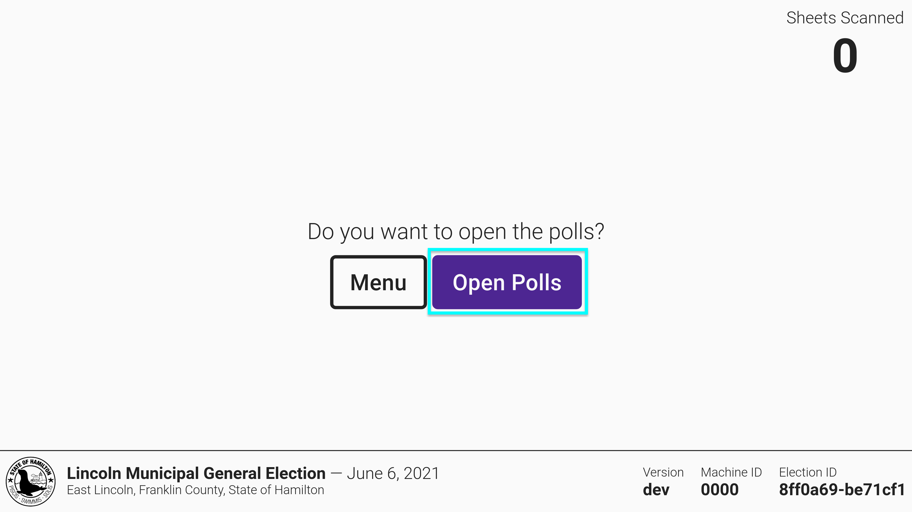
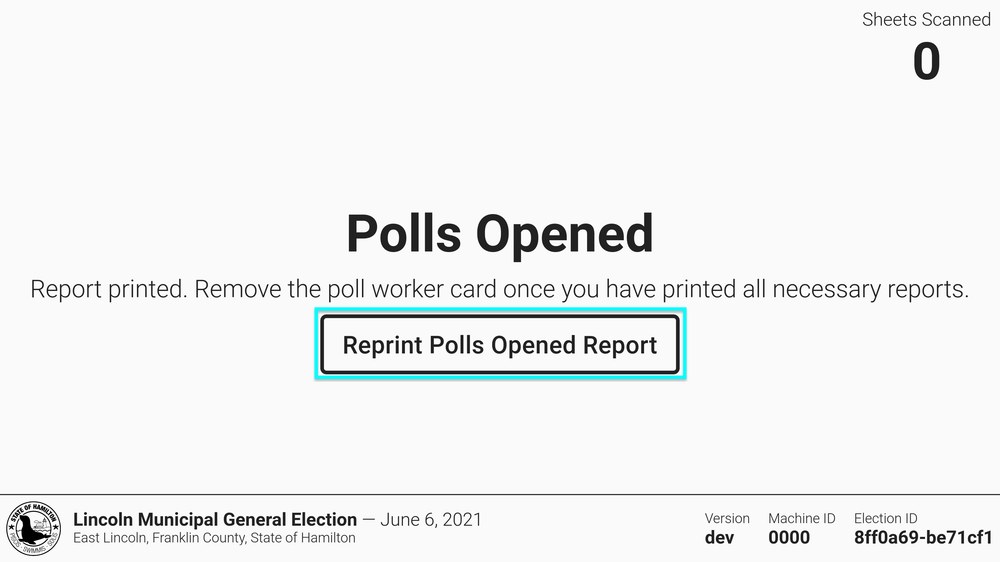
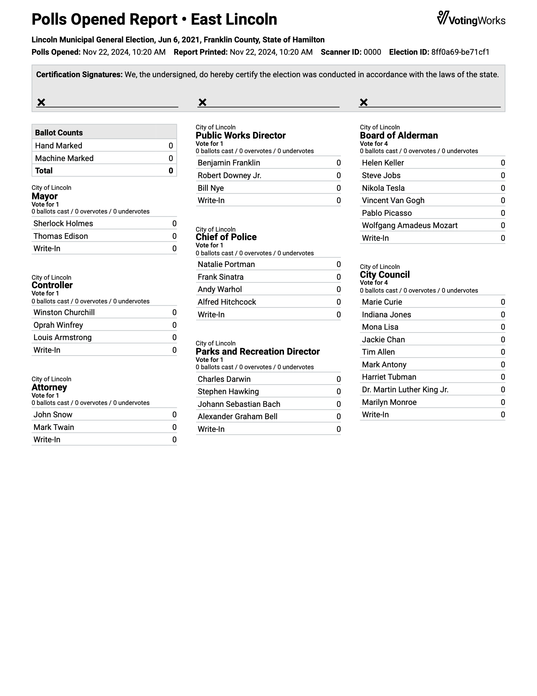

# Opening Polls

After VxScan is plugged in, the screen will show that polls are closed:

<figure><figcaption></figcaption></figure>


If there is an orange banner that says "Test Ballot Mode" on the screen, contact your election administrator immediately to prepare the machine for the election.


To open the polls:

* [ ] insert the poll worker card into the card reader
* [ ] select _`Open Polls`_

<figure><figcaption>
Insert poll worker card
</figcaption></figure> <figure><figcaption>
Select <em>Open Polls</em>
</figcaption></figure>

* [ ] one copy of the polls opened report will print
* [ ] tear to remove the report
* [ ] select _`Reprint Polls Opened Report`_ to print more reports as necessary

<figure><figcaption></figcaption></figure> <figure><figcaption>
Select <em>Reprint Polls Opened Report</em> to print more reports
</figcaption></figure>

* [ ] remove the poll worker card


For primary elections, you may be prompted to print and tear multiple reports, one for each party.


The polls are now open. The number of ballots scanned should be zero. Verify the precinct name and election date are correct in the bottom left corner.

<figure><figcaption></figcaption></figure>

Below is an example of the polls opened report. All totals should be zero.

<figure><figcaption></figcaption></figure>


The poll worker door should remain sealed and secure at all times unless a poll worker requires access. Any unauthorized access should be reported to an election administrator immediately.


