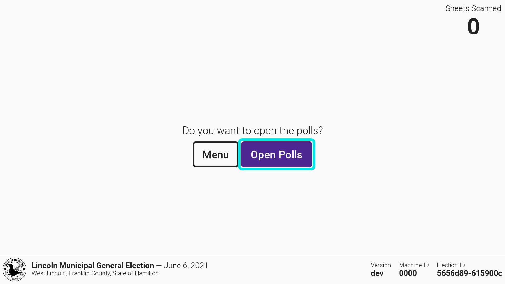
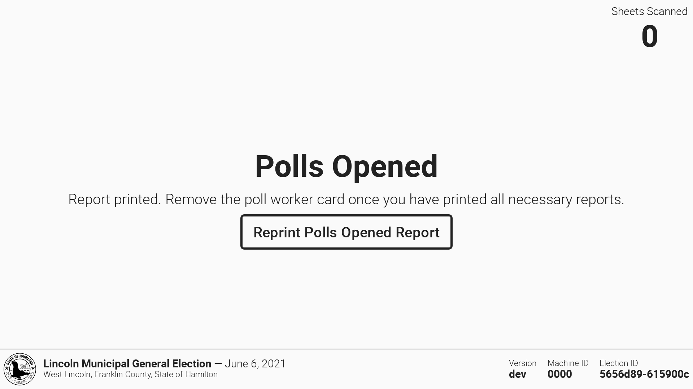
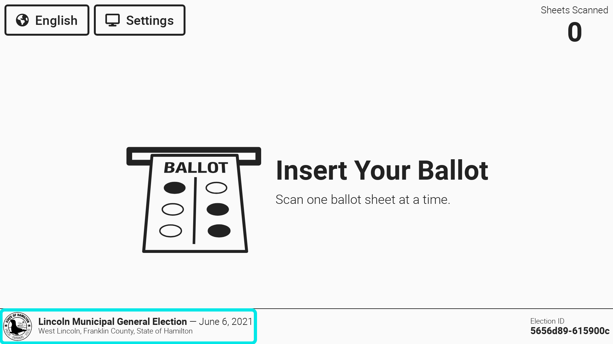
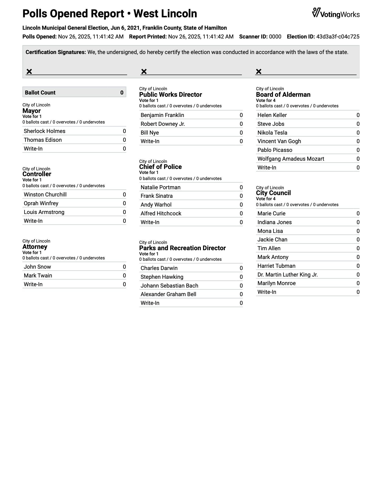

# Opening Polls

After VxScan is plugged in, the screen will show that polls are closed:

<figure><figcaption></figcaption></figure>


If there is an orange callout that says "Test Ballot Mode" on the screen, contact your election administrator immediately to prepare the machine for the election.


To open the polls:

* [ ] Insert the poll worker card into the card reader
* [ ] Select `Open Polls` . The polls opened report will start printing.

<figure><figcaption>
Insert poll worker card
</figcaption></figure> <figure><figcaption>
Select <em>Open Polls</em>
</figcaption></figure>

* [ ] Gently tear the report against the tear bar.&#x20;
* [ ] If you see the `Print Next Report` button, select it. Gently tear the report against the tear bar. Repeat until there is no `Print Next Report` button.
* [ ] Select `Reprint Polls Opened Report` to print additional copies as necessary

<figure><figcaption></figcaption></figure> <figure><figcaption>
Select <em>Reprint Polls Opened Report</em> to print more reports
</figcaption></figure>

* [ ] Remove the poll worker card

The polls are now open. The number of ballots scanned should be zero. Verify the polling place name and election date are correct in the bottom left corner.

<figure><figcaption></figcaption></figure>

Below is an example of the polls opened report. All totals should be zero.

<figure><figcaption></figcaption></figure>


The poll worker door should remain sealed and secure at all times unless a poll worker requires access. Any unauthorized access should be reported to an election administrator immediately.

