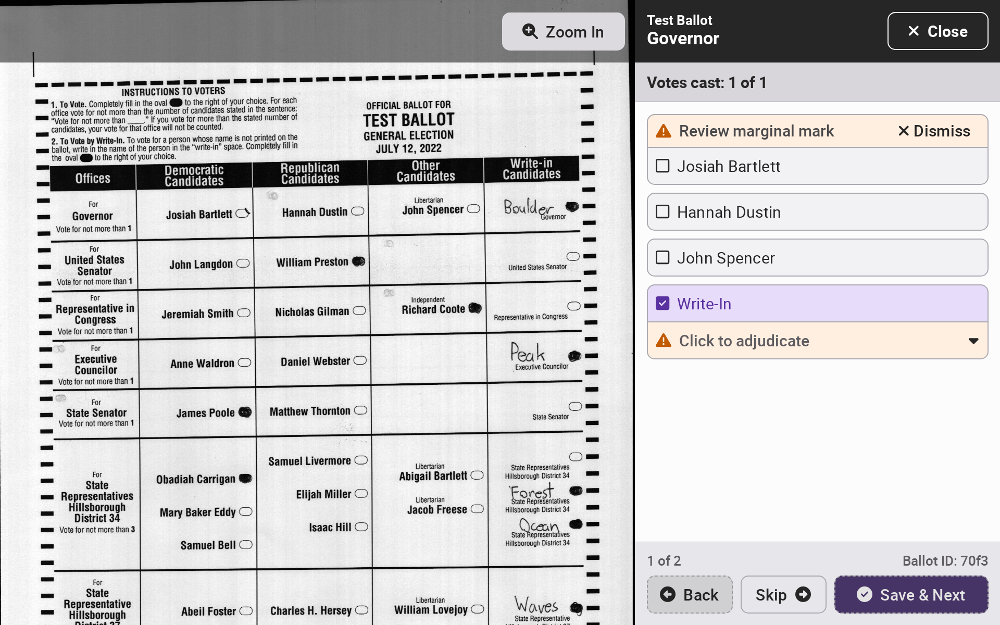

# Adjudication


The following steps must be completed by an election manager.


Adjudication covers:

* Ballots with write-ins
* Ballots with marginal marks (i.e., marks that may or may not represent an intentional selection), if the relevant system setting has been enabled

Once CVRs have been loaded, the adjudication process can begin. Log in with an election manager card and select _`Adjudication`_ from the side menu.

If a contest has any ballots cast requiring adjudication, an _`Adjudicate X`_ button will appear to the right of the contest. The number indicates how many votes there are to adjudicate. Select _`Adjudicate X`_ to the right of the contest to start the adjudication process.

<figure><figcaption></figcaption></figure>

For every ballot requiring adjudication, the contest area will be highlighted. Select _`Zoom Out`_ to see the entire ballot. Select _`Back`_, _`Skip`_, or _`Save & Next`_ to navigate across ballots.

<figure><figcaption></figcaption></figure> <figure><figcaption></figcaption></figure>

For write-ins, the dropdown will display buttons for each of the official candidates on the ballot. If the voter wrote in an official candidate, simply select the correct one to award the vote to that candidate. If the voter wrote in a candidate not on the ballot, type in the name of the candidate. Previously entered names will show up as you type. If the entered name is not allowed under state law or is a stray mark, empty space, or any other invalid entry, select _`Invalid`_.

<figure><figcaption></figcaption></figure> <figure><figcaption></figcaption></figure>


Write-in votes without the bubble marked are not included in tally reports until their vote is assigned via adjudication. They will always appear in the write-in adjudication report, assuming the relevant system setting has been enabled.


If a write-in is for an official candidate and the system also detects a mark for the official candidate, the following message will appear to prevent double votes:

<figure><figcaption></figcaption></figure>

For marginal marks, determine whether the mark is an intentional mark or not given your jurisdiction's guidelines. If the mark is deemed unintentional, click _`Dismiss`_. If the mark is deemed intentional, check the box of the corresponding candidate.

<figure><figcaption></figcaption></figure> <figure><figcaption></figcaption></figure>

After finishing adjudication for a contest, select _`Finish`_ to return to the contest menu, or select _`Close`_ to return to the contest menu at any time.

<figure><figcaption></figcaption></figure>

Proceed through all contests until adjudication is complete.

<figure><figcaption></figcaption></figure> <figure><figcaption></figcaption></figure>

