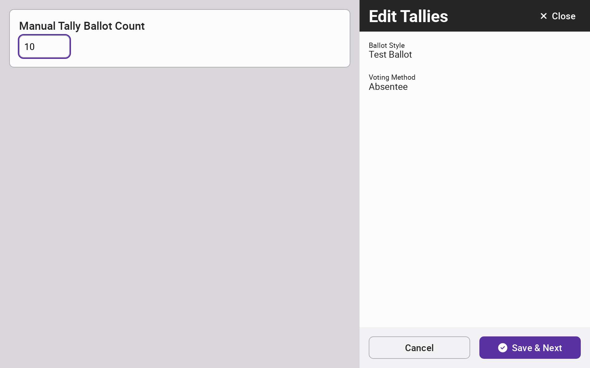
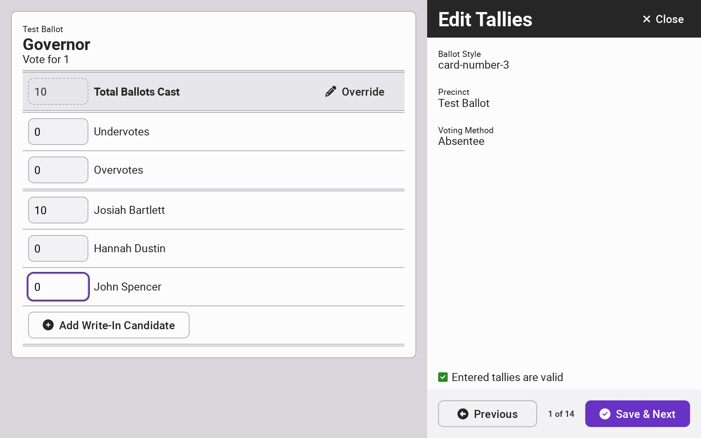

# Manual Tallies


The following steps must be completed by the Election Manager.


To enter tallies manually, select `Tally` from the side menu and then select the `Manual Tallies` tab.

<figure><figcaption></figcaption></figure>

Enter the Ballot Style, Precinct, and Voting Method of the ballots being added and select `Enter Tallies`. This step will be repeated for any additional ballot styles, precincts, and voting methods.

<figure><figcaption></figcaption></figure>

Start by entering the manual tally ballot count. By default, the manual tally ballot count is the same for all contests but can be overridden on a per-contest basis.

Then enter vote tallies for the first contest, entering undervotes and overvotes in addition to votes cast for each candidate or option. If a vote is for a write-in candidate, select `Add Write-In Candidate` to enter the name found on the ballot and add a tally. Select `Save & Next` to proceed to the next contest and repeat steps for all contests. Select `Finish` after entering vote tallies for the last contest.

<figure><figcaption></figcaption></figure> <figure><figcaption></figcaption></figure>

