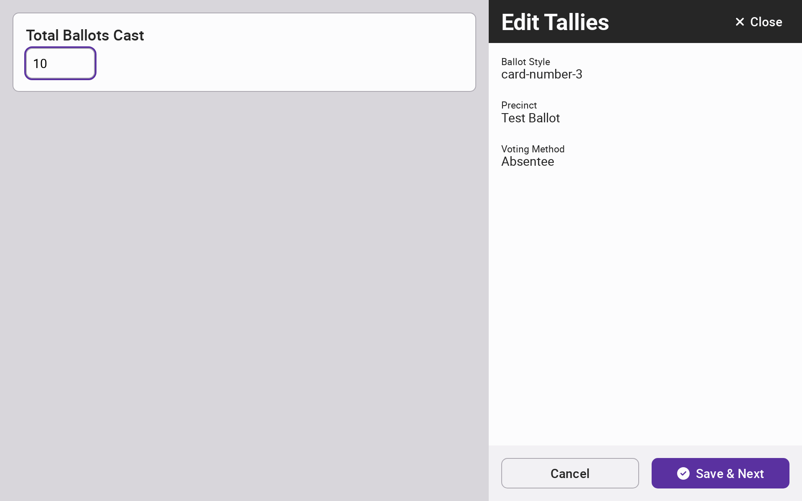

# Manual Tallies


The following steps must be completed by the Election Manager.


To enter tallies manually, select Tally from the side menu and then select the Manual Tallies tab.

<figure><figcaption></figcaption></figure>

 

<figure><figcaption></figcaption></figure>

Enter the Ballot Style, Precinct, and Voting Method of the ballots being added and select _`Enter Tallies`_. This step will be repeated for any additional ballot styles, precincts, and voting methods.

<figure><figcaption></figcaption></figure>

Start by entering the total ballots cast. By default, the total ballots cast is the same for all contests but can be overriden on a per-contest basis.&#x20;

Then enter vote tallies for the first contest, entering undervotes and overvotes in addition to votes cast for each candidate or option.  If a vote is for an unofficial write-in candidate, select _`Add Write-In Candidate`_ to enter the name found on the ballot and add a tally. Select _`Save & Next`_ to proceed to  next contest and repeat steps for all contests. Select _`Finish`_ after entering vote tallies for the last contest.

<figure><figcaption></figcaption></figure>

 

<figure><figcaption></figcaption></figure>

