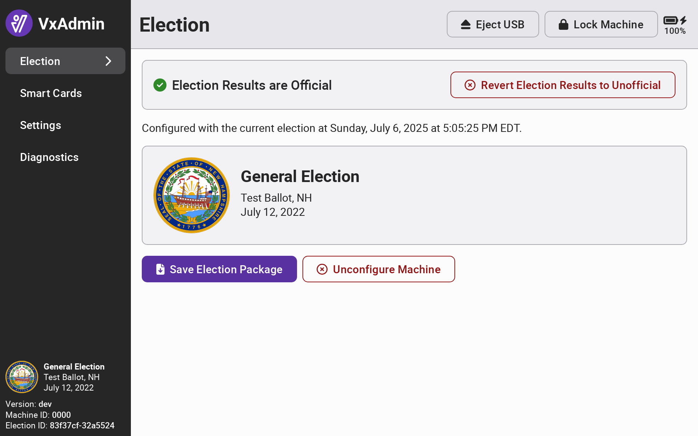

# Mark Results as Official


The following steps must be completed by an election manager.


When you are ready to certify election results, you can mark VxAdmin results as official to print official reports.&#x20;


Make sure that you've imported all CVR files, completed all adjudication, and added all manual tallies before proceeding.


To mark results as official, select _`Reports`_ from the side menu and select _`Mark Election Results as Official`._

<figure><figcaption></figcaption></figure>

&#x20;Confirm by selecting _`Mark Election Results as Official`._

<figure><figcaption></figcaption></figure>

All references to unofficial results in VxAdmin will be changed to official.&#x20;

<figure><figcaption></figcaption></figure> <figure><figcaption></figcaption></figure>

If you become aware of a mistake after marking results as official (say, you forgot to import one machine's CVRs), you can revert the results to unofficial as a system administrator. Log in as a system administrator and use the _`Revert Election Results to Unofficial`_ button.

<figure><figcaption></figcaption></figure>

Log out and log back in as an election manager to make the necessary edits and be sure to remark the results as official once done.
