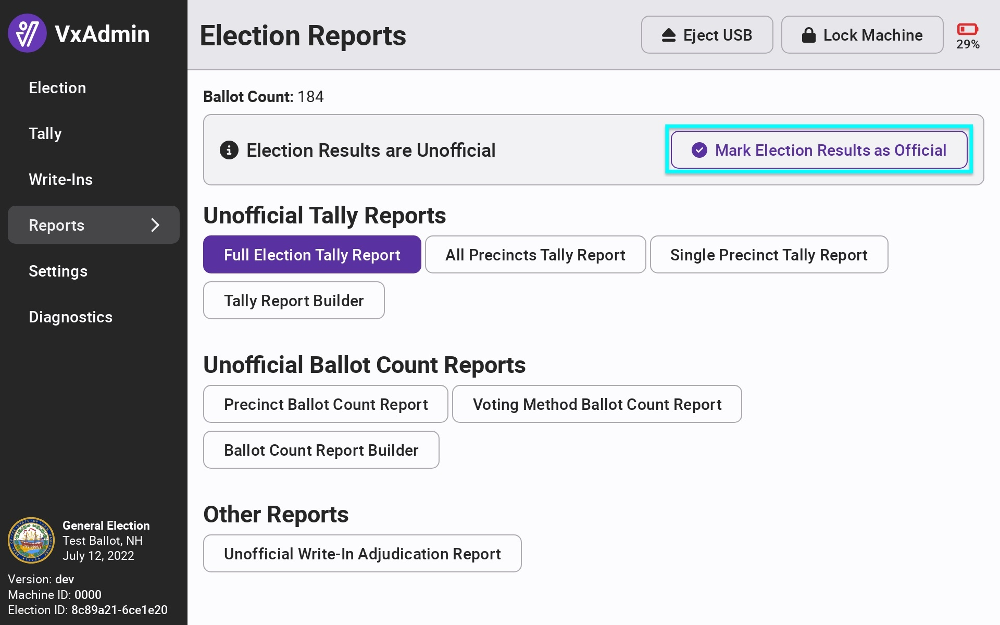
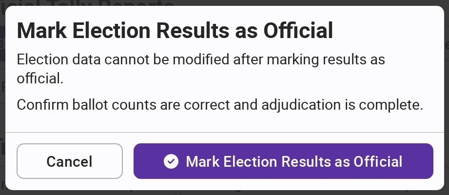
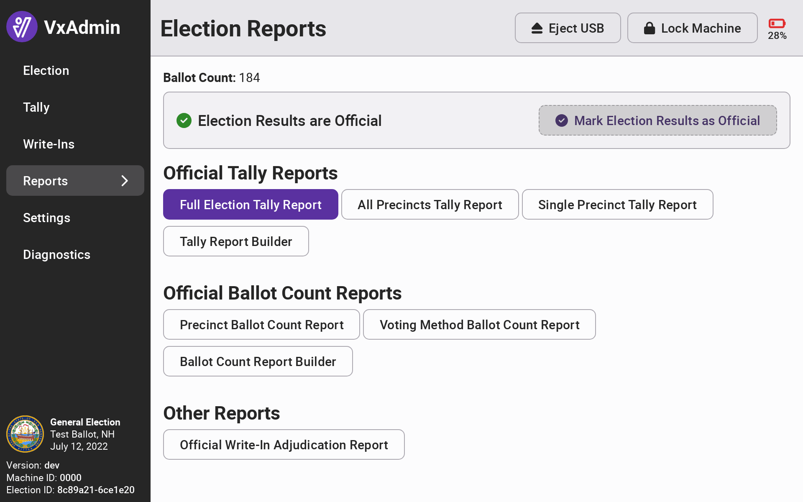
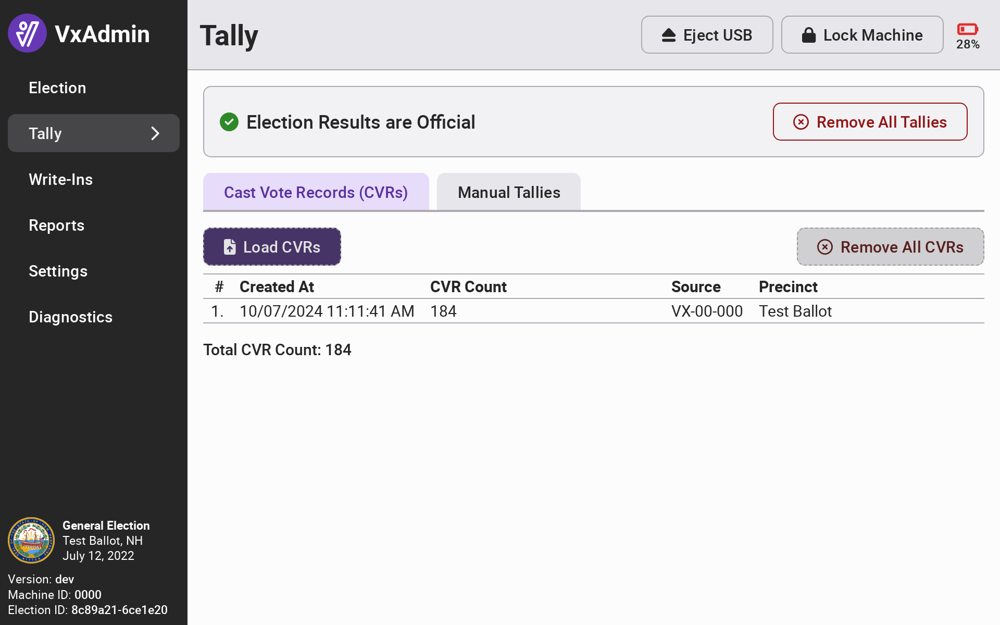

# Mark Results as Official


The following steps must be completed by the election manager.


When you are ready to certify election results, you can mark VxAdmin results as official to print official reports.&#x20;


You may not add additional CVR files, adjudicate write-ins, or add manual tallies after marking as official so please ensure you are ready to do so!


To mark results as official, select Reports from the side menu and select _`Mark Election Results as Official.`_

<figure><figcaption></figcaption></figure>

&#x20;Confirm by selecting _`Mark Election Results as Official.`_

<figure><figcaption></figcaption></figure>

All references to unofficial results in VxAdmin will be changed to official.&#x20;

<figure><figcaption></figcaption></figure>

 

<figure><figcaption></figcaption></figure>

