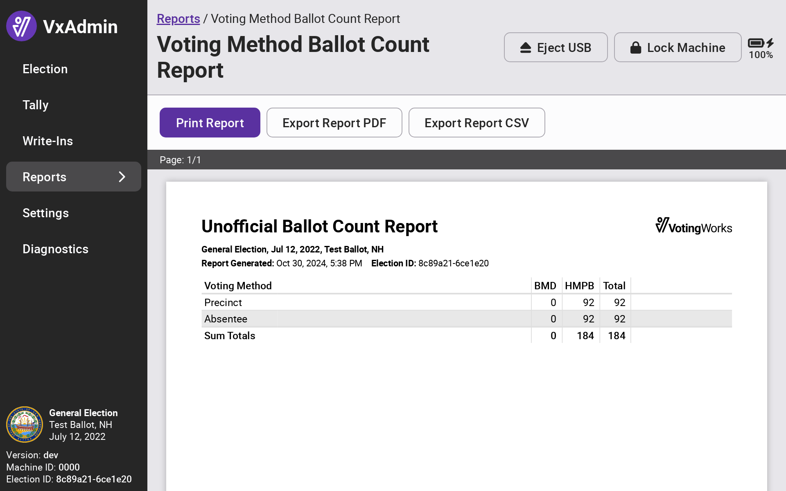

# Reports

## Full Election Tally Report

To review results, select Reports from the side menu and select _`Full Election Tally Report`._  A preview will appear. Select _`Print Report`_ to print the report, _`Export Report as PDF`_ to save the election tally report to a USB drive as a `.pdf` file, or _`Export Report CSV`_ to save the election tally report to a USB drive as a `.csv` file. Files will save to the `reports/` folder on the USB drive.

<figure><figcaption></figcaption></figure>

 

<figure><figcaption></figcaption></figure>


The tally report will include any total write-in count of one or more in a contest. If a specific write-in candidate has enough votes to be considered in the outcome of a contest, the report will list that candidate and their vote total. The tally report will not list every write-in adjudicated - the write-in adjudication report will have the full list.


### Tally Report Builder

The tally report builder allows you to create custom reports. These reports can be filtered or reported by precinct, district, ballot style, and more. To navigate to the tally report builder, select _`Tally Report Builder`_ from the Reports screen.

<figure><figcaption></figcaption></figure>

To create a filtered and/or grouped report:

1. Select _`Add Filter`_
2. Select Ballot Style, Batch, Precinct, or Scanner

<figure><figcaption></figcaption></figure>

 

<figure><figcaption></figcaption></figure>

3. Specify any specific ballot style(s), batch(es), precinct(s), or scanner(s)&#x20;
4. Select _`Add Filter`_ to add an additional filter as needed
5. Select how you'd like the report organized
6. Select _`Generate Report`_
7. Print or export the report as a .pdf or .csv file (if needed)

<figure><figcaption></figcaption></figure>

 

<figure><figcaption></figcaption></figure>

### Ballot Count Reports

Ballot count reports show the number of ballots cast. The ballot count report builder enables you to generate custom reports by precinct, district, ballot style, and more. An example of the Voting Method Ballot Count Report is on the right.

<figure><figcaption></figcaption></figure>

 

<figure><figcaption></figcaption></figure>

Ballot counts are recorded by type.  Manual are counts recorded in the Manual Tally process, BMD are ballots from the VotingWorks ballot marking device (VxMark), and HMPB are ballots hand marked by a voter and processed via VxScan or VxCentralScan.

### Write-In Adjudication Report

The write-in adjudication report presents how all write-ins were adjudicated and the count of votes for write-in candidates.

To print the report, select _`Unofficial Write-In Adjudication Report`_. An example of the write-in adjudication report is on the right.

<figure><figcaption></figcaption></figure>

 

<figure><figcaption></figcaption></figure>

### Example Reports

<figure><figcaption></figcaption></figure>

 

<figure><figcaption></figcaption></figure>

 

<figure><figcaption></figcaption></figure>

