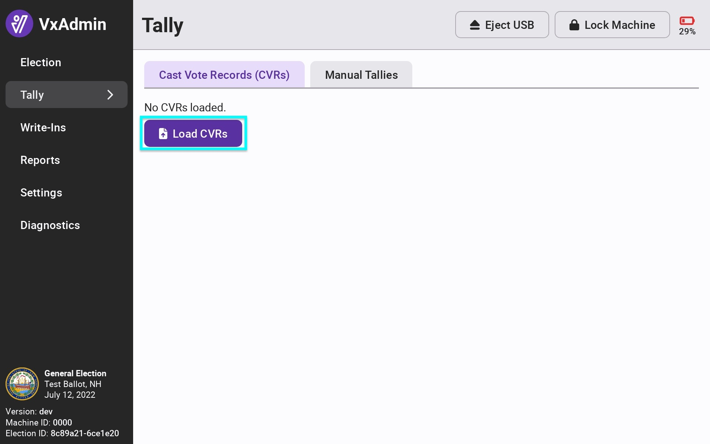
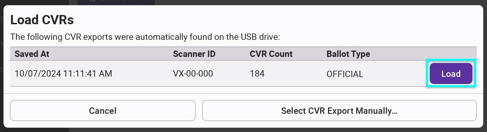
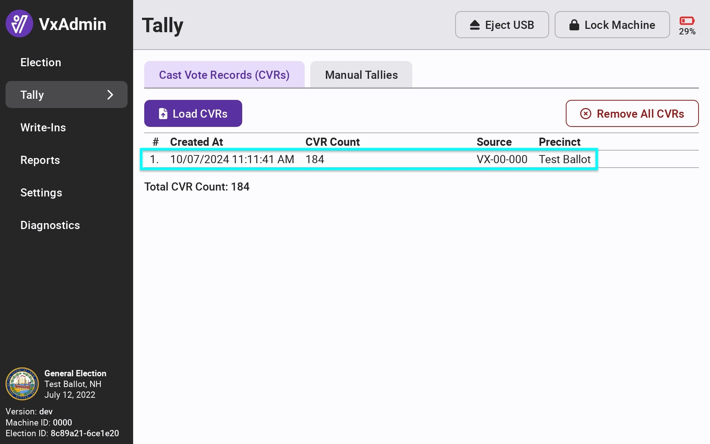

# Loading CVRs


The following steps must be completed by the election manager.


Navigate to the Tally screen by selecting Tally from the side menu. Select _`Load CVRs`_ to load the cast vote records.

One at a time, insert the USB drive(s) containing CVR exports from VxScan and VxCentralScan. A dialog box will pop up and show you all CVR exports on the USB drive. Select _`Load`_ next to the export (official ballots, correct number of ballots, correct time) you'd like to load.

<figure><figcaption></figcaption></figure>

 

<figure><figcaption></figcaption></figure>

After loading the CVR export, confirm that the timestamp, CVR count, and precinct(s) are as expected. Load CVR exports from all of your scanners, VxScan and VxCentralScan.&#x20;

<figure><figcaption></figcaption></figure>

