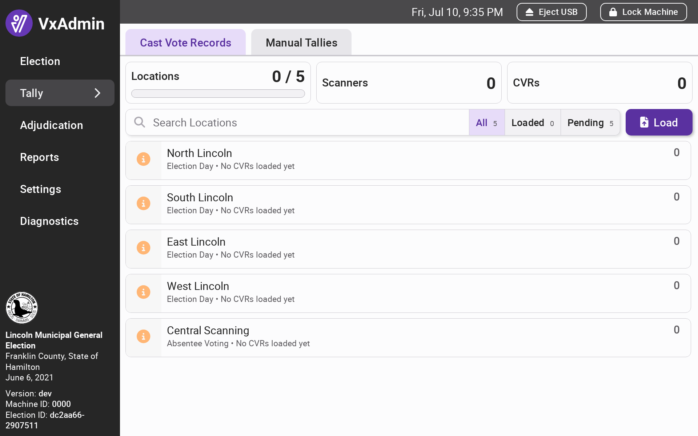
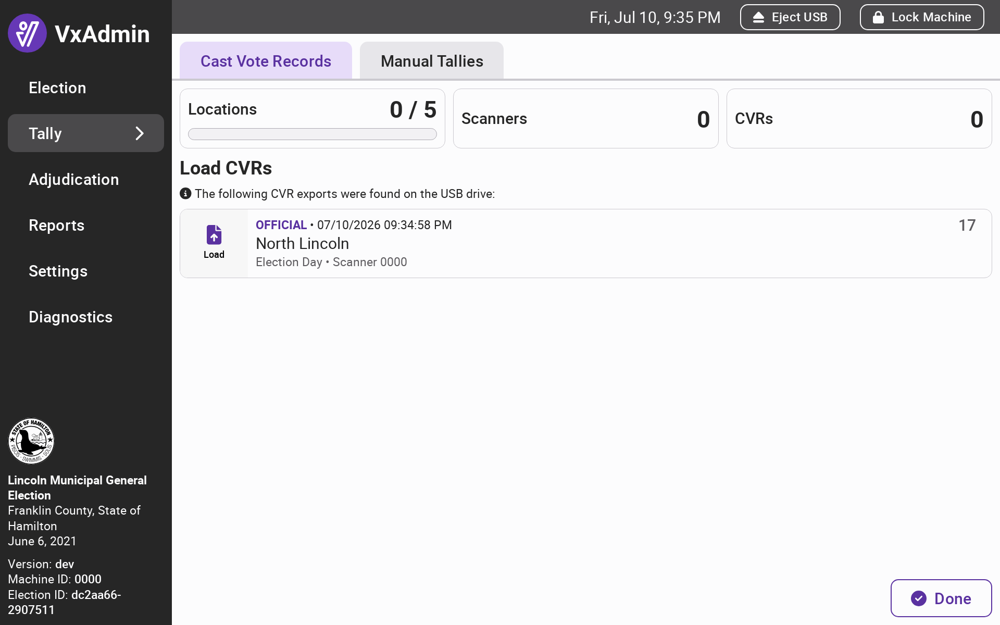
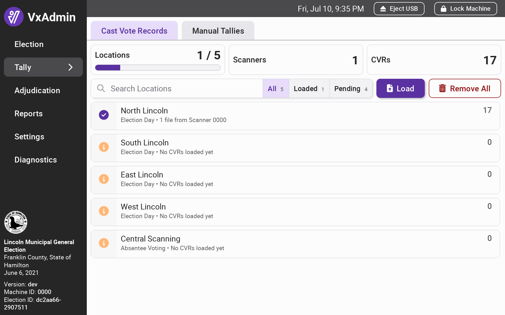

# Tally Results


The following steps must be completed by the election manager.


Navigate to the tally screen by selecting `Tally` from the side menu. You will see the list of polling places in your election. After loading all cast vote records, there should typically be results loaded for every single polling place. You may use the progress bar under "Locations" and the summary statistics next to "Scanners" and "CVRs" to monitor your progress.

Select `Load` to begin loading cast vote records. One at a time, insert each USB drive containing CVR exports from VxScan or VxCentralScan. The screen will display the list of all CVR exports on the USB drive. Often there will be only one export. If there are multiple, identify the correct export(s) by polling place, timestamp, or CVR count. Click the CVR export(s) you want to load.

<figure><figcaption></figcaption></figure> <figure><figcaption></figcaption></figure>

The selected CVR export should show as "Loaded". At this point, you may eject the USB drive and insert the next USB drive or, if you are done loading CVRs for now, select `Done`. Back on the list of polling places, confirm that each polling place shows as loaded with the expected number of CVRs. You may search the list of polling places by typing in the "Search Locations" bar. You may also filter the list of polling places to only those that have already been loaded by selecting `Loaded` or only those that have not been loaded by selecting `Pending`.

<figure><figcaption></figcaption></figure> <figure><figcaption></figcaption></figure>

