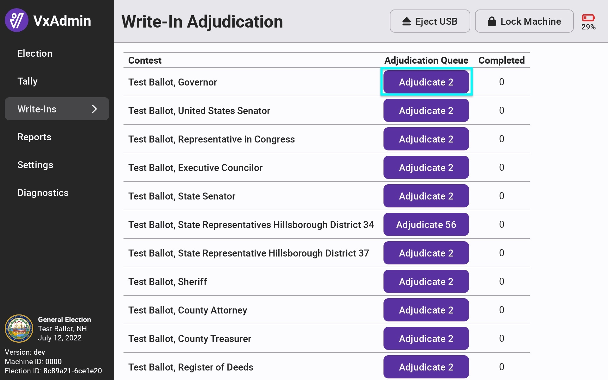
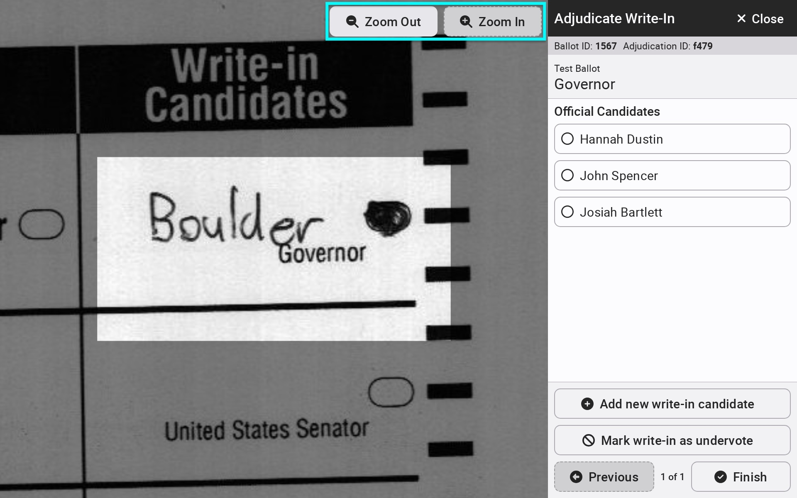
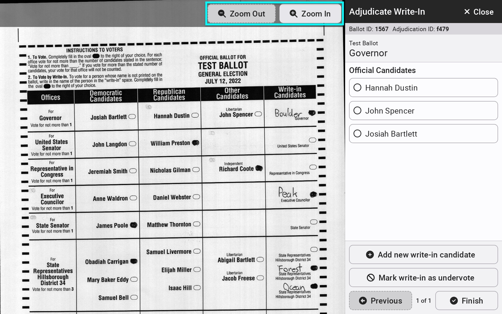
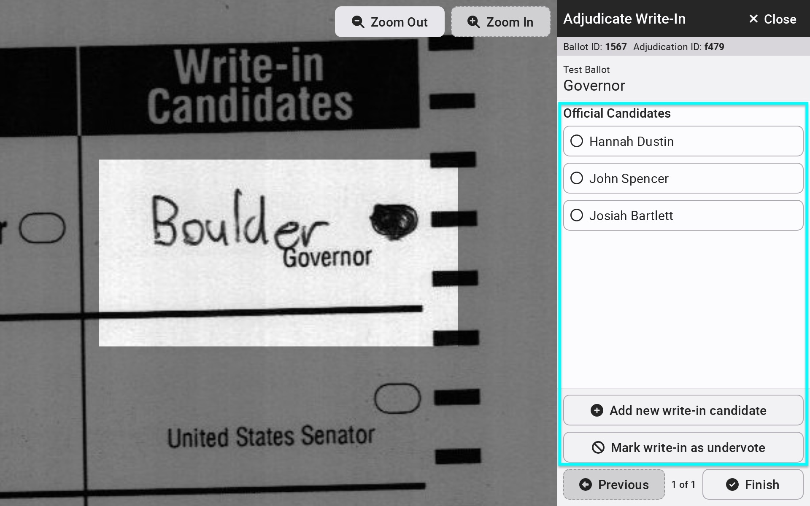
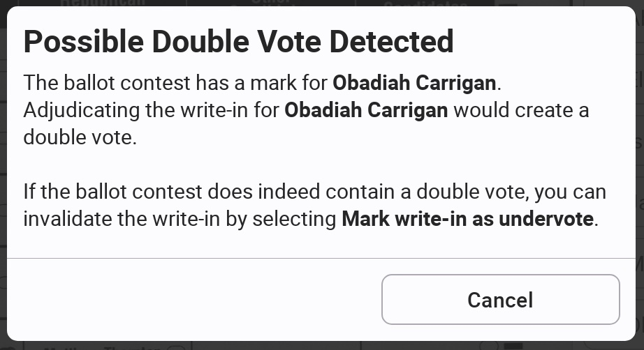
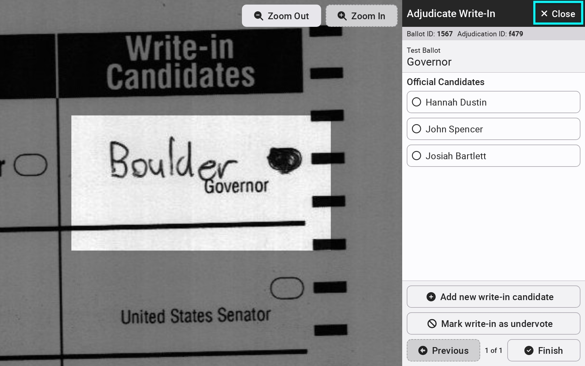

# Write-In Adjudication


The following steps must be completed by the election manager.


Ballots with a write-in bubble filled in or marks on the write-in line must be adjudicated in VxAdmin after CVRs have been loaded. To start the write-in adjudication process, log in with an election manager card and select Write-ins from the side menu.

If a contest had write-in votes cast, an _`Adjudicate x`_ button will appear to the right of the contest. The number indicates how many votes there are to adjudicate. Select _`Adjudicate x`_ to the right of the contest to start the adjudication process.&#x20;

<figure><figcaption></figcaption></figure>

The adjudication process is the identification of what the voter wrote in the write-in space. The contest area will be highlighted for each ballot. Select _`Zoom Out`_ to see the entire ballot or a larger view of the written vote. Select _`Previous`_ or _`Next`_ to move to or go back to a write-in.

<figure><figcaption></figcaption></figure>

 

<figure><figcaption></figcaption></figure>

The screen will display buttons for each of the official candidates on the ballot. If the voter wrote in an official candidate, simply select the correct one to award the vote to that candidate. If the voter wrote in a candidate not on the ballot, select _`Add new write-in candidate`_ to enter the name. Once recorded, a button is created for that name and can be selected if written in on another ballot.  Select _`Mark write-in as undervote`_ to mark a name not allowed under state law or rule, a stray mark, an empty space, or any other invalid entry as invalid.

<figure><figcaption></figcaption></figure>


As more candidates are added, scrolling will be required to view all selections.


If the write-in is for an official candidate and the system also detects a mark for the official candidate, the following message will appear to prevent double votes:\

<figure><figcaption></figcaption></figure>

After finishing adjudication for all write-ins in a contest, select _`Finish`_ to return to the contest menu or select _`Close`_ to return to the contest menu at any time.

<figure><figcaption></figcaption></figure>


Write-in votes without the bubble marked are not included in tally reports until their vote is assigned via adjudication. They will always appear in the write-in adjudication report.

