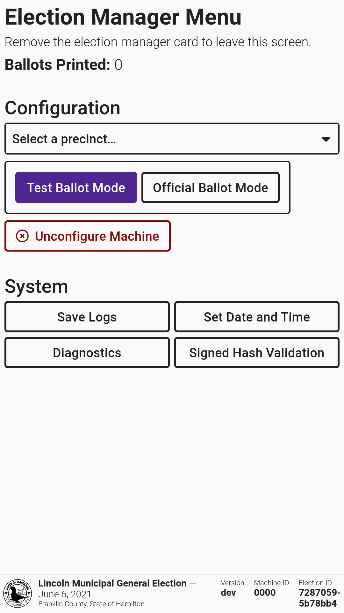

# L\&A Overview

Logic & accuracy testing (L\&A) is meant to ensure that every component of the voting system is operating as expected and has been configured properly for a specific election. Testing rules vary by jurisdiction. The following functions may be useful as tests are conducted and are referenced in the [l-and-a-testing-checklist.md](l-and-a-testing-checklist.md "mention").

### VxAdmin Tally Report&#x20;

Before starting the testing process, using an election manager card, confirm VxAdmin does not have CVRs loaded. Select _`Reports`_ from the side menu and select _`Full Election Tally Report`_ to print a "zero" report.

<figure><figcaption></figcaption></figure>

### Test Ballot vs. Official Ballot Mode&#x20;

VxScan, VxCentralScan, and VxMark can be placed into test ballot mode to only accept test ballots. VxScan and VxCentralScan default to test mode after configuration.


You may scan official ballots in test mode if your election package has the system setting `allowOfficialBallotsInTestMode` enabled. This setting is used for jurisdictions that only print official ballots.


In VxScan, insert an election manager card and select the correct mode.&#x20;

<figure><figcaption></figcaption></figure>

In VxCentralScan, insert an election manager card, select _`Settings`_ from the side menu, and select the correct mode.

<figure><figcaption></figcaption></figure>

In VxMark, insert an election manager card and select the correct mode.

<figure><figcaption></figcaption></figure>


A callout is displayed on machines when in test ballot mode.


<figure><figcaption></figcaption></figure> <figure><figcaption></figcaption></figure>

