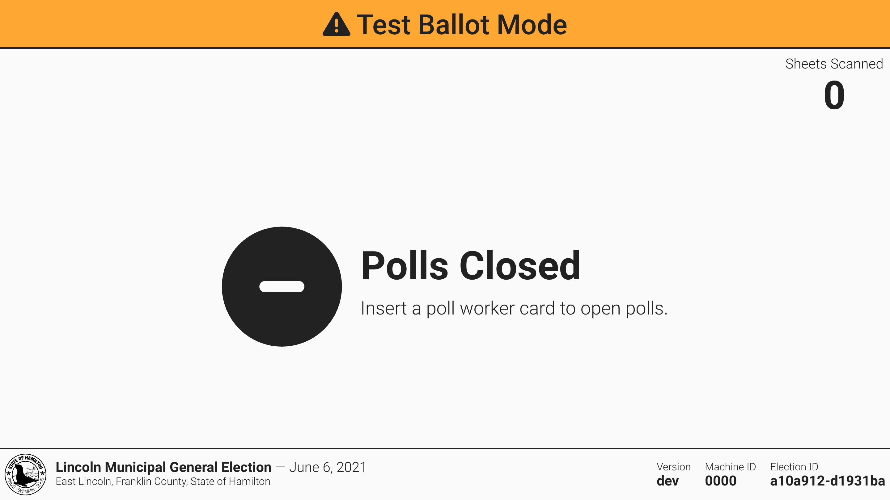

# L\&A Overview

Logic & accuracy testing (L\&A) is meant to ensure that every component of the voting system is operating as expected and has been configured properly for a specific election. Testing rules vary by jurisdiction. The following functions may be useful as tests are conducted and are referenced in the [l-and-a-testing-checklist.md](l-and-a-testing-checklist.md "mention").

### VxAdmin Tally Report

Before starting the testing process, using an election manager card, confirm VxAdmin does not have CVRs loaded. Select `Reports` from the side menu and select `Full Election Tally Report` to print a "zero report."

<figure><figcaption></figcaption></figure>

### Test Ballot vs. Official Ballot Mode

VxScan, VxCentralScan, VxMark, VxMarkScan, and VxPrint can be placed into test ballot mode to accept or produce only test ballots. Each of these apps defaults to test mode after configuration, with the exception of VxPrint.


You may scan official ballots in test mode if your election package has the system setting `allowOfficialBallotsInTestMode` enabled. This setting is used for jurisdictions that only print official ballots.


If any device is not in test ballot mode, toggle the ballot mode on the election manager menu for VxScan, VxMark, or VxMarkScan or on the `Settings` page for VxCentralScan or VxPrint. A test mode banner is displayed on the top of the screen while in test ballot mode:

<figure><figcaption></figcaption></figure>
