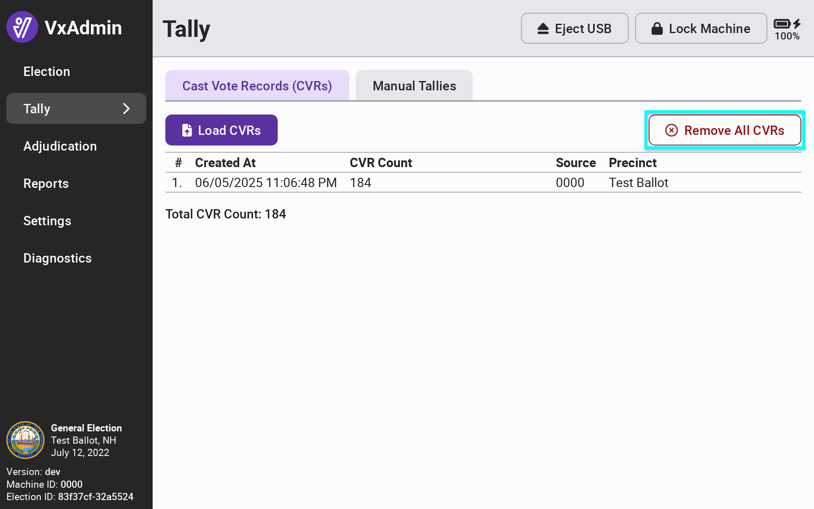
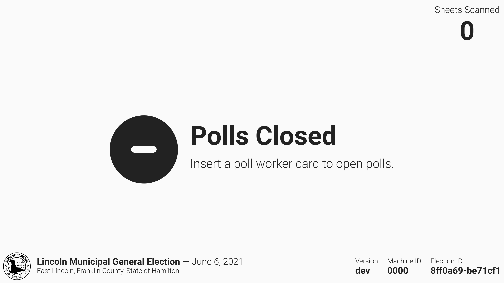

# L\&A Cleanup

### Remove CVRs from VxAdmin

When L\&A is complete, select _`Tally`_ from the side menu, then select _`Remove CVRs`_ to clear VxAdmin of CVRs to prepare for election day. Confirm by selecting _`Remove CVRs`_ in the popup confirmation screen.

<figure><figcaption></figcaption></figure>

### Toggle VxScan to Official Ballot Mode

If you used test ballot mode to conduct your L\&A be sure to put VxScan into official ballot mode. Insert the election manager card into VxScan and select _`Official Ballot Mode`_.

If you used _`Official Ballot Mode`_ to conduct your L\&A, simply toggle to _`Test Ballot Mode`_ and back to _`Official Ballot Mode`_ to reset VxScan for election day.

<figure><figcaption></figcaption></figure>

Remove the election manager card and confirm that the VxScan is in official ballot mode by checking that there is no orange _Test Ballot Mode_ banner, _Polls Closed_ is displayed, and the _Sheets Scanned_ count is 0.

<figure><figcaption></figcaption></figure>


A USB drive is required to use VxScan on election day. After testing, you may re-insert the USB drive used during testing or a new USB drive into the USB port and seal the machine until a poll worker accesses it on election day. If official ballot mode was used, we strongly recommend using a new USB drive for election day.&#x20;


### Toggle VxCentralScan to Official Ballot Mode

If you used test ballot mode to conduct your L\&A be sure sure to put VxCentralScan into official ballot mode. Insert an election manager card, select _`Settings`_ from the side menu and then tap _`Official Ballot Mode`_.

If you used _`Official Ballot Mode`_ to conduct your L\&A, simply toggle to _`Test Ballot Mode`_ and back to _`Official Ballot Mode`_ to reset VxCentralScan for election day.

<figure><figcaption></figcaption></figure>

### Toggle VxMark to Official Ballot Mode

If you used test ballot mode to conduct your L\&A be sure to put VxMark into official ballot mode. To change modes, insert your election manager card and select _`Official Ballot Mode`_.

If you used _`Official Ballot Mode`_ to conduct your L\&A, simply toggle to _`Test Ballot Mode`_ and back to _`Official Ballot Mode`_ to reset VxMark for election day.

<figure><figcaption></figcaption></figure>
