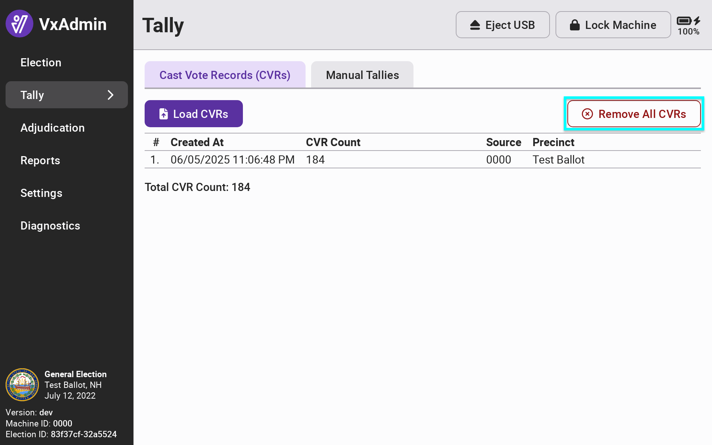
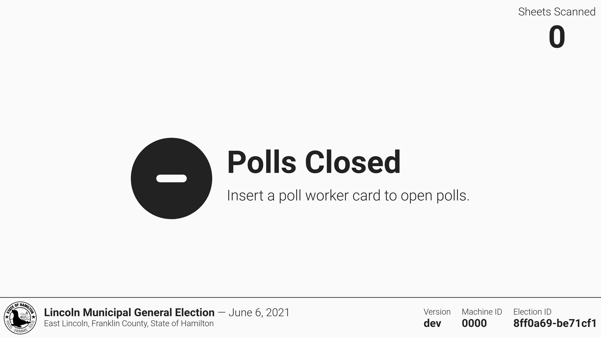
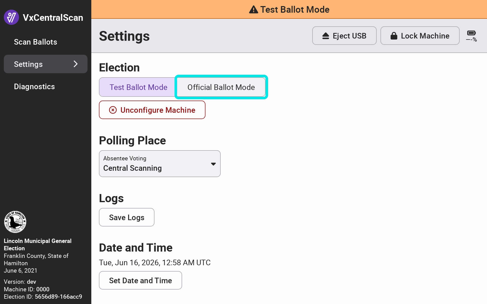

# L\&A Cleanup

### Remove CVRs from VxAdmin

When L\&A is complete, select `Tally` from the side menu, then select `Remove All CVRs` to clear VxAdmin of CVRs to prepare for election day. Confirm by selecting `Remove All CVRs` in the popup confirmation screen.

<figure><figcaption></figcaption></figure>

### Toggle VxScan to Official Ballot Mode

If you used test ballot mode to conduct your L\&A be sure to put VxScan into official ballot mode. Insert the election manager card into VxScan and select `Official Ballot Mode`.

<figure><figcaption></figcaption></figure>

If you used official ballot mode to conduct your L\&A, simply toggle to test ballot mode and back to official ballot mode to reset VxScan for election day.

Remove the election manager card and confirm that the VxScan is in official ballot mode by checking that there is no orange "Test Ballot Mode" banner, that "Polls Closed" is displayed, and that the "Sheets Scanned" count is 0.

<figure><figcaption></figcaption></figure>


A USB drive is required to use VxScan on election day. After testing, you may re-insert the USB drive used during testing or a new USB drive into the USB port and seal the machine until a poll worker accesses it on election day. If official ballot mode was used, we strongly recommend using a new USB drive for election day.


### Toggle All Devices to Official Ballot

If you used test ballot mode to conduct your L\&A be sure sure to put all devices into official ballot mode. Toggle the ballot mode on the election manager menu for VxScan, VxMark, or VxMarkScan or on the `Settings` page for VxCentralScan or VxPrint.&#x20;

<figure><figcaption></figcaption></figure> <figure><figcaption></figcaption></figure>

If you used official ballot mode to conduct your L\&A, simply toggle to test ballot mode and back to official ballot to reset counters.
