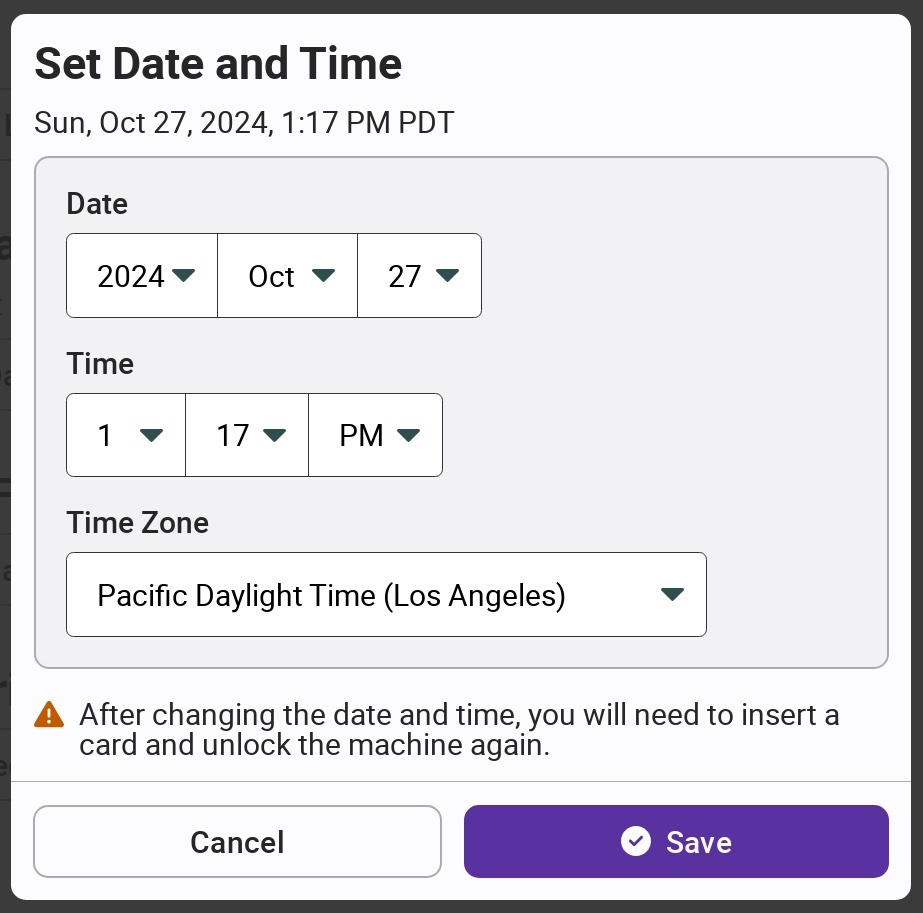

# Setting Date & Time

Because VotingWorks machines do not connect to an external network, the internal clocks may drift slightly. Over time, this can lead to report timestamps being out of date or authentication failures. As a result, a system administrator or election manager should check the date and time of each machine during pre-election setup or logic and accuracy testing and update the time if necessary.


The time is automatically updated for daylight savings time.


The `Set Date and Time` button is in the settings menu on VxAdmin, VxCentralScan, and VxPrint. On VxScan, VxMark, and VxMarkScan, it's on the election manager and system administrator menus. Within the VxScan election manager menu, the button is in the "More" tab.

Update the date and time and select `Save`.

<figure><figcaption></figcaption></figure>
