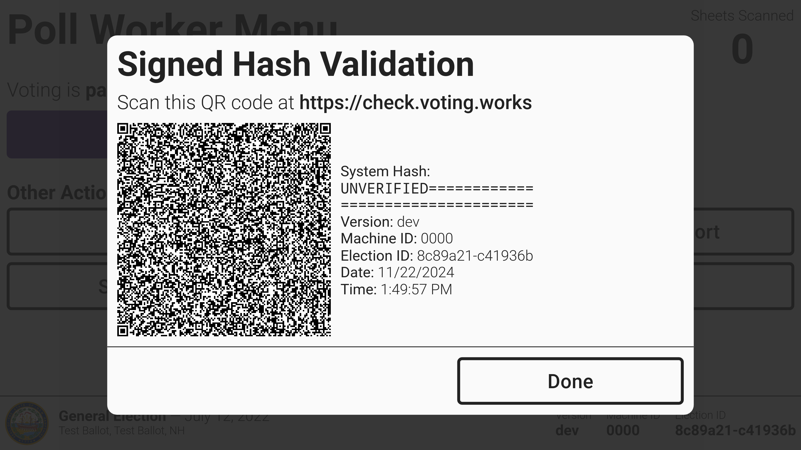

# Signed Hash Validation

VotingWorks applications provide additional system security by allowing you to confirm the software is the same as the certified version. The feature is available on all machines for all authenticated user. On VxAdmin and VxCentralScan, the _`Signed Hash Validation`_ button is in the **Settings** menu. On VxMarkScan and VxScan, the _`Signed Hash Validation`_ button is on the main menu for each user type. For an election manager on VxScan, navigate to the **More** tab. After selecting the button, the machine will generate the hash and display it in the form of a QR code.

<figure><figcaption></figcaption></figure>


The image above is taken from a development unit, so it does not have a full system hash.


Navigate to[ https://check.voting.works](https://check.voting.works) on your phone and scan the QR code. The site will validate the QR code data and verify the software is the same as the certified version.

<figure><figcaption></figcaption></figure>


