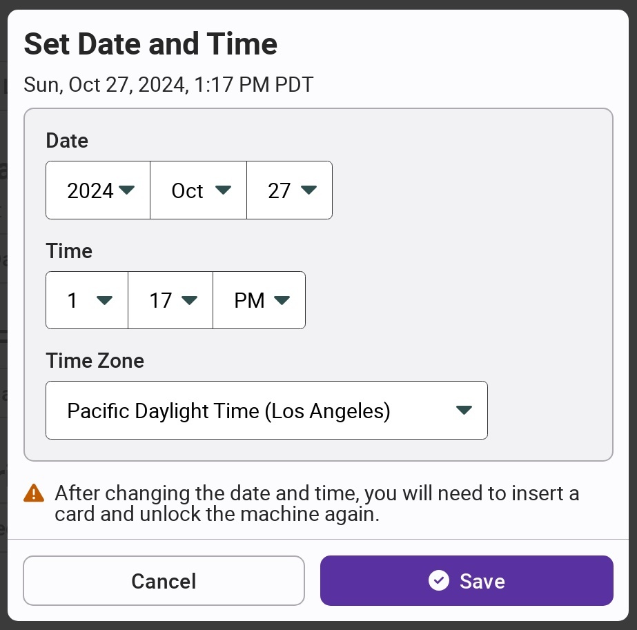

# Setting Date & Time

Because all VotingWorks machines are not connected to any kind of network, the internal clocks may drift slightly. Over time, this can lead to report timestamps being out of date or authentication failures. As a result, a system administrator or election manager should check the date and time of each machine during pre-election setup or logic and accuracy testing and update the time if necessary.


The time is automatically updated for daylight savings time.


The _`Set Date and Time`_ button is accessible from the _Settings_ menu on VxAdmin and VxCentralScan and on the main election manager and system administrator menus in VxScan and VxMark. On VxScan, the button can be found in the _More_ tab.

Update the date and time as appropriate and select _`Save`_.

<figure><figcaption></figcaption></figure>
