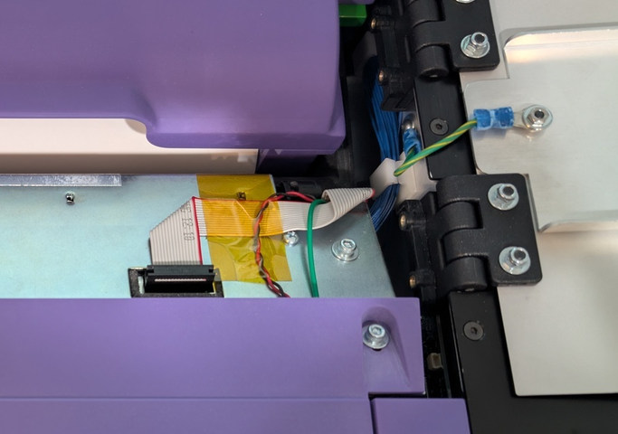

# VxScan Maintenance Manual

For reference information on VxScan, see the following links:

* **Hardware Overview -** [VxScan Hardware](https://app.gitbook.com/s/Z4bC0rbmogHEUUuMLAUa/system-overview/vxscan-hardware "mention")
* **Software Functionality -** [VxScan Function](https://app.gitbook.com/s/Z4bC0rbmogHEUUuMLAUa/system-overview/vxscan-function "mention")

## Hardware Maintenance

Review the warnings and cautions listed below first. Then below that, find specific recommendations about scanner cleaning, printer paper, and other maintenance.

### Warnings

1. The user should **never** try to perform complex repairs on VxScan.
2. The top and bottom panel are sealed. The screen and the speaker are sealed under the top panel, and the computer and USB hub are sealed under the bottom left panel. The seals and panels should **not** be removed by end users. Only VotingWorks should perform repairs that require removing panels.
3. Users are expected to keep the scanner clean, the printer paper loaded, and the screen and USB ports clean.
4. **Never** disconnect the cables inside the unit, which can be seen after opening the poll worker door and scanner access door (see photo below). Users should never need to handle these cables. They should never handle them while the unit is plugged in. These cables are normally connected securely and safely. However, if any of these cables are disconnected or loosened in any way, then note how it happened and how the machine was behaving at the time, and then contact VotingWorks with these details to confirm how to proceed. If the power was on when a cable was disconnected, then power down the machine before continuing to use it or before making any more changes. If the power was off when a cable was disconnected, still confer with VotingWorks before proceeding.

<figure><figcaption>
Do not disconnect, cut, unplug, or remove these cables or wires.
</figcaption></figure>

### Scanner Cleaning

The scanner should be cleaned for every election before pre-election testing and again after pre-election testing. For instructions, see [scanner-management.md](../vxscan/scanner-management.md "mention") in the user manual. VotingWorks recommends using Ricoh Cleaner F1 (PN: PA03950-0352) with cleaning wipes (PN: CG90000-120001) or equivalent. Other scanner-specific cleaning fluids or greater than 70% isopropyl alcohol can be used for the cleaning fluid. A microfiber or lint-free cloth can be used for the wipe. You may also blow out paper dust from the scanner with compressed air after wiping.

If the software detects streaks in a scanned ballot, the user will be alerted and prompted to clean the scanner. To identify streaks proactively, an election manager or system administrator can perform a test scan in the diagnostics interface. For instructions, see the [vxscan-diagnostics.md](../vxscan/vxscan-diagnostics.md "mention") article.

If the scanner is not used for an election, then the scanner should still be cleaned after approximately 15,000 scans or every 6 months, whichever comes first. After 100,000 scans, it is recommended that the scanner rollers are inspected and cleaned using wipes and alcohol as mentioned above, if they were not cleaned previously.

### Printer Paper Management

VxScan features a full letter-width report printer. In order for VxScan to print reports, it must be properly loaded with a thermal paper roll. Polls cannot be opened or closed without the paper installed. The thermal paper rolls are provided by VotingWorks. While it is possible to use thermal rolls from another vendor that meet the requirements specified in the [approved-parts-list.md](approved-parts-list.md "mention"), it is not recommended.

The thermal paper rolls are 78' in length. The amount of paper used will depend on the number of reports printed and the number of contests appearing on the report. 78' is enough for an entire election, including pre-election testing, in almost all cases. VotingWorks recommends replacing the thermal paper roll once for each election. Customers may choose to re-use rolls between elections but, in doing so, greatly increase the risk of running out of paper in the middle of an election. In those situations, an unprepared poll worker may have to replace paper or wait for an election administrator.

Replacing the paper roll is generally performed by an election manager, but may also be performed by a system administrator, a technician, or in rare cases a poll worker. The application guides the user through the paper loading flow. For additional instructions, see the [printer-management.md](../vxscan/printer-management.md "mention") article in the user manual.

When the scanner is not in use between elections, the thermal paper roll should be left loaded in the scanner to protect the thermal printer head.

### Other Maintenance Tasks

VotingWorks recommends cleaning the screen and USB ports as needed. The screen can be cleaned by gently wiping with cleaning wipes such as ULINE S-12236 or equivalent. The USB ports can be cleaned by blowing them with air in a can, such as ULINE S-6771 or equivalent, from a distance of at least one foot. Read all manufacturer safety instructions before using air in a can.

### Long-Term Hardware Maintenance

To keep a VxScan machine functioning smoothly over many years, it is recommended to service it periodically after every 100,000 scans or every 3 years, whichever comes first.  At these intervals, the following preventative maintenance tasks can be done:

1. [Clean the scanner glass and rollers](vxscan-maintenance-manual.md#scanner-cleaning). (Can be done by customer)
2. [Recalibrate the image sensors](../vxscan/scanner-management.md#image-sensor-calibration). (Can be done by customer)
3. Test the scanner speed. Recalibrate its speed if needed. (Should be done by VotingWorks technician)

Contact VotingWorks support staff to schedule help with long-term maintenance tasks.

## Ballot Box (VxBox) Maintenance

The ballot box that works with VxScan requires little maintenance, but it should be inspected and cleaned as needed for every election before pre-election testing and again after pre-election testing.  Inspection confirms that it works as expected and checks for debris in or on the ballot box.  Cleaning should remove debris from inside the ballot ballot box bag and inside the emergency bin.  The plastic surfaces can also be wiped down with a lint-free wipe, or equivalent.

## Software Maintenance

There are no required steps for maintaining the software or firmware. The software is installed by VotingWorks and cannot be modified. The underlying databases for all applications are self-maintaining and do not need to be tuned by end users.

## Data Maintenance

As VxScan is used for an election, it will gradually be storing more and more ballot data. As long as users remain within the specified [System Limits](https://app.gitbook.com/s/Z4bC0rbmogHEUUuMLAUa/system-performance-and-specifications/system-limits "mention") they should not exceed the data limits on VxScan. The free disk space available on VxScan is visible to system administrators and election managers by selecting _`Diagnostics`_ from the side menu.

When the machine is unconfigured or ballot data is cleared, disk space will be recovered. The free disk space may not appear to return to 100% but old files will eventually be replaced by new files and the disk space will be re-used.

VotingWorks recommends that all cast vote records are backed up to a USB drive before being cleared from the application. As ballots are scanned, cast vote records are automatically backed up to the attached USB drive. If an additional backup is required, an election manager can separately save CVRs.

## Maintenance Support & Spare Recommendations

VotingWorks recommends having scanner cleaning supplies immediately available at all times. If streaking is detected in the scanned images, the scanner will have to be cleaned to continue scanning. In order to avoid delays in voting, scanning cleaning supplies should be at all voting locations.

VotingWorks recommends having extra thermal paper rolls easily available at all times. If thermal paper runs out, the polls cannot be opened or closed until paper is reloaded. Pre-election testing typically prevents paper issues, but it may still occur when election managers do not load new rolls for each election. Extra thermal paper rolls should either be available at every voting location or transportable to voting locations within a reasonable time window.
