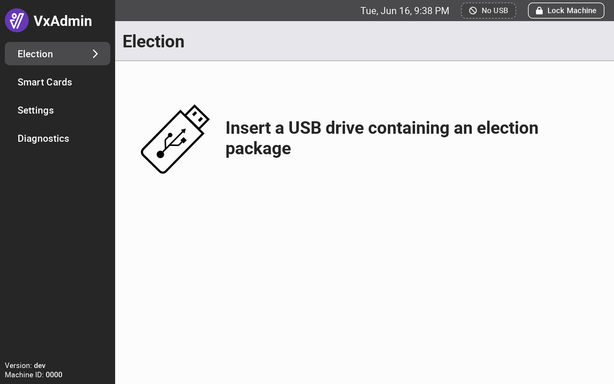
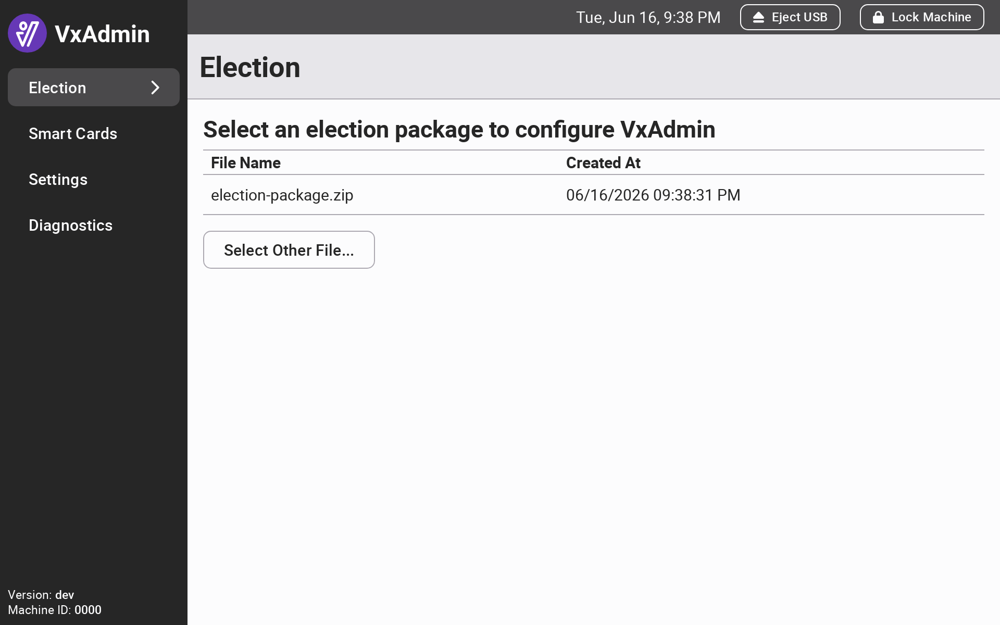
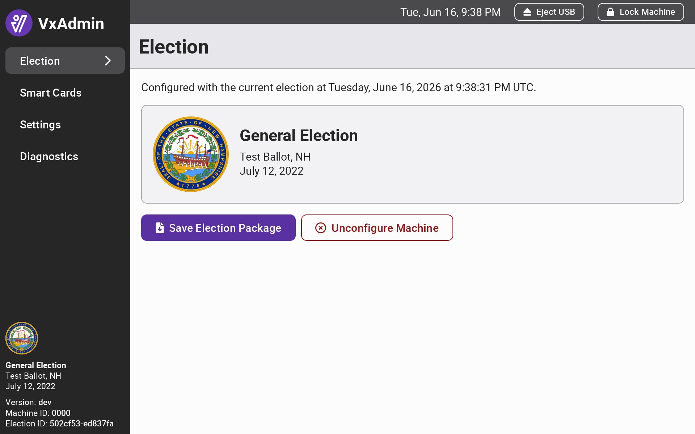
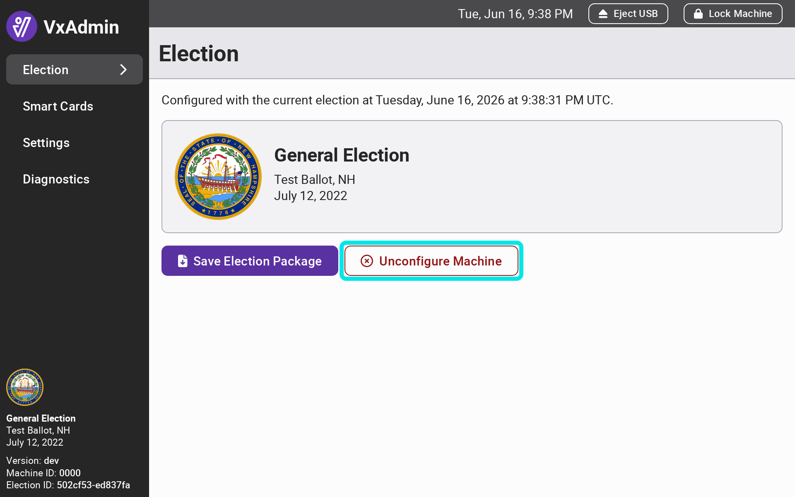
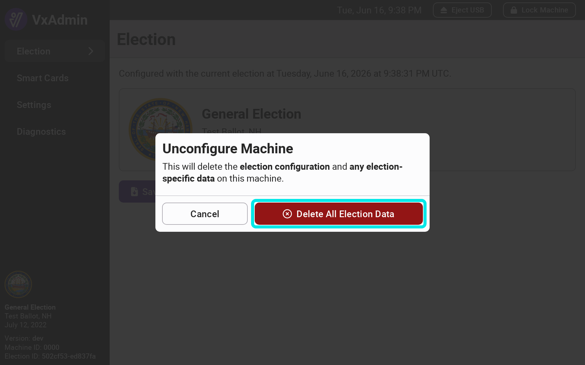

# Configure VxAdmin

For each election, you will configure VxAdmin by loading an election package provided by VotingWorks or downloaded from VxDesign. The [full election package specifications](https://app.gitbook.com/s/Z4bC0rbmogHEUUuMLAUa/system-overview/election-package) can be found in the technical data package.


The following steps must be completed by a system administrator.


## Load Election Package

When VxAdmin is not configured, the screen will prompt you to insert a USB drive containing an election package. After inserting the USB drive, VxAdmin will automatically list the election package(s) available. Select the file name of the correct election package to configure VxAdmin. If the file is not automatically listed, select `Select Other File...` and manually select the file from the USB drive.

Once configured, the election screen will display the title and date of your election as well as the date and time VxAdmin was configured.

<figure><figcaption></figcaption></figure> <figure><figcaption></figcaption></figure> <figure><figcaption></figcaption></figure>

## Remove Election

If you need to change an election package or reset VxAdmin for the next election, you must unconfigure the machine.

Select `Election` from the side menu and select `Unconfigure Machine`.

<figure><figcaption></figcaption></figure> <figure><figcaption></figcaption></figure>

After confirming by selecting `Delete All Election Data` , you will return to the initial VxAdmin `Election` screen. VxAdmin can be reconfigured by loading a new election package by repeating the steps above.
