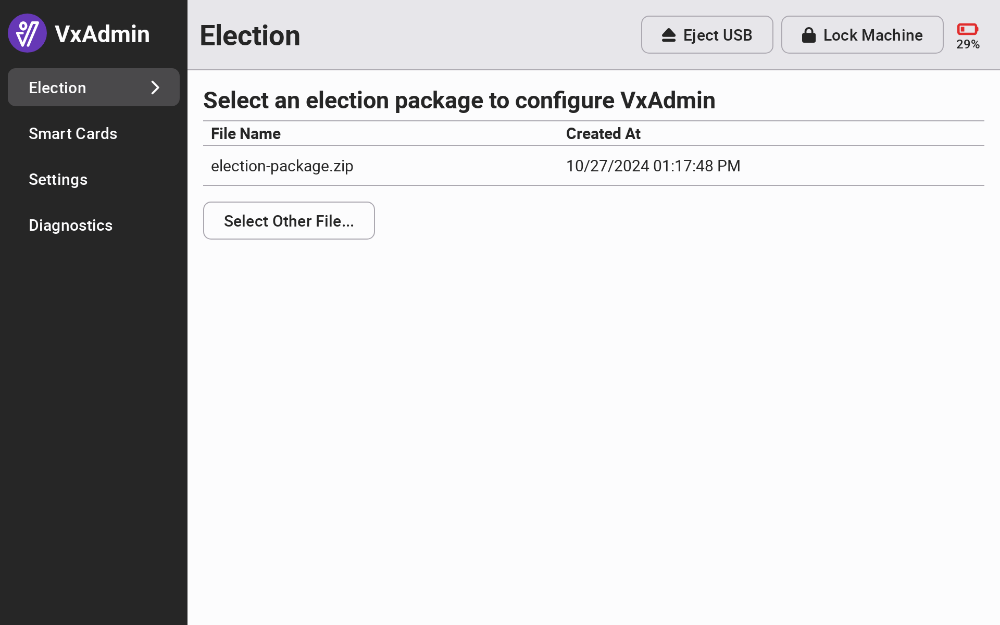

# Configure VxAdmin


The following steps must be completed by a system administrator.


For each election, you will configure VxAdmin by loading an election package provided by VotingWorks or downloaded from VxDesign.&#x20;

## Load Election Package

When VxAdmin is not configured, the screen will prompt you to **Insert a** **USB drive containing an election package.** After inserting the USB drive, VxAdmin will automatically list the election package(s) available. Select the file name of the correct election package to configure VxAdmin. If the file is not automatically listed, click _`Select Other File...`_ and manually select the file from the USB drive.&#x20;

Once configured, the election screen will display the title and date of your election as well as the date and time VxAdmin was configured.

<figure><figcaption>
System administrator election screen before configuring
</figcaption></figure>

 

<figure><figcaption>
System administrator election screen listing available election packages
</figcaption></figure>

 

<figure><figcaption>
System administrator election screen once configured
</figcaption></figure>

## Remove Election

If you need to change an election package or reset VxAdmin for the next election, you must unconfigure the machine.

Select Election from the side menu and select _`Unconfigure Machine`_.

<figure><figcaption>
Unconfiguring VxAdmin
</figcaption></figure>

After confirming the removal of the election package and results data, you will return to the initial VxAdmin Election screen. VxAdmin can be reconfigured by loading a new election package by repeating the steps above.


If at any point, the VxAdmin laptop becomes unresponsive, simply press the power button for one second and release. Don't hold the button down. Once the laptop has shutdown, press the power button again to restart.

