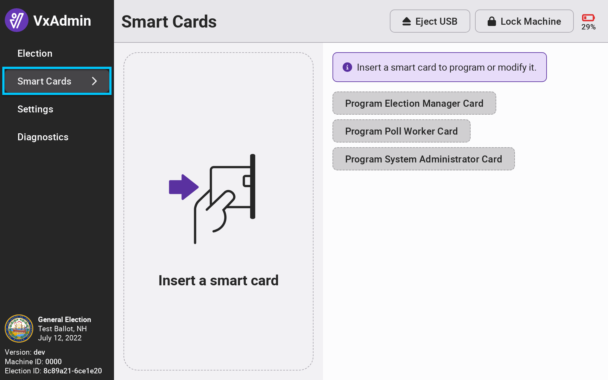

# Smart Cards and User Roles


The following steps must be completed by a system administrator.


## Overview

Smart cards are used to configure and operate equipment. It's the same technology as the chip in your credit card, but is instead used to provide election administrators and poll workers a secure means to configure and operate the equipment. There are three user roles and cards: system administrator, election manager, and poll worke&#x72;**.**

<figure><figcaption>
Smart cards
</figcaption></figure>

### System Administrator

System administrator cards allow an election administrator to load an election definition, program smart cards, and remove the election definition from VxAdmin.

System administrator cards are typically only used at the very beginning and very end of an election. Keep this card in a secure location when not in use and in between elections.


System administrators should be an election administrator (central election official, administrator, etc.) or their designee who is in charge of the voting system.

The technical skill level required for this role is a 6-hour training session provided by VotingWorks.


### Election Manager&#x20;

Election manager cards allow election administrators to use central system devices and configure precinct system devices. Election managers are responsible for:

* configuring and unconfiguring precinct equipment
* preparing machines for pre-election testing
* preventative maintenance tasks
* general equipment troubleshooting
* centrally scanning ballots
* managing cast vote records
* adjudicating write-ins and marginal marks, if applicable
* entering manual tallies
* printing and saving results

Election manager cards should only be used by election administrators and should be kept secure at all times.


Election managers should be an election administrator (central election official, administrator, etc.) or their designee responsible for the aforementioned tasks.  The technical skill level required for this role is a 4-hour training session provided by VotingWorks.

The technical skill level required for an election manager only operating the VxCentralScan or adjudicating ballots in VxAdmin is a 1-hour training session provided by the election official. In some jurisdications, an election judge may be responsible for adjudicating ballots and be considered an election manager.


### Poll Worker Cards

Poll worker cards allow poll workers to manage election day precinct tasks, including:

* opening the polls
* pausing or resuming voting
* closing the polls
* printing precinct tally reports

Every precinct will need at least one poll worker card in order to operate the polls.


A poll worker (aka election worker) should be designated by the election administrator to operate the voting equipment during open voting periods.  The technical skill level required for this role is a 1-hour training session provided by the election official.


## Programming Cards

For each election, you will create election manager and poll worker cards specifically for that election. Smart cards can be created quickly and easily with VxAdmin by logging in with a system administrator card and selecting _`Smart Cards`_ from the side menu.

You will use the smart card reader in the lower lefthand side of your VxAdmin laptop to program a card.&#x20;

<figure><figcaption>
Smart cards screen without card inserted
</figcaption></figure> <figure><figcaption>
Insert smart card
</figcaption></figure>

Simply insert the card of your choice and select the correct button for the card.

<figure><figcaption>
Smart cards screen with blank card
</figcaption></figure>

When creating an election manager or system administrator card, the screen will show you a unique PIN for that card. Keep the PIN secure. When creating a poll worker card, the screen will simply confirm the card is created.

<figure><figcaption>
System administrator card programmed
</figcaption></figure> <figure><figcaption>
Election manager card programmed
</figcaption></figure> <figure><figcaption>
Poll worker card programmed
</figcaption></figure>


If VxAdmin is not configured with an election, you will only be able to program system administrator cards because election manager and poll worker cards are election-specific.


## Modifying and Unprogramming Cards

If you insert an already programmed card, you will be presented with options to modify the card.

<figure><figcaption>
Modifying a system administrator card
</figcaption></figure> <figure><figcaption>
Modifying an election manager card
</figcaption></figure> <figure><figcaption>
Modifying a poll worker card
</figcaption></figure>

**Unprogram Card** will remove the election configuration from the card, after which it can be programmed for a new election. System administrator cards cannot be unprogrammed.

**Reset Card PIN** will reset the card PIN. The old PIN will no longer be valid. Note the new PIN and keep it secure. The PIN can only be reset on cards that match the current election.
