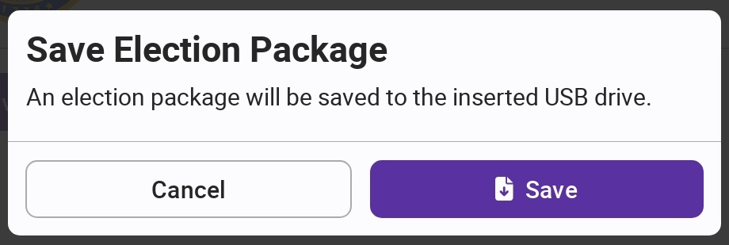
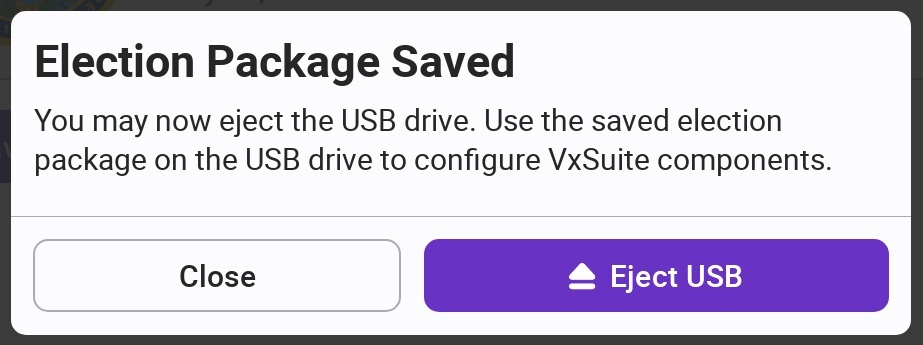

# Save Election Package


The following steps can be completed by a system administrator or an election manager.


## Save Election Package

To configure VxScan, VxCentralScan, and VxMark you must first save the election package from VxAdmin to a USB drive. Select Election from the side menu in VxAdmin and select _`Save Election Package`_.

<figure><figcaption></figcaption></figure>

If you don't already have a USB drive inserted, you'll be prompted to insert a USB drive. After inserting a USB drive, you will be prompted you to save the election package. Select _`Save`_.

<figure><figcaption></figcaption></figure>

VxAdmin will save an election package to the USB drive inside the `/election-packages` folder.


The election package saved at VxAdmin is different from the election package used to configure your VxAdmin. VxMark, VxScan, and VxCentralScan can only be configured with election packages saved at VxAdmin.


Once the file is saved, VxAdmin prompts you to eject the USB drive. Select _`Eject USB`_.

After a few seconds, VxAdmin will confirm USB was ejected and that it is safe to remove the USB drive.

