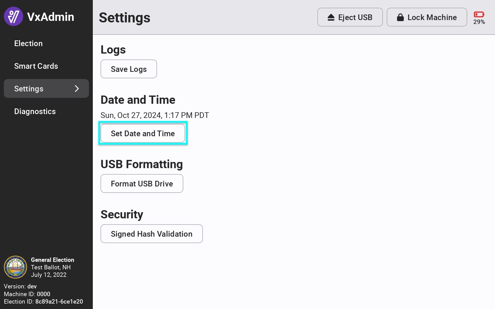
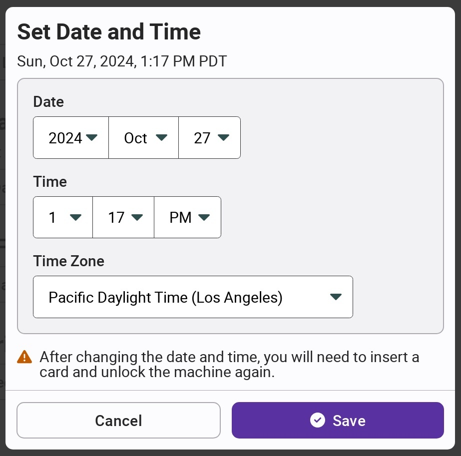

# Setting Date & Time

### VxAdmin

Using a System Administrator or Election Manager Card in VxAdmin, select _`Settings`_ from the side menu. The current date and time is shown under Date and Time. The time is automatically updated for Daylight Savings Time.  Select _`Set Date and Time`_ to change.

<figure><figcaption></figcaption></figure>

Update the date and time and select _`Save`_.

<figure><figcaption></figcaption></figure>

### VxCentralScan

In VxCentralScan, the current date and time is shown in the system administrator screen. The time is automatically updated for Daylight Savings Time.  Select _`Set Date and Time`_ to change.

<figure><figcaption></figcaption></figure>

Update the date and time and select _`Save`_.

<figure><figcaption></figcaption></figure>
