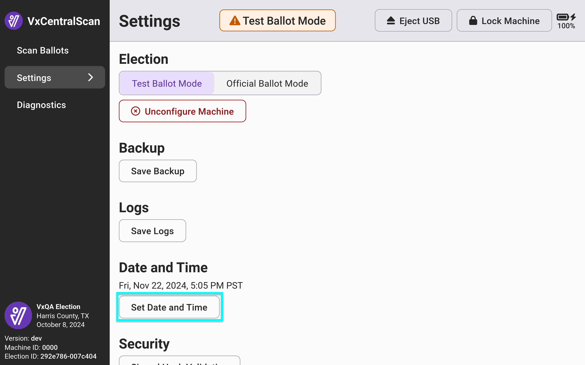

# Setting Date & Time

### VxAdmin

Using a system administrator or election manager card, select _`Settings`_ from the side menu. The current date and time is shown under Date and Time. The time is automatically updated for Daylight Savings Time.  Select _`Set Date and Time`_ , update the date and time, and select _`Save`_.

<figure><figcaption></figcaption></figure> <figure><figcaption></figcaption></figure>

Update the date and time and select _`Save`_.

### VxCentralScan

In VxCentralScan, the current date and time is shown in the system administrator screen. The time is automatically updated for Daylight Savings Time.  elect _`Set Date and Time`_ , update the date and time, and select _`Save`_.

<figure><figcaption></figcaption></figure> <figure><figcaption></figcaption></figure>

