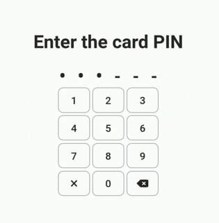

# Unlocking/Locking Hardware

### Unlocking

VxAdmin and VxCentralScan require users to use a smart card and a PIN to log in. Both machines have a smartcard reader slot in the lower left hand side of the laptop.&#x20;

Both machines will display Machine Locked when turned on. To unlock the machine, insert your Election Manager or System Administrator Card into the smartcard reader. Enter the smartcard PIN and remove your card.

<figure><figcaption>
Locked screen
</figcaption></figure>

 

<figure><figcaption>
Insert smartcard in card reader
</figcaption></figure>

 

<figure><figcaption>
Enter PIN
</figcaption></figure>

### Locking

Lock the machine by selecting _`Lock Machine`_in the upper right hand corner of the screen. Each machine should be locked when not in use.

**VxAdmin**

<figure><figcaption></figcaption></figure>

**VxCentralScan**

<figure><figcaption></figcaption></figure>
