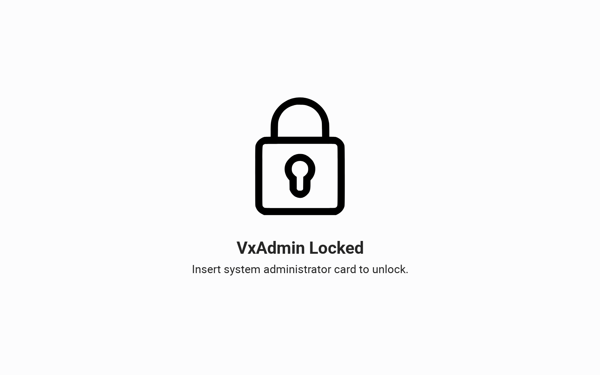
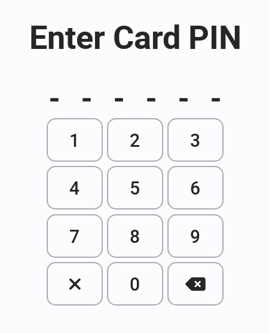

# Unlocking/Locking Hardware

### Unlocking

VxAdmin and VxCentralScan require users to use a smart card and a PIN to log in. Both machines have a smart card reader slot in the lower left hand side of the laptop.&#x20;

Both machines will display Machine Locked when turned on. To unlock the machine, insert your election manager or system administrator card into the smart card reader. Enter the smart card PIN and remove your card.

<figure><figcaption>
Locked screen
</figcaption></figure>

 

<figure><figcaption>
Insert smartcard in card reader
</figcaption></figure>

 

<figure><figcaption></figcaption></figure>

### Locking

Lock the machine by selecting _`Lock Machine`_ in the upper right hand corner of the screen. Each machine should be locked when not in use.

**VxAdmin**

<figure><figcaption></figcaption></figure>

**VxCentralScan**

<figure><figcaption></figcaption></figure>
