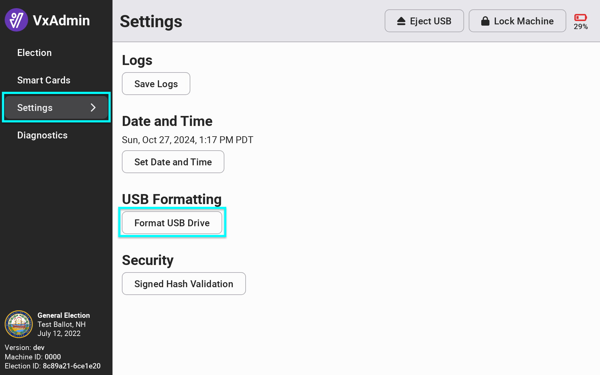
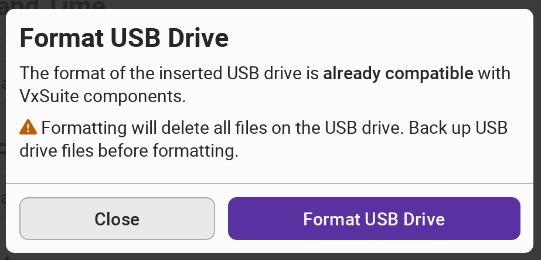

# USB Formatting


The following steps must be completed by the System Administrator.


Before using a USB drive, whether it's brand new or has been used in a previous election, it should be formatted.

In VxAdmin, select Settings from the side menu and select _`Format USB Drive.`_

<figure><figcaption></figcaption></figure>

Confirm you want to format the USB drive by selecting _`Format USB Drive`_. **Formatting the USB drive will delete all files on the USB drive.**

<figure><figcaption></figcaption></figure>

VxAdmin will then confirm your USB drive is ready for use.  Repeat this step for all other USB drives.
