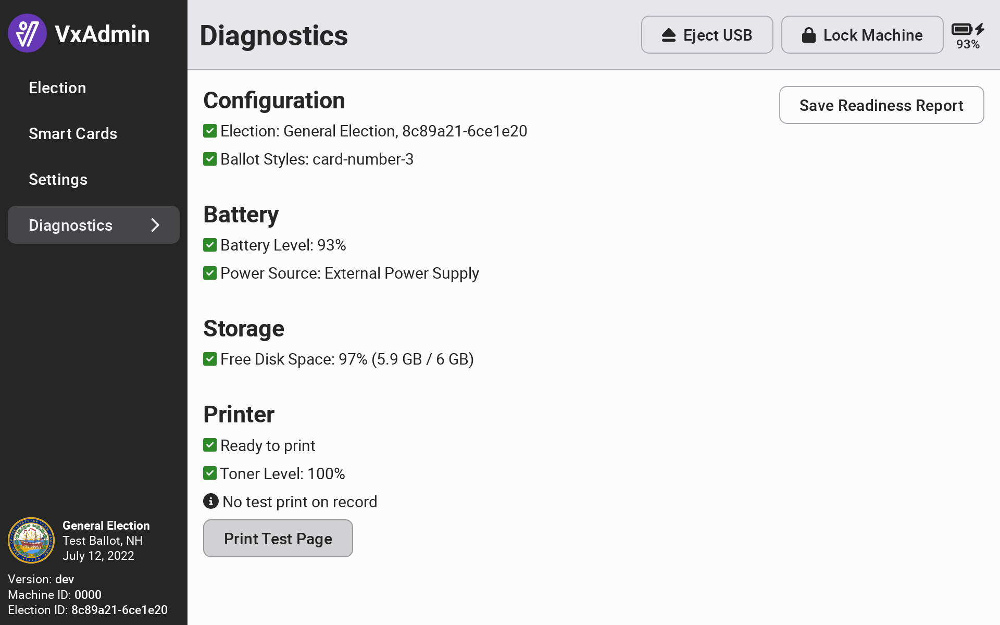

# VxAdmin Diagnostics

The VxAdmin diagnostics interface displays information about the currently configured election, if any, the current battery level and charging status, and the disk space available to the application. For large elections, the disk space should be monitored to ensure that you are not surpassing system storage limits.&#x20;

The printer status indicates whether the printer is ready to print, in sleep mode, or jammed, in addition to the toner level. You can print a test page with _`Print Test Page`_ to verify the printer is working as expected. After printing the test page, you'll be asked to indicate whether the print was successful or failed. The results of the most recent test are displayed on the diagnostics page. You can repeat the test as many times as needed.

<figure><figcaption></figcaption></figure>

The readiness report can be used as a record of system diagnostic verification.  Select _`Save Readiness Report`_ to save a copy to a USB drive.

<figure><figcaption>
Example VxAdmin Readiness Report
</figcaption></figure>
