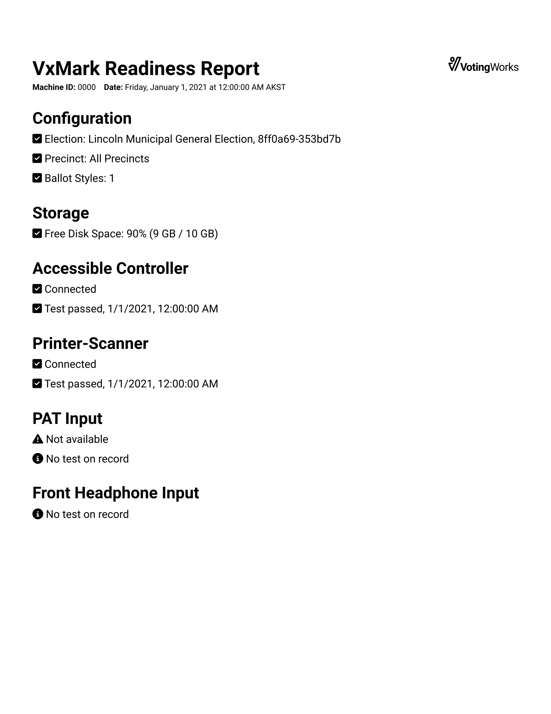

# VxAdmin Diagnostics

Each piece of VotingWorks equipment provides diagnostic information related to each system.  VxAdmin shows the following indicators:

* **Configuration** - information about the currently configured election, if any
* **Battery Level** - indicates the percent remaining on the laptop battery
* **Power Source** - indicates if the laptop is running on battery power or an external power supply
* **Free Disk Space** - indicates how much disk space is available to the application
* **Printer**
  * &#x20;**Printer Status** - indicates if the printer is ready to print, in sleep mode, or has an error
  * **Toner Level** - indicates the amount of toner detected in the connected printer
  * **Test Print** - indicates the status of the last test print

<figure><figcaption>
VxAdmin Diagnostics Screen
</figcaption></figure>

Use _`Print Test Page`_ to print a test page and verify the connected printer is working properly. &#x20;

The readiness report can be used as a record of system diagnostic verification.  Select _`Save Readiness Report`_ to save a copy to a USB drive.

<figure><figcaption>
Example VxAdmin Readiness Report
</figcaption></figure>
