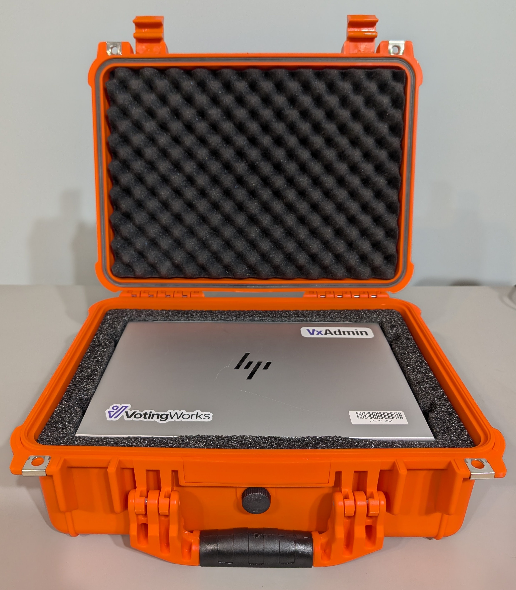
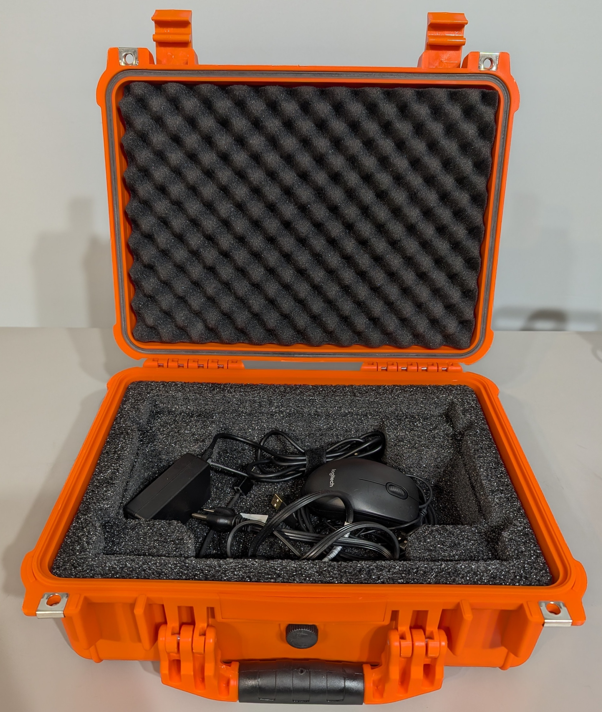

# VxAdmin Hardware Setup

### Hardware Overview

**VxAdmin** is a commercial off-the-shelf (COTS) laptop pre-installed with VotingWorks software and an optional printer. All USB drives, cords, adapters, and programmable smart cards needed to operate the system are included and stored in an orange case.

<figure><figcaption>
VxAdmin stored in case
</figcaption></figure> <figure><figcaption>
VxAdmin fully set up
</figcaption></figure>

### **VxAdmin** Setup

1. **Unbox and Setup Printer**:&#x20;
   * [ ] remove the printer and power cord from the case
   * [ ] plug the power cord into the back of the printer
   * [ ] plug the power cord into an outlet
   * [ ] press the power button to turn the printer on
   * [ ] load paper into the lower paper tray

<figure><figcaption>
Remove printer and power cord
</figcaption></figure> <figure><figcaption>
Plug the power cord into printer and an outlet
</figcaption></figure> <figure><figcaption>
Press the power button to turn on
</figcaption></figure>

2\. **Setup VxAdmin laptop:**

* [ ] remove and document seals as necessary,&#x20;
* [ ] open the case by lifting the latches on the front

<figure><figcaption>
Remove and document seals as necessary
</figcaption></figure> <figure><figcaption>
Open the case by lifting the latches
</figcaption></figure>

* [ ] remove the **laptop**
* [ ] pull the **power cord** (A) out and plug into the laptop and an outlet
* [ ] pull the **USB hub** (B) out and plug into the laptop
* [ ] pull the **printer cord** (C) out and plug into the USB hub and the printer
* [ ] turn the laptop on


An optional mouse is included.  Plug it in to the USB hub to use.


<figure><figcaption>
Remove laptop
</figcaption></figure> <figure><figcaption>
Remove peripherals
</figcaption></figure> <figure><figcaption>
Connect peripherals
</figcaption></figure>

### Packing Up VxAdmin

To pack up the VxAdmin, simply place all of the components back into the case as displayed above. Secure the case as required by sealing the eyelets highlighted below.

<figure><figcaption></figcaption></figure>

