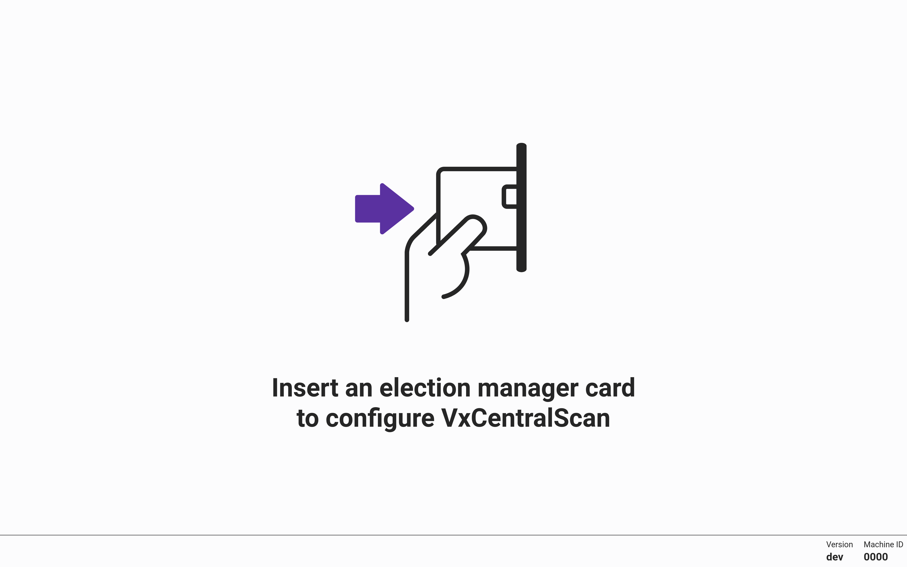
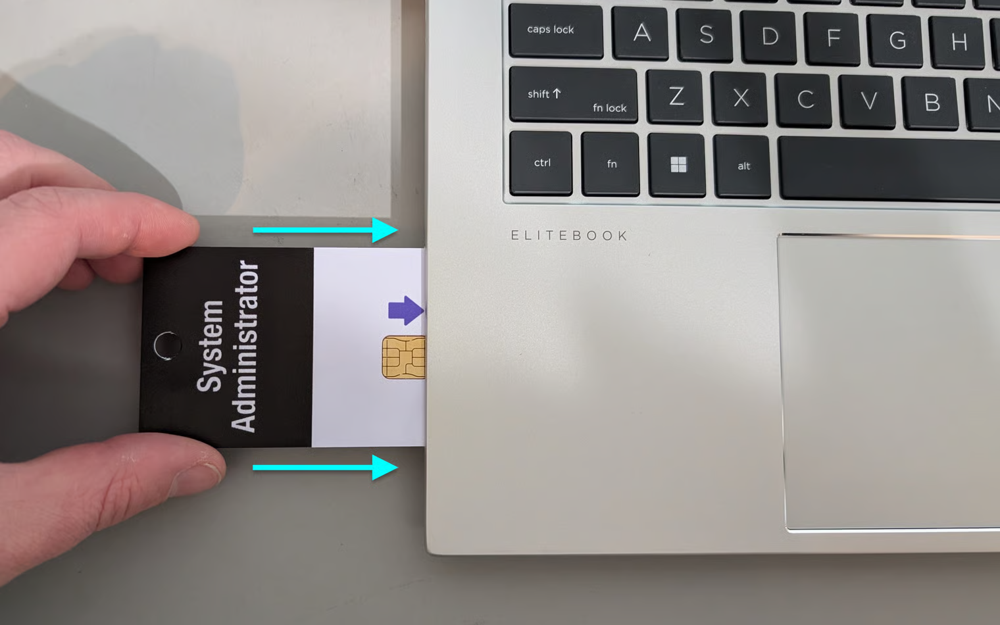
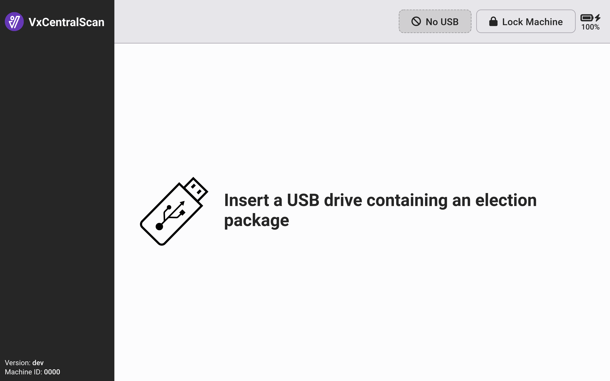
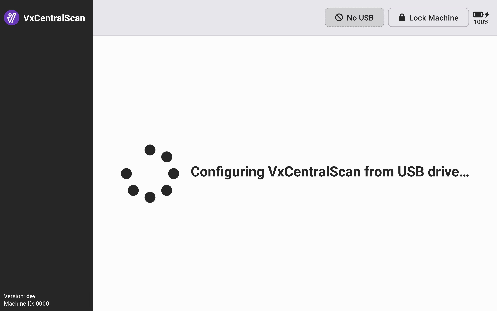
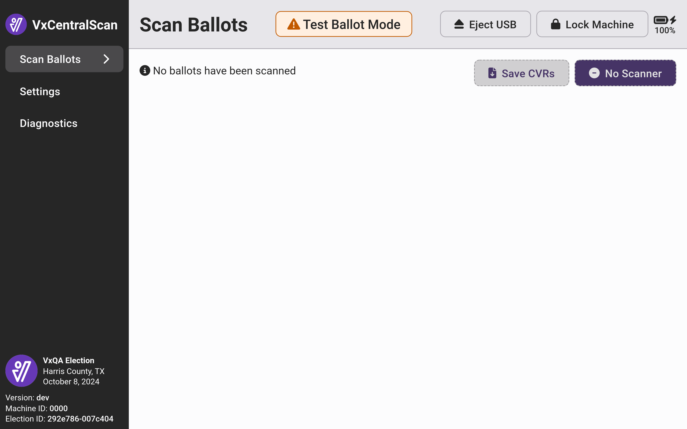
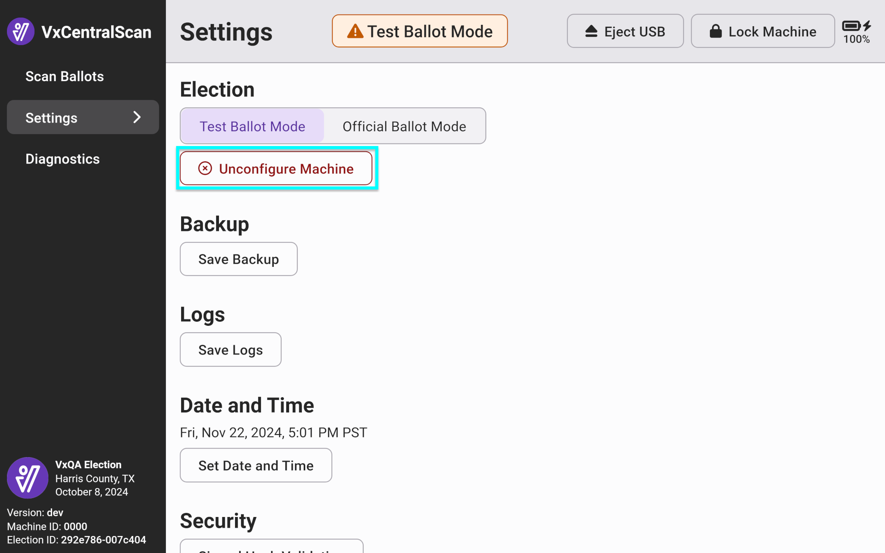
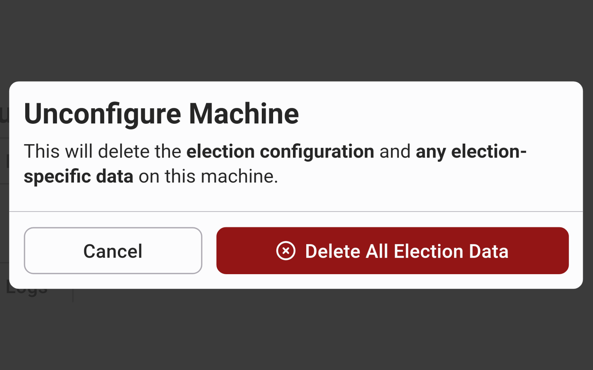

# Configure VxCentralScan


The following steps must be completed by an election manager.


Before you configure VxCentralScan, you must set up the machine. Follow the steps in the [vxcentralscan-hardware-setup.md](vxcentralscan-hardware-setup.md "mention").&#x20;

To configure **VxCentralScan**, you must do two things in **VxAdmin**:

1. [Save the election package](../vxadmin-system-setup/save-election-package.md) to a USB drive.
2. [Create an election manager card](../vxadmin-system-setup/programming-cards.md).

## Load Election Package

Once the election package is saved to a USB drive, you can load the file to VxCentralScan.

[Set up the VxCentralScan hardware](vxcentralscan-hardware-setup.md) and turn on the VxCentralScan laptop.&#x20;

<figure><figcaption></figcaption></figure> <figure><figcaption></figcaption></figure>

Use an election manager card to unlock the machine. Insert the USB drive with the election package. The election package will automatically load.

<figure><figcaption></figcaption></figure> <figure><figcaption></figcaption></figure>

VxCentralScan is now configured and in test mode. The screen will show _No ballots have been scanned_ and election summary information (name, date, jurisdiction, etc.) will be shown in the bottom left corner of the screen.&#x20;

<figure><figcaption></figcaption></figure>

VxCentralScan is now ready for scanning.&#x20;

## Remove Election

To remove an election package and reset VxCentralScan:

* [ ] Insert an Election Manager Card
* [ ] Select _`Settings`_ from the side menu
* [ ] Select _`Unconfigure Machine`_
* [ ] Confirm by selecting _`Delete All Election Data`_

<figure><figcaption></figcaption></figure> <figure><figcaption></figcaption></figure>

You can now reconfigure VxCentralScan with a different election package.


VxCentralScan may also be unconfigured with a system administrator card.

