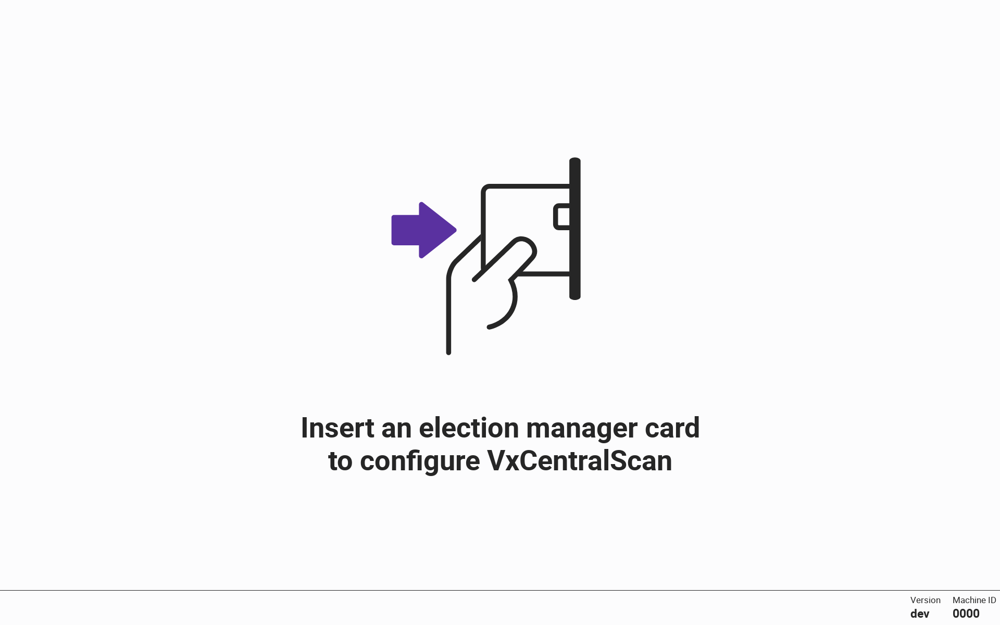
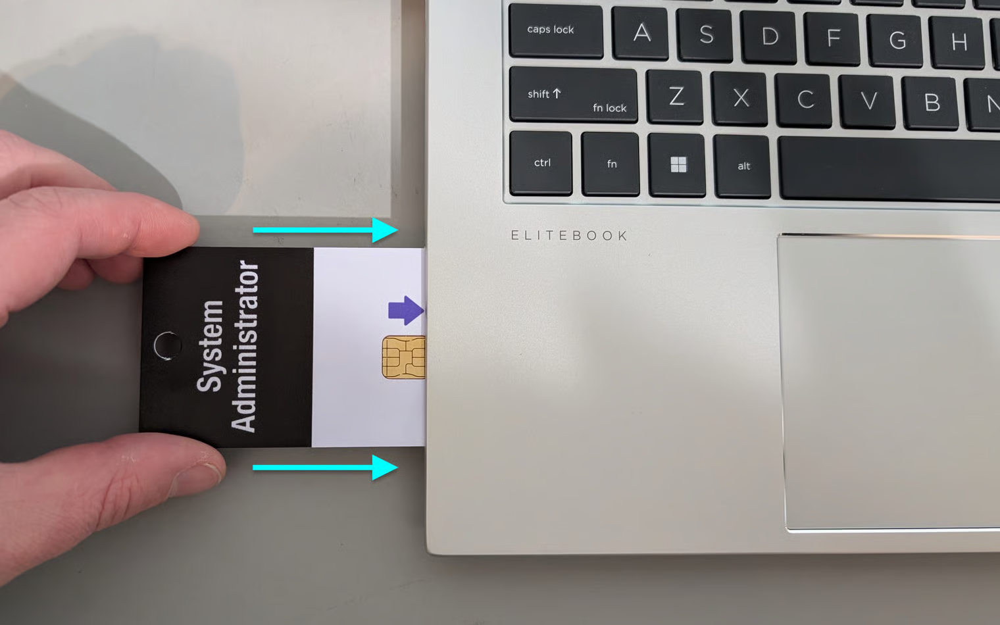
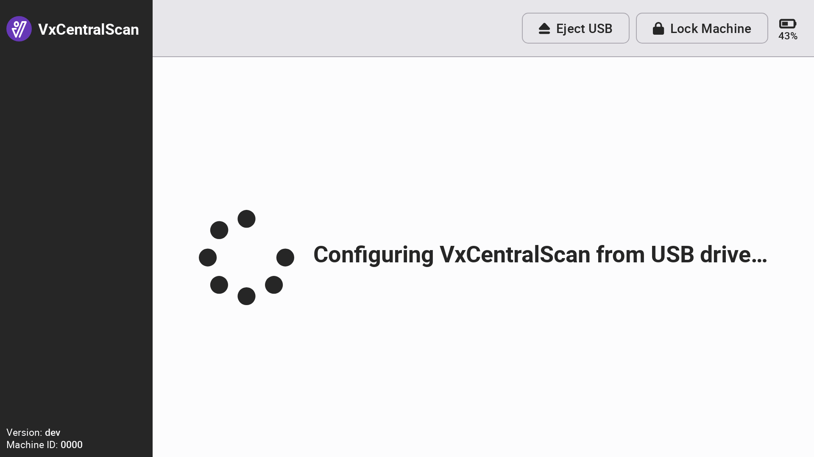
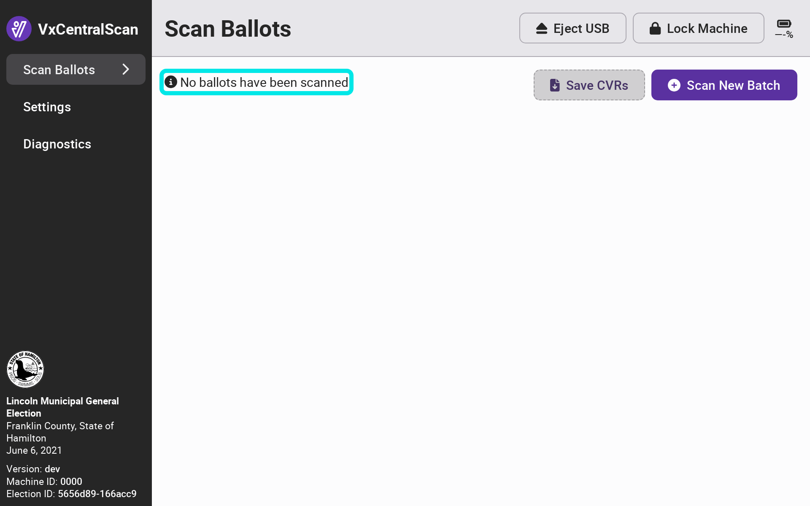
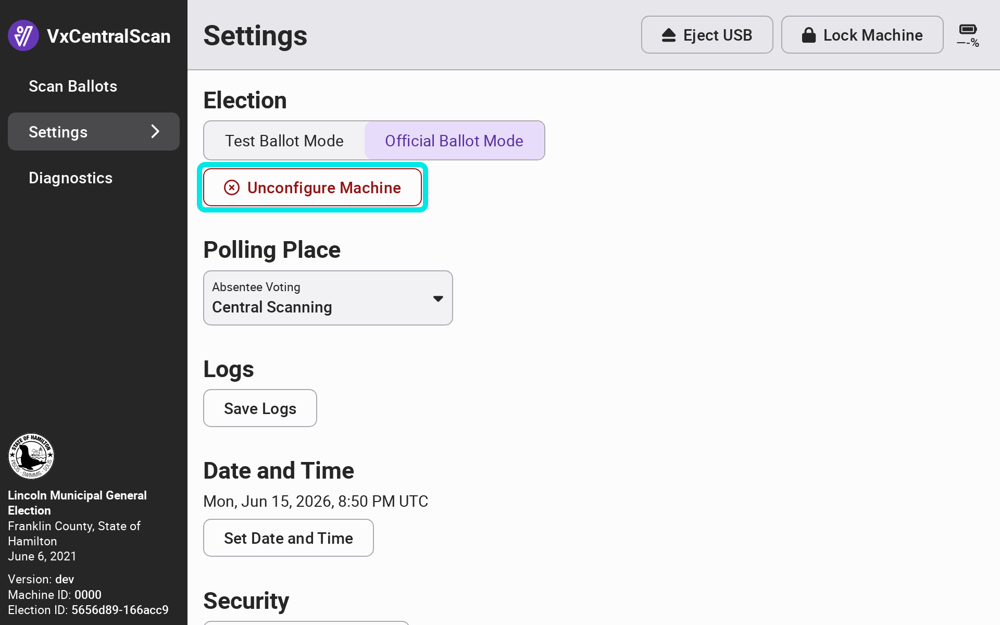

# Configure VxCentralScan


The following steps must be completed by an election manager.


Before you configure VxCentralScan, you must set up the machine. Follow the steps in the [vxcentralscan-hardware-setup.md](vxcentralscan-hardware-setup.md "mention").

To configure **VxCentralScan**, you must do two things in **VxAdmin**:

1. [Save the election package](../vxadmin-system-setup/save-election-package.md "mention") to a USB drive.
2. [Create an election manager card](../vxadmin-system-setup/programming-cards.md "mention").

## Load Election Package

Once the election package is saved to a USB drive, you can load the file to VxCentralScan.

[Set up the VxCentralScan hardware](vxcentralscan-hardware-setup.md) and turn on the VxCentralScan laptop.

<figure><figcaption></figcaption></figure> <figure><figcaption></figcaption></figure>

Use an election manager card to unlock the machine. Insert the USB drive with the election package. The election package will automatically load.

<figure><figcaption></figcaption></figure> <figure><figcaption></figcaption></figure>

VxCentralScan is now configured and in test mode. The election summary information (name, date, jurisdiction, etc.) will be shown in the bottom left corner of the screen - confirm that it is correct.&#x20;

<figure><figcaption></figcaption></figure>

When testing is complete, switch VxCentralScan to official ballot mode on the settings screen:

<figure><figcaption></figcaption></figure>

The `Scan Ballots` page should have the text "No ballots have been scanned" and there should be no test ballot mode banner. VxCentralScan is now ready for the election.

<figure><figcaption></figcaption></figure>

#### Polling Places

There's usually no need to set the polling place on VxCentralScan. For most jurisdictions, it will default to an absentee polling place like "Central Scanning" or "Absentee Voting" that covers all precincts in the jurisdictions. If VxCentralScan must be limited to certain precincts, the election manager should select a different polling place from the dropdown. If ballots outside the selected polling place are scanned, VxCentralScan will stop on those ballots and will not allow tabulating them. The polling place cannot be changed once ballots have been scanned.

## Remove Election

To remove an election package and reset VxCentralScan:

* [ ] Insert an election manager card
* [ ] Select `Settings` from the side menu
* [ ] Select `Unconfigure Machine`
* [ ] Confirm by selecting `Delete All Election Data`

<figure><figcaption></figcaption></figure> <figure><figcaption></figcaption></figure>

You can now reconfigure VxCentralScan with a different election package.


VxCentralScan may also be unconfigured with a system administrator card.

