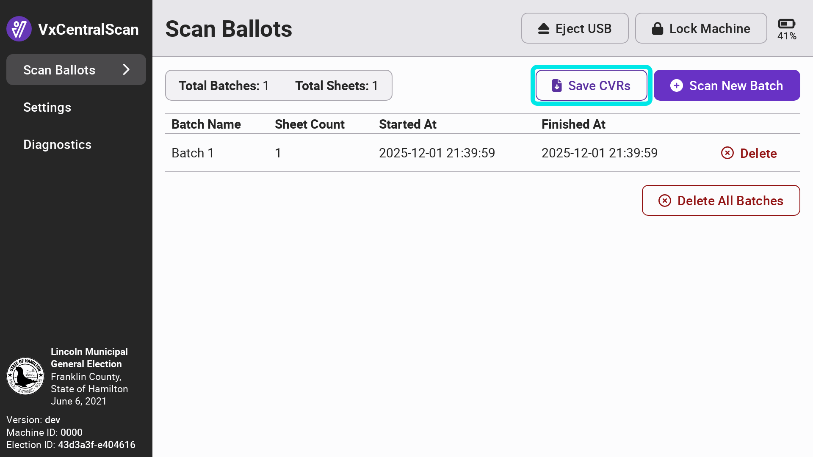
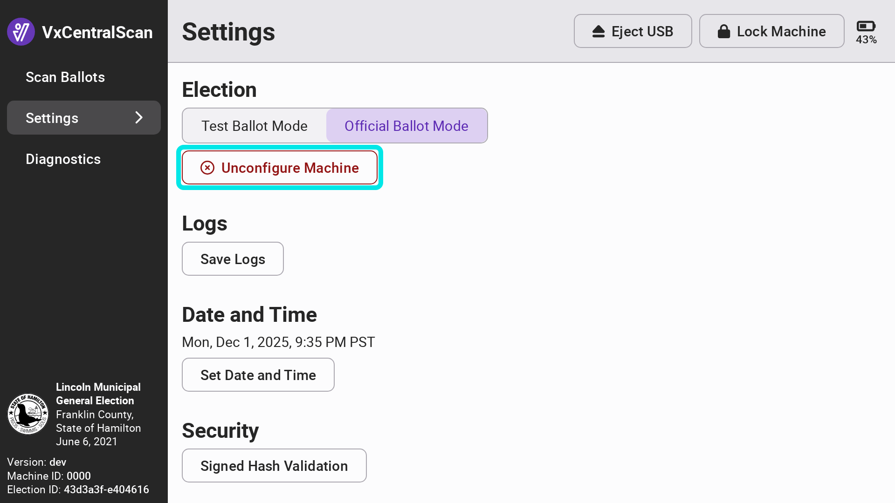

# Retaining and Removing Files - VxCentralScan

## Retaining Election Files

VotingWorks recommends retaining a backup of the CVRs and the logs on VxCentralScan. If the CVRs were not saved on election night, select _`Save CVRs`_ from the `Scan Ballots` page. To save logs,  navigate to the `Settings` page and select _`Save Logs`_.

<figure><figcaption></figcaption></figure> <figure><figcaption></figcaption></figure>

## Removing Election Files

To remove files from VxCentralScan, select _`Settings`_ from the side menu and select _`Unconfigure Machine`_.

<figure><figcaption></figcaption></figure> <figure><figcaption></figcaption></figure>

