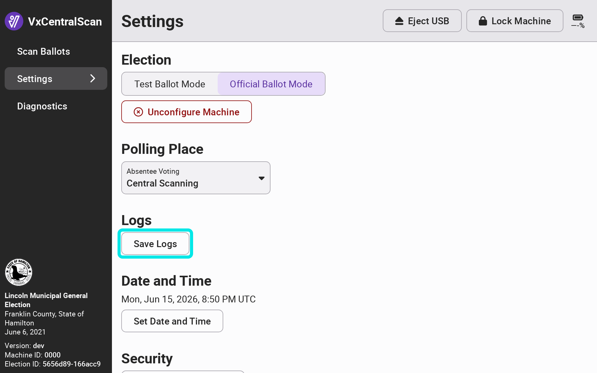
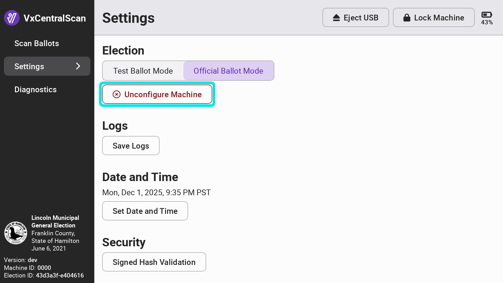
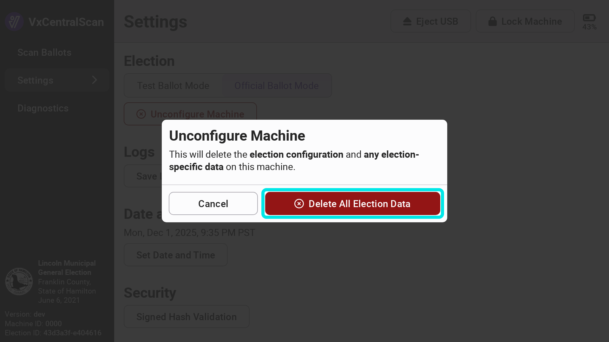

# Retaining and Removing Files - VxCentralScan

## Retaining Election Files

VotingWorks recommends retaining a backup of the CVRs and the logs on VxCentralScan. If the CVRs were not saved on election night, select `Save CVRs` from the `Scan Ballots` page. To save logs, navigate to the `Settings` page and select `Save Logs`.

<figure><figcaption></figcaption></figure> <figure><figcaption></figcaption></figure>

## Removing Election Files

To remove files from VxCentralScan, select `Settings` from the side menu and select `Unconfigure Machine`.

<figure><figcaption></figcaption></figure> <figure><figcaption></figcaption></figure>

