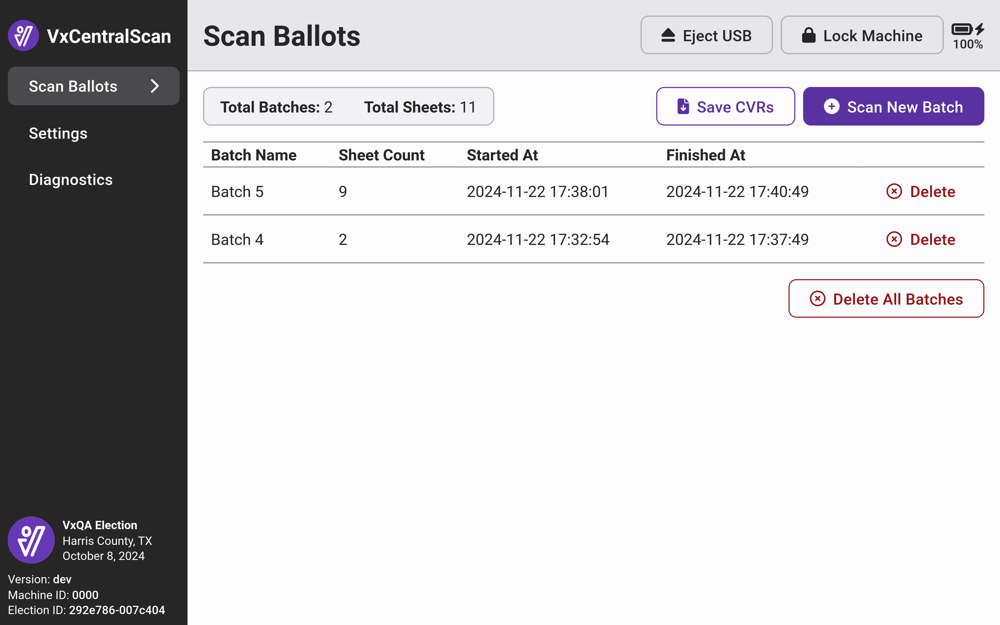
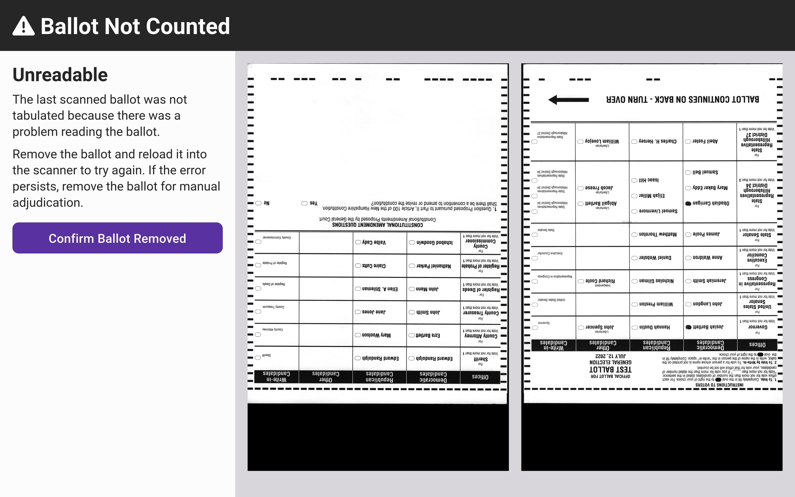

# Central Scanning


The following steps must be completed by an election manager.


VxCentralScan is a central scanning solution that allows you to quickly scan large batches of ballots. If you are using VxScan at your precincts, you can use VxCentralScan to scan absentee or vote-by-mail ballots on election day and mail, provisional, military ballots, or other ballots counted post-election day. VxCentralScan can also be used to quickly verify a test deck and re-tabulate an out-of-balance precinct.&#x20;

Follow the [vxcentralscan-hardware-setup.md](vxcentralscan-hardware-setup.md "mention")instructions to prepare the system for use.

## Scan Ballot Batches

Before scanning the first ballot batch, confirm that VxCentralScan displays _No ballots have been scanned_. If not, select _`Delete All Batches`_ to clear the scanned ballot data.

<figure><figcaption></figcaption></figure>

Load a stack of ballots into the feeder tray of the scanner. VotingWorks recommends loading no more than 30 ballot sheets at time for Ricoh model fi-8170 and 100 ballot sheets for Fujitsu model fi-7600. The ballots need to be in a neat stack, unfolded and lying flat, but ballots can be in any orientation (e.g. upside down or backwards is fine).

Select _`Scan New Batch`_. Ballots feed through the scanner automatically and the _Sheet Count_ will increase as each ballot is scanned. A timestamp will appear under the _Finished At_ header when a batch is done scanning.&#x20;

<figure><figcaption></figcaption></figure> <figure><figcaption></figcaption></figure>

Once the batch finishes scanning, remove it from the output tray on the scanner and place the next stack of ballots in the feeder tray. Repeat the scanning process until all ballots are scanned.


If a batch needs to be rescanned, use the _`Delete`_ button to remove the original scan.


## Adjudicate Ballots

VxCentralScan will stop scanning and present a review screen if scanning cannot be completed due to a blank ballot, overvoted or undervoted contest, scan mode mismatch, or an otherwise unreadable ballot sheet. The review screen will display an image of the scanned ballot sheet, the reason why scanning was stopped, and confirm that this ballot sheet has not been tabulated yet.

### Overvoted, Blank, and Undervoted Ballots

If the scanner stops, remove the last ballot sheet scanned from the scanner output tray and confirm it matches the ballot sheet displayed onscreen. Once removed, follow review requirements. If the ballot needs to be reviewed by someone not operating the scanner or needs to be duplicated to be tabulated properly, select _`Confirm Ballot Removed`_. If the ballot should be tabulated as-is, meaning that overvoted contests will be ignored but any other valid votes will be counted, select `Tabulate Ballot`.  After making a selection, the scanner will resume scanning ballots in the batch.&#x20;

<figure><figcaption></figcaption></figure> <figure><figcaption></figcaption></figure> <figure><figcaption></figcaption></figure>

The scanner will present overvotes, blank ballots, and undervotes in that order. In other words, an overvoted ballot may also have undervoted contests not highlighted. Depending on the adjudication settings for the current election, VxCentralScan may not stop for every adjudication reason.

### Unreadable Ballots

VxCentralScan may show an **Unreadable** ballot screen for a properly marked ballot if it's unable to decode ballot information due to page skew, dust, or tampering of the ballot. When a ballot sheet is shown as unreadable, you can safely remove the ballot and re-scan the ballot sheet. If the ballot is unreadable on a second scan, you should remove the ballot for duplication.

<figure><figcaption></figcaption></figure>

### Saving Cast Vote Records (CVRs)

When all ballot batches (including any duplicated ballots) have been scanned, you will need to save the CVRs from VxCentralScan to load into VxAdmin for write-in adjudication and reporting.

To save, select _`Save CVRs`_ in the top right.

<figure><figcaption></figcaption></figure>

You'll be prompted to insert a USB drive. Once recognized, select _`Save`_ and then _`Eject USB`_. Once the USB drive is ejected, remove the USB drive.

If using multiple VxCentralScan stations, repeat saving CVRs for each one.


Tabulated ballots should be sealed into a secure container post-tabulation with the seal number recorded as required. Follow state guidelines to ensure proper retention.


