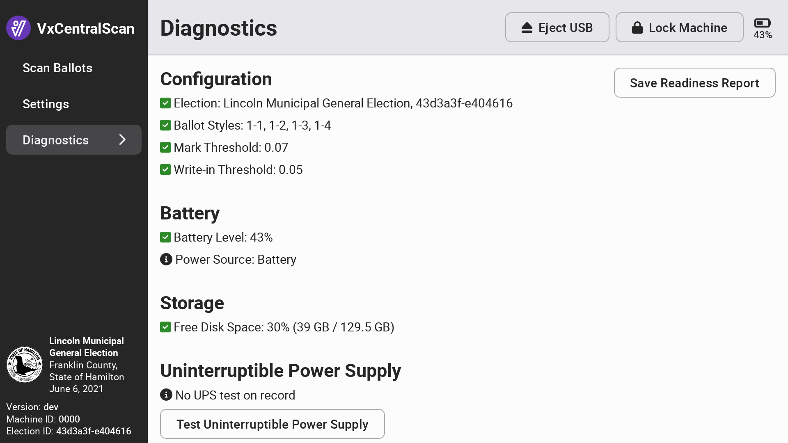

# VxCentralScan Diagnostics

The VxCentralScan diagnostics interface displays information about the currently configured election, if any, the current battery level and charging status, and the disk space available to the application. For large elections, the disk space should be monitored to ensure that you are not exceeding system storage limits. The uninterruptible power supply test asks the user to confirm that the scanner's uninterruptible power supply is connected and fully charged.

The scanner status indicates whether the scanner is connected or not. Select _`Perform Test Scan`_ and insert a blank sheet of paper as prompted. This test verifies the scanner is clean and ballot images are clear.  If the test fails, you'll be prompted to clean the scanner. The test will also fail if the sheet is not blank.&#x20;

<figure><figcaption></figcaption></figure>

The readiness report can be used as a record of system diagnostic verification.  Select _`Save Readiness Report`_ to save a copy to a USB drive.&#x20;

<figure><figcaption>
Example VxCentralScan Readiness Report
</figcaption></figure>
