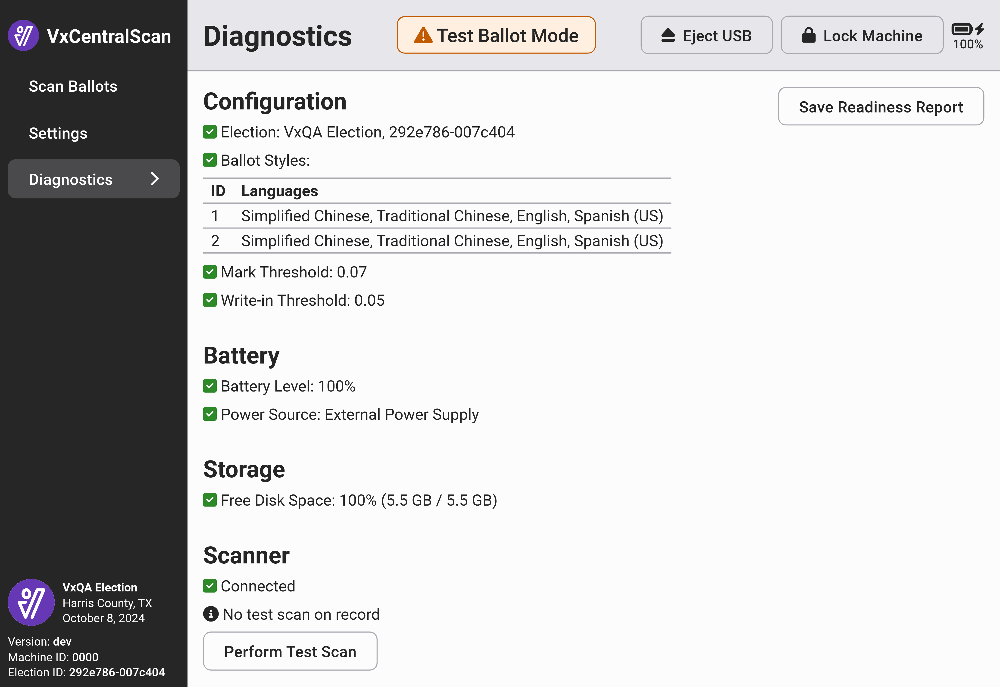

# VxCentralScan Diagnostics

The VxCentralScan diagnostics interface displays information about the currently configured election, if any, the current battery level and charging status, and the disk space available to the application. For large elections, the disk space should be monitored to ensure that you are not surpassing system storage limits.&#x20;

The scanner status indicates whether the scanner is connected or not. You may _`Perform Test Scan`_ to test the scanner's image capture. The purpose of the test scan is to ensure that the ballot images produced by the scanner do not have defects. You will need to insert a blank sheet of paper. The system will automatically determine if the image appears blank and free of defects. Inserting a sheet of paper that is not blank will cause the test to fail.

<figure><figcaption></figcaption></figure>

The readiness report can be used as a record of system diagnostic verification.  Select _`Save Readiness Report`_ to save a copy to a USB drive.&#x20;

<figure><figcaption>
Example VxCentralScan Readiness Report
</figcaption></figure>
