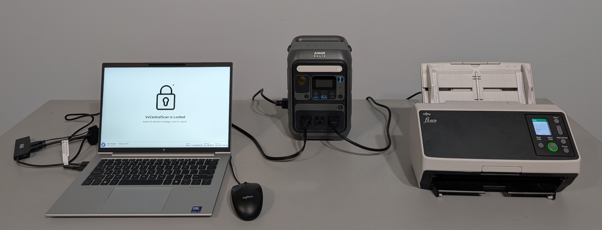
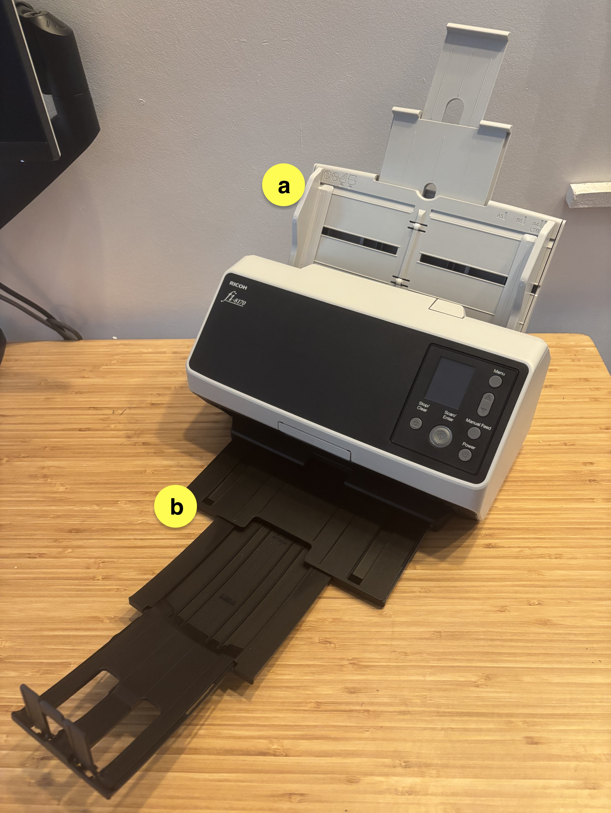
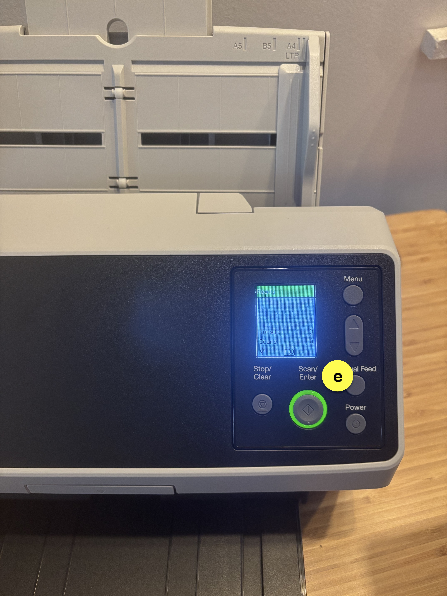

# VxCentralScan Hardware Setup

## Hardware Overview

**VxCentralScan** is a commercial off-the-shelf (COTS) laptop pre-installed with VxCentralScan software that connects to a Ricoh scanner.

 

Two models of Ricoh scanners are supported: fi-8170 and fi-7600. The smaller fi-8170 (shown above) can scan batches of up to 30 ballots. The larger fi-7600 can scan larger batches of up to 100 ballots.

## **VxCentralScan** Setup

**VxCentralScan** can be set up through the following steps:

1. **Unbox and set up Scanner**:&#x20;
   * [ ] remove the scanner and power cord from the case
   * [ ] attach and pull out the paper feed guide tray (a)
   * [ ] pull out the paper holder tray (b)
   * [ ] plug the USB cord (c) into the back of the scanner and into the laptop
   * [ ] plug the power cord (d) into the back of the scanner and into an outlet or UPS
   * [ ] press the power button (e) to turn the scanner on

   

&#x32;**.  Setup VxCentralScan laptop:**

* [ ] remove and document seal(s) as necessary
* [ ] open the case by lifting the latches on front

<figure><figcaption>
remove and document seals as necessary
</figcaption></figure> <figure><figcaption>
lift the latches
</figcaption></figure>

* [ ] **prepare the components:**
  * [ ] remove the **laptop**
  * [ ] pull the **power cord** (a) out and plug into the laptop and an outlet
  * [ ] pull the **USB hub** (b) out and plug into the laptop
  * [ ] pull the **scanner cord** (c) out and plug into the USB hub and the scanner
  * [ ] turn the laptop on

.jpg>)  .jpg>)

### Packing Up VxCentralScan

To pack up the VxCentralScan, simply place all of the components back into the case as displayed above and package the batch document scanner. Secure[^1] the laptop case as required by sealing the eyelets highlighted below.

<figure><figcaption></figcaption></figure>

## Imprinting

Both the fi-8170 and the fi-7600 can be used with an optional imprinter, the fi-819PRB and the fi-760PRB respectively. See the user guides for the [fi-819PRB](https://github.com/votingworks/docs-vxsuite-v4/blob/main/hardware-assets/cots-documentation/central-system/ricoh-fi-8170/ricoh-fi-819prb-user-guide.pdf) and [fi-760PRB](https://github.com/votingworks/docs-vxsuite-v4/blob/main/hardware-assets/cots-documentation/central-system/ricoh-fi-7600/ricoh-fi-760prb-user-guide.pdf) for assembly instructions. Note that the imprinter should not be attached while the scanner is already powered on.

## Scanner Maintenance

The scanner should be cleaned before every election. The rollers should be replaced occasionally depending on scanning volume. Consult [the maintenance manual](broken-reference) section about cleaning and maintaining the Ricoh scanners.

[^1]: 
