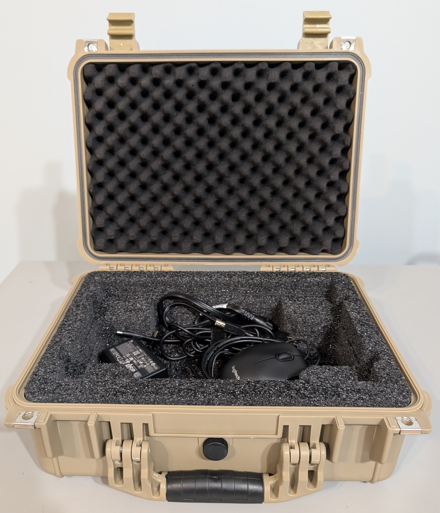

# VxCentralScan Hardware Setup

## Hardware Overview

**VxCentralScan** is a commercial off-the-shelf (COTS) laptop pre-installed with VxCentralScan software that connects to a Ricoh scanner.

.png>) 

Two models of Ricoh scanners are supported: fi-8170 and fi-7600. The smaller fi-8170 (shown above) can scan batches of up to 30 ballots. The larger fi-7600 can scan larger batches of up to 100 ballots.

## **VxCentralScan** Setup

**VxCentralScan** can be set up through the following steps:

1. **Unbox and set up scanner**:
   * [ ] Remove the scanner and power cord from the case
   * [ ] Attach and pull out the paper feed guide tray (a)
   * [ ] Pull out the paper holder tray (b)
   * [ ] Plug the USB cord (c) into the back of the scanner and into the laptop
   * [ ] Plug the power cord (d) into the back of the scanner and into an outlet or UPS power backup
   * [ ] Press the power button (e) to turn the scanner on

   

&#x32;**. Set up VxCentralScan laptop:**

* [ ] Remove and document seal(s) as necessary
* [ ] Open the case by lifting the latches on front

<figure><figcaption>
remove and document seals as necessary
</figcaption></figure> <figure><figcaption>
lift the latches
</figcaption></figure>

* [ ] **Prepare the components:**
  * [ ] Remove the **laptop**
  * [ ] Pull the **power cord** (a) out and plug into the laptop and an outlet
  * [ ] Pull the **USB hub** (b) out and plug into the laptop
  * [ ] Pull the **scanner cord** (c) out and plug into the USB hub and the scanner
  * [ ] Turn the laptop on

.jpg>)  

### Packing Up VxCentralScan

To pack up the VxCentralScan, simply place all of the components back into the case as displayed above and package the batch document scanner. Secure the laptop case as required by sealing the eyelets highlighted below.

<figure><figcaption></figcaption></figure>

## Imprinting

Both the fi-8170 and the fi-7600 can be used with an optional imprinter, the fi-819PRB and the fi-760PRB respectively. See the user guides for the [fi-819PRB](https://github.com/votingworks/docs-vxsuite-v4/blob/main/hardware-assets/cots-documentation/central-system/ricoh-fi-8170/ricoh-fi-819prb-user-guide.pdf) and [fi-760PRB](https://github.com/votingworks/docs-vxsuite-v4/blob/main/hardware-assets/cots-documentation/central-system/ricoh-fi-7600/ricoh-fi-760prb-user-guide.pdf) for assembly instructions. The scanner should be off when attaching the imprinter. After the imprinter is attached, adjust the paper guides on the imprinter to match the paper width of each batch, which is 8.5" for hand marked paper ballots or 8" for machine marked paper ballots.

After the imprinter is attached, adjust the paper guides on the imprinter to match the paper width of each batch, which is 8.5" for hand marked paper ballots or 8" for machine marked paper ballots. This adjustment is necessary to ensure that imprinting is done outside of the ballot marking area on each ballot.

## Scanner Maintenance

Clean the scanner before every election. The rollers should be replaced occasionally depending on scanning volume. Consult [vxadmin-and-vxcentralscan-maintenance-manual.md](../system-maintenance/vxadmin-and-vxcentralscan-maintenance-manual.md "mention") for instructions on cleaning and maintaining the Ricoh scanners.
