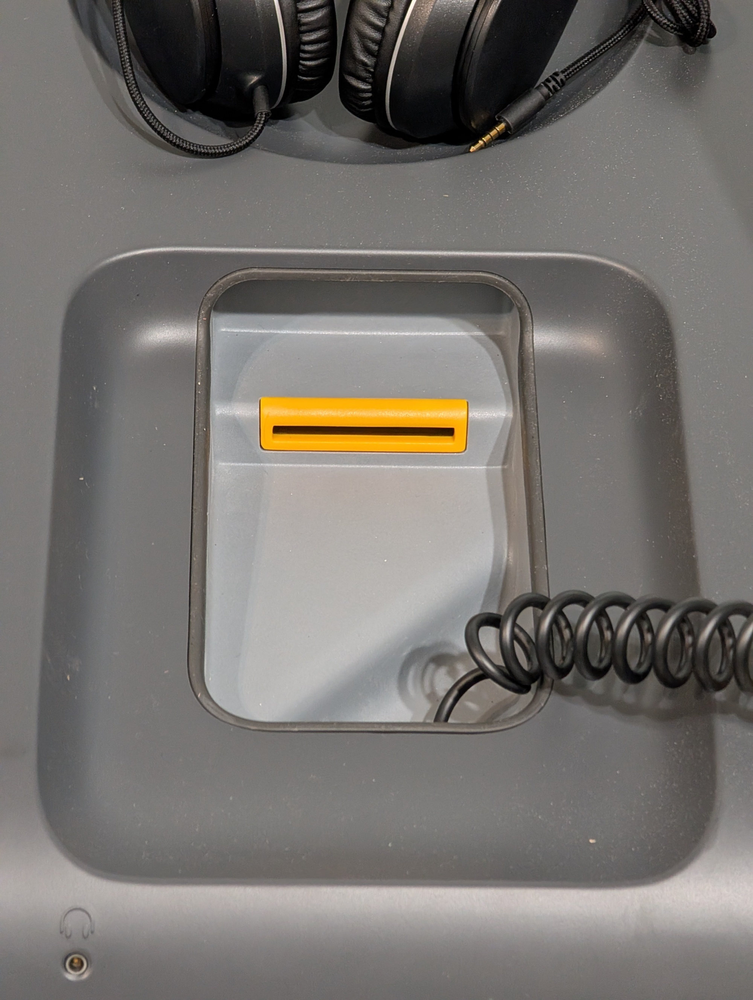
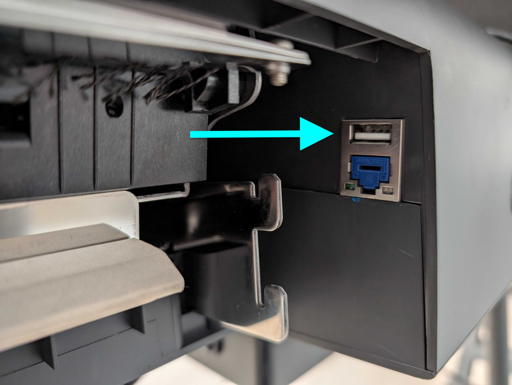
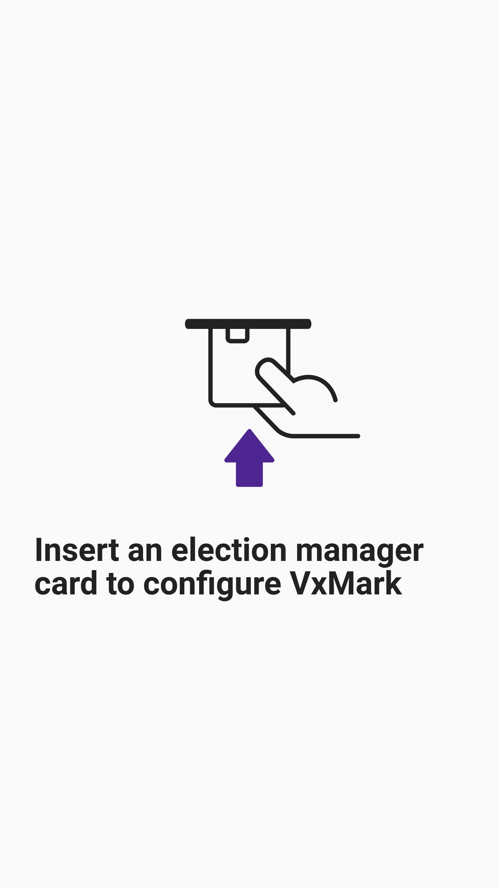
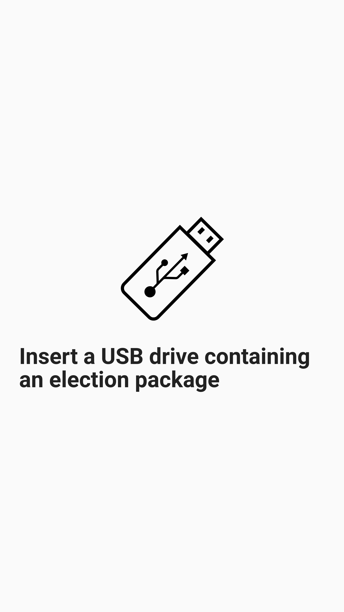
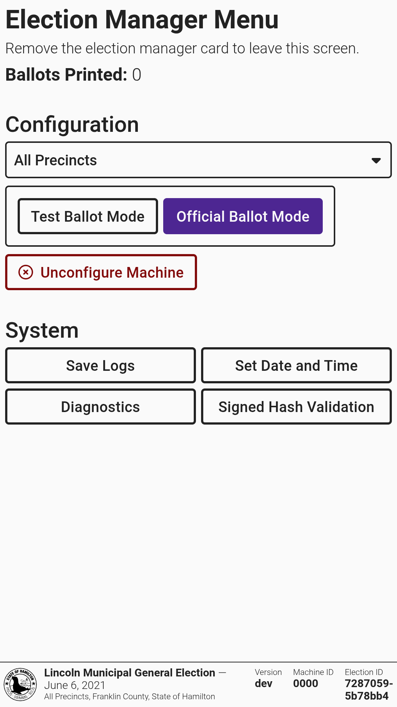

# Configure VxMark


The following steps must be completed by an election manager.


Before you configure VxMark, you must set up the machine. Follow [VxMark Hardware Setup](vxmark-hardware-setup.md) steps.

To configure **VxMark**, you must do two things in **VxAdmin**:

1. [Save the election package](../vxadmin-system-setup/save-election-package.md) to a USB drive.
2. [Create an election manager card](../vxadmin-system-setup/programming-cards.md).

## Inserting Smart Cards & USB Drives

The smart card reader is beneath the accessible controller. The USB port is accessible at the ballot box attachment point. The ballot box must be removed to insert a USB drive. Seal and document the ballot box as required.

<figure><figcaption>
Smart card reader under accessible controller
</figcaption></figure> <figure><figcaption>
USB port hidden by the ballot box
</figcaption></figure>

## Loading The Election Package

An unconfigured machine will prompt you to insert an election manager card to log in and then a USB drive with the election package saved from VxAdmin to configure.&#x20;

After the USB drive is inserted, VxMark will automatically begin loading all ballot styles for the election. After the election package is done loading, the election manager menu screen will appear and VxMark will be in test ballot mode.

<figure><figcaption></figcaption></figure> <figure><figcaption></figcaption></figure> <figure><figcaption></figcaption></figure>

## Setting Ballot Mode

Use the toggle button to switch between _`Test Ballot Mode`_ and _`Official Ballot Mode`_. The machine must be in official ballot mode on election day.  Review the [l-and-a-overview.md](../logic-and-accuracy-pre-election-testing/l-and-a-overview.md "mention") instructions to understand which mode to use during logic and accuracy testing.

<figure><figcaption></figcaption></figure>

## Remove Election Data & Configuration

To remove election configuration (and all data) from VxMark:

* [ ] Log in with an election manager card
* [ ] Select _`Unconfigure Machine`_

<figure><figcaption></figcaption></figure>

* [ ] Confirm by selecting _`Delete All Election Data`_

You can now re-configure VxMark with a different election package.
