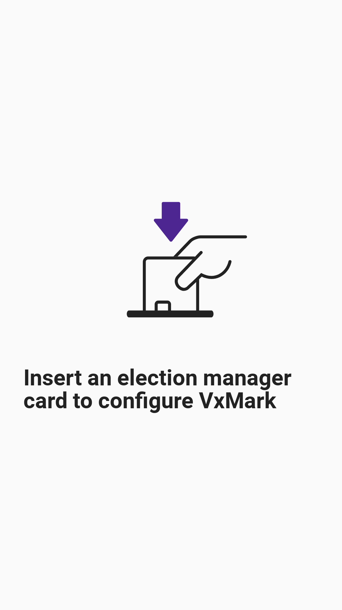
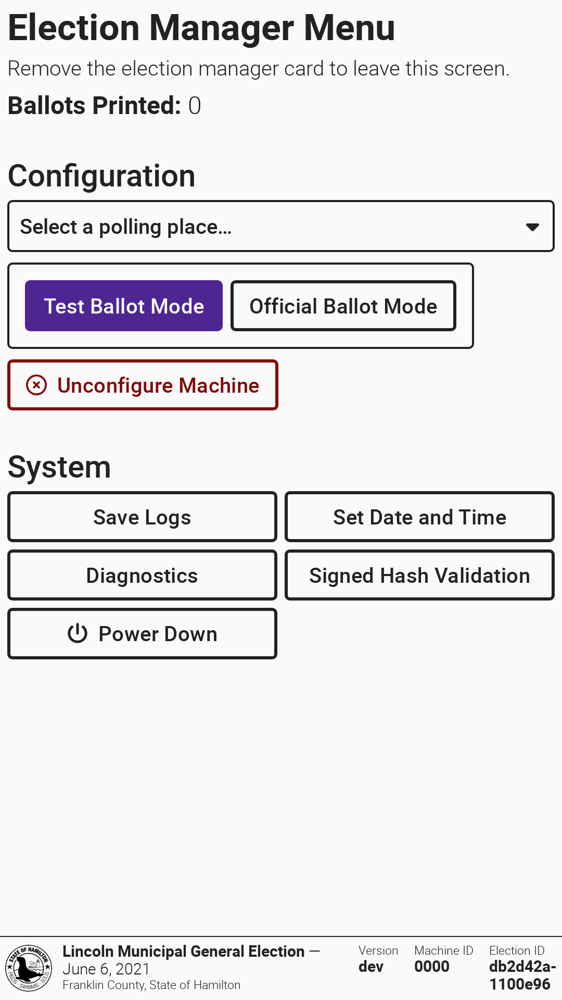
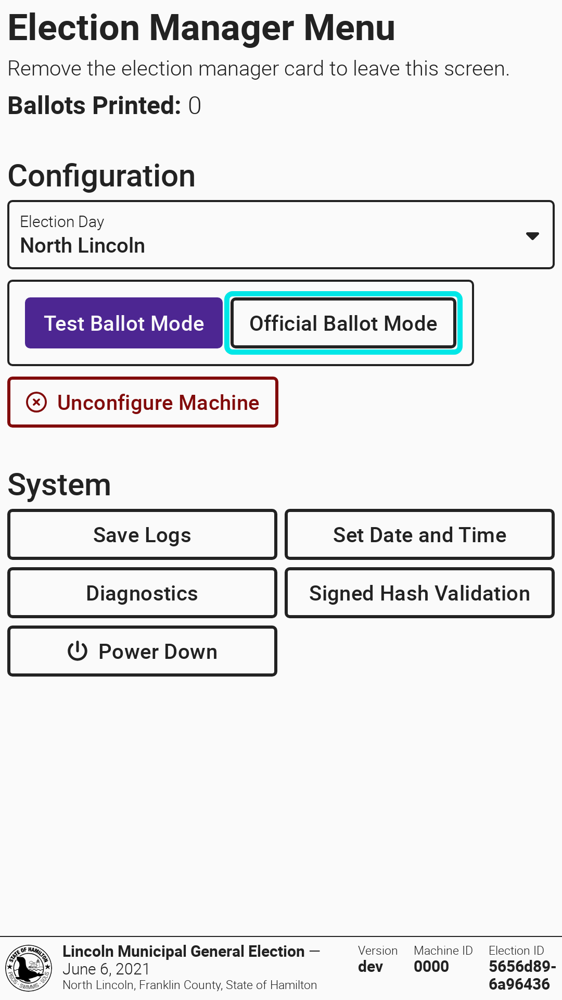
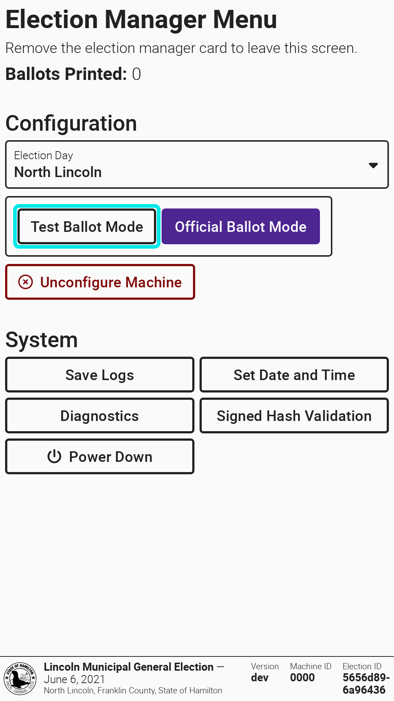
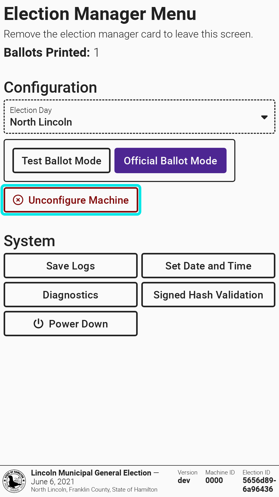
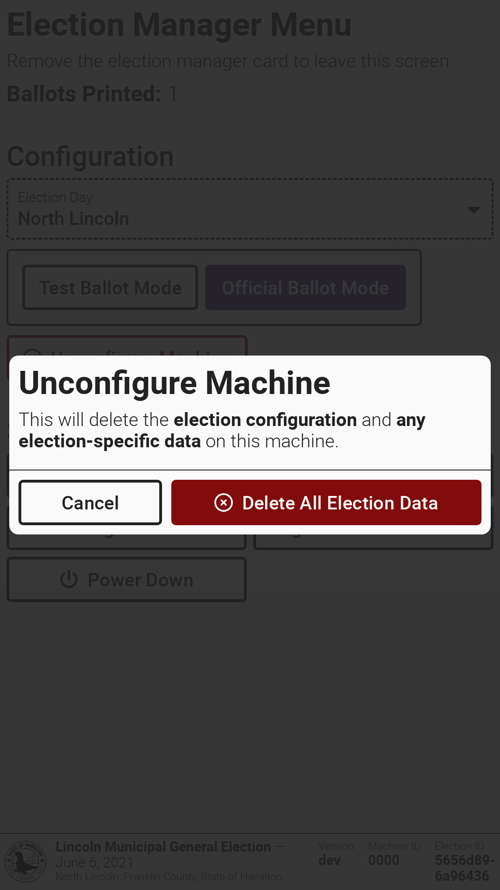

# Configure VxMark


The following steps must be completed by an election manager.


Before you configure VxMark, you must set up the machine. Follow the [VxMark Hardware Setup](vxmark-hardware-setup.md) steps.

To configure **VxMark**, you must do two things in **VxAdmin**:

1. [Save the election package](../vxadmin-system-setup/save-election-package.md) to a USB drive.
2. [Create an election manager card](../vxadmin-system-setup/programming-cards.md).

## Inserting Smart Cards & USB Drives

The smart card reader is to the right in the back of the case. Insert smart cards with the chip facing toward you. The USB port is located directly in front of the smart card reader.

<figure><figcaption></figcaption></figure>

## Loading The Election Package

An unconfigured machine will prompt you to insert an election manager card to log in and then insert a USB drive with the election package saved from VxAdmin.&#x20;

After the USB drive is inserted, VxMark will automatically begin loading all ballot styles for the election. After the election package is done loading, the election manager screen will appear and VxMark will be in test ballot mode.

<figure><figcaption></figcaption></figure> <figure><figcaption></figcaption></figure> <figure><figcaption></figcaption></figure>

## Select a Polling Place

Use the `Select a polling place...`  dropdown to choose a polling place. Only ballot styles for the selected polling place will be options for voting.

<figure><figcaption></figcaption></figure>


If your election package defines only one polling place, there is no need to select a precinct and the `Select a polling place...` dropdown will not be visible.


## Setting Ballot Mode

Use the toggle button to switch between `Test Ballot Mode` and `Official Ballot Mode`. The machine must be in official ballot mode on election day.&#x20;

<figure><figcaption></figcaption></figure> <figure><figcaption></figcaption></figure>

## Removing Configuration & Election Data

To remove election configuration (and all data) from VxMark:

* [ ] Log in with an election manager card
* [ ] Select `Unconfigure Machine`
* [ ] Confirm by selecting `Delete All Election Data`

<figure><figcaption></figcaption></figure> <figure><figcaption></figcaption></figure>

You can now re-configure VxMark with a different election package.
