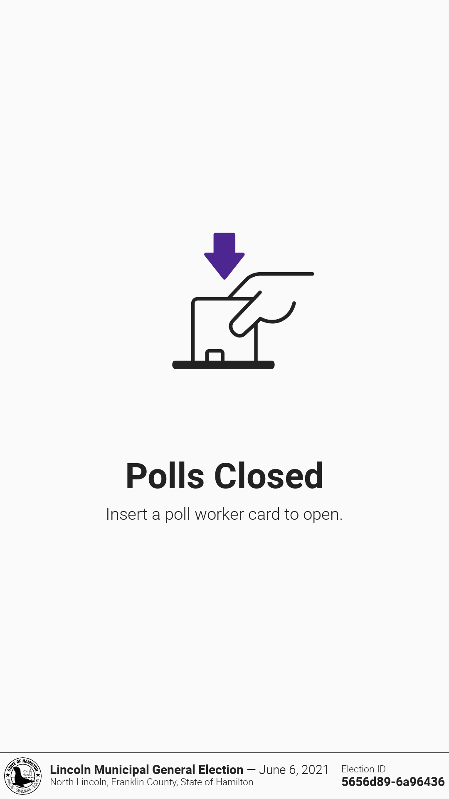
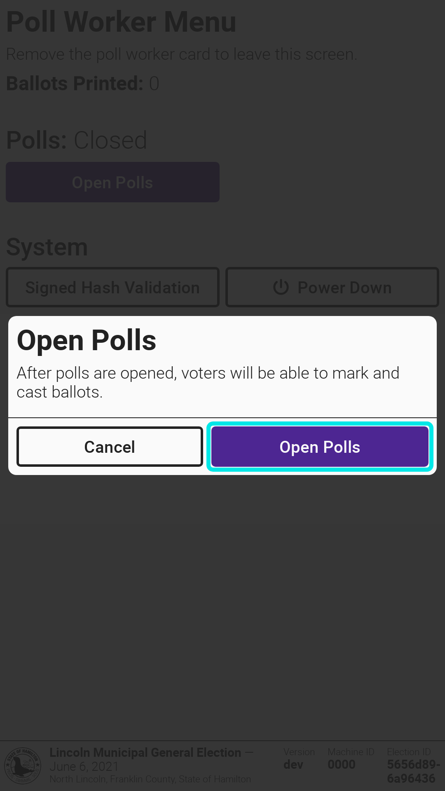
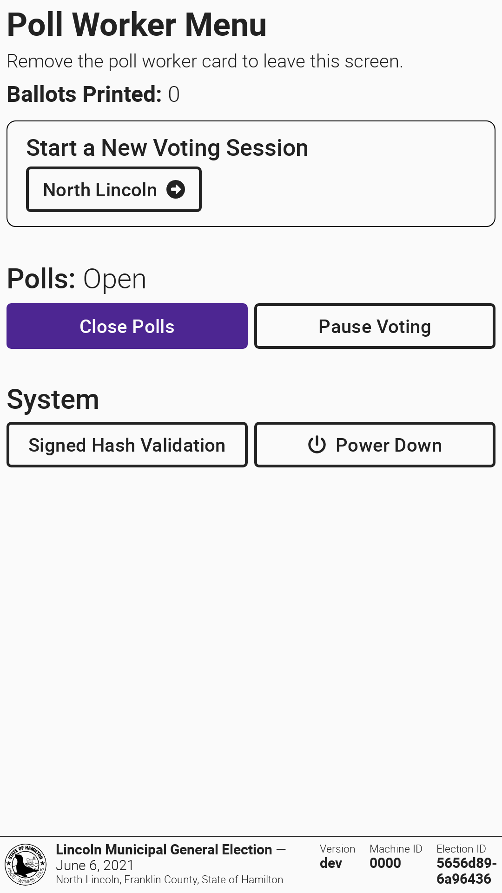
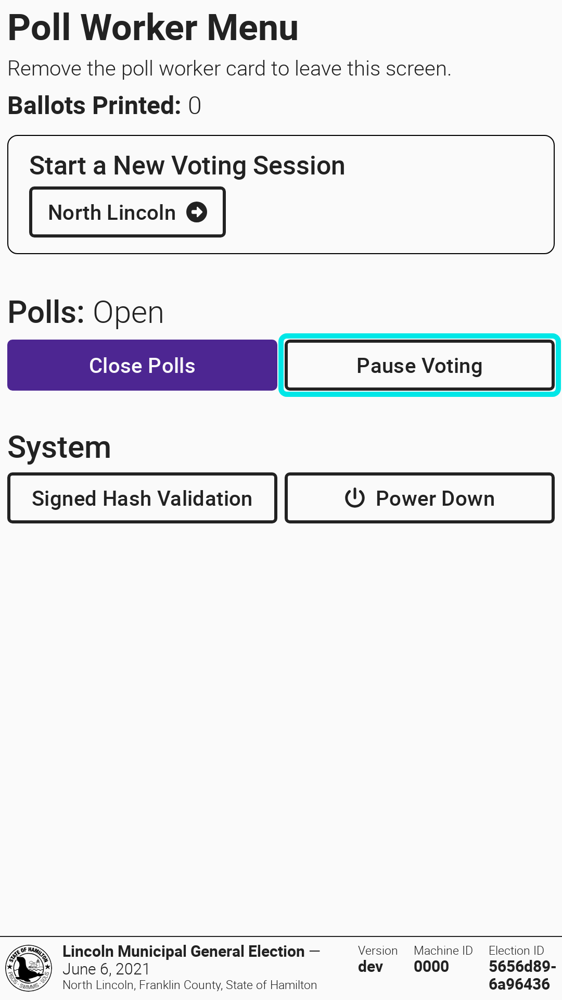
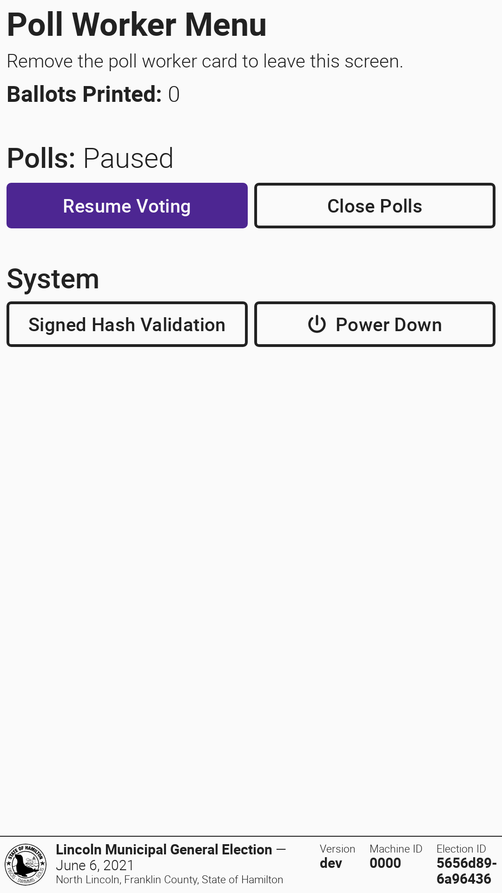
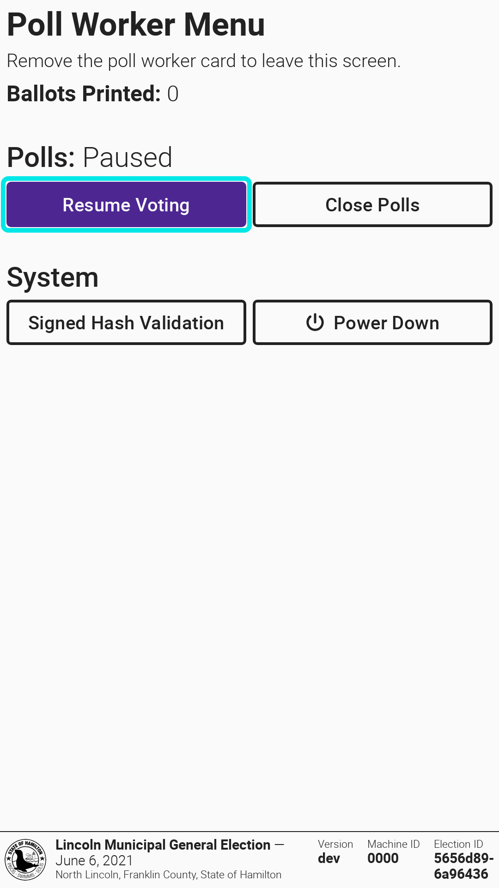
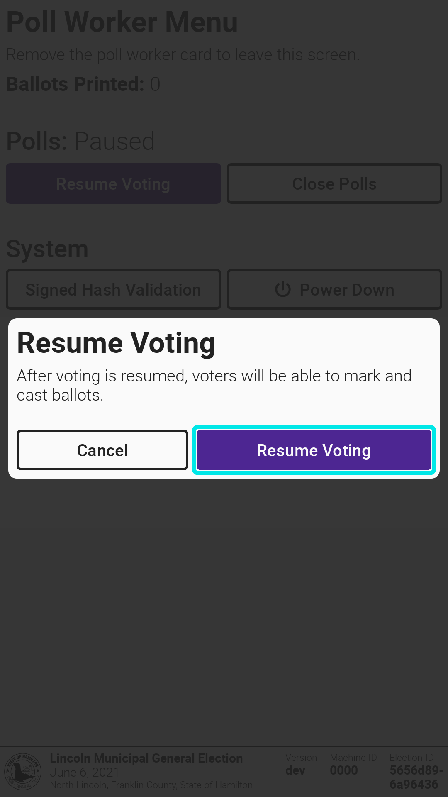

# Open and Close Polls

## Open Polls on VxMark

After VxMark is turned on, the screen will show "Polls Closed":

<figure><figcaption></figcaption></figure>

Verify the election name, election date, and polling place are correct in the bottom left corner.


If there is an orange callout that says "Test Ballot Mode" on the screen, contact your election administrator immediately to prepare the machine for the election.


**In order to open the polls:**

* [ ] Insert the poll worker card into the card reader in the back right
* [ ] Select `Open Polls`
* [ ] Confirm by selecting `Open Polls` again
* [ ] Verify the number of ballots printed is zero
* [ ] Remove the poll worker card

<figure><figcaption></figcaption></figure> <figure><figcaption></figcaption></figure> <figure><figcaption></figcaption></figure>

The polls are now open and voting can begin.

## Close Polls on VxMark

* [ ] Insert the poll worker card into the card reader in the back right
* [ ] Select `Close Polls`
* [ ] Confirm by selecting `Close Polls` again
* [ ] Remove the poll worker card

<figure><figcaption></figcaption></figure> <figure><figcaption></figcaption></figure> <figure><figcaption></figcaption></figure>

The polls are now closed and voting is complete.

## Pause or Resume Voting

The `Pause Voting` action is generally used by jurisdictions conducting early voting over multiple days or during an emergency situation. To pause voting and not allow ballots to be marked by VxMark:

* [ ] Insert the poll worker card into the card reader in the back right
* [ ] Select `Pause Voting`
* [ ] Confirm by selecting `Pause Voting` again
* [ ] Remove the poll worker card

<figure><figcaption></figcaption></figure> <figure><figcaption></figcaption></figure> <figure><figcaption></figcaption></figure>

Voting is now paused. When you want to resume voting:

* [ ] Insert the poll worker card into the card reader in the back right
* [ ] Select `Resume Voting`
* [ ] Confirm by selecting `Resume Voting` again
* [ ] Remove the poll worker card

<figure><figcaption></figcaption></figure> <figure><figcaption></figcaption></figure>

Voting can now continue.
