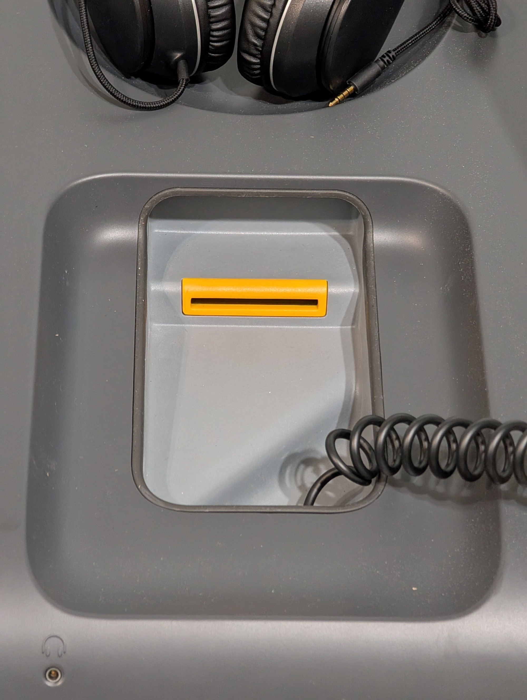

# Open and Close Polls

## Open Polls on VxMark

After VxMark is turned on, the screen will show _Polls Closed:_

<figure><figcaption></figcaption></figure>

Verify the election name, election date, and precinct are correct in the bottom left corner.


If there is an orange banner that says "Test Ballot Mode" on the screen, contact your election administrator immediately to prepare the machine for the election.


**To open the polls:**

* [ ] insert the poll worker card into the card reader beneath the accessible controller
* [ ] select _`Open Polls`_
* [ ] confirm by selecting _`Open Polls`_ again
* [ ] remove the poll worker card

<figure><figcaption></figcaption></figure> <figure><figcaption></figcaption></figure> <figure><figcaption></figcaption></figure>

* [ ] verify the number of ballots printed is zero

The polls are now open and VxMark is ready for voters.&#x20;

## Close Polls on VxMark

* [ ] remove ballot bin seal
* [ ] remove ballots inside (secure or tabulate as required)

<figure><figcaption>
remove ballot bin seal
</figcaption></figure>

* [ ] insert the poll worker card into the card reader beneath the accessible controller
* [ ] select _`Close Polls`_
* [ ] confirm by selecting _`Close Polls`_ again

<figure><figcaption></figcaption></figure> <figure><figcaption></figcaption></figure>

* [ ] remove the poll worker card

The polls are now closed.

## Pause or Resume Voting

The _`Pause Voting`_ action is generally used by jurisdictions conducting early voting over multiple days or during an emergency situation. To pause voting and not allow ballots to be marked by VxMark:

* [ ] insert the poll worker card into the card reader beneath the accessible controller
* [ ] select _`Pause Voting`_
* [ ] confirm by selecting _`Pause Voting`_ again

<figure><figcaption></figcaption></figure> <figure><figcaption></figcaption></figure>

* [ ] remove the poll worker card

Voting is now paused. When you want to resume voting:

* [ ] insert the poll worker card into the card reader beneath the accessible controller
* [ ] select _`Resume Voting`_
* [ ] confirm by selecting _`Resume Voting`_ again&#x20;

<figure><figcaption></figcaption></figure> <figure><figcaption></figcaption></figure>

* [ ] remove the poll worker card

Voting can now continue.

